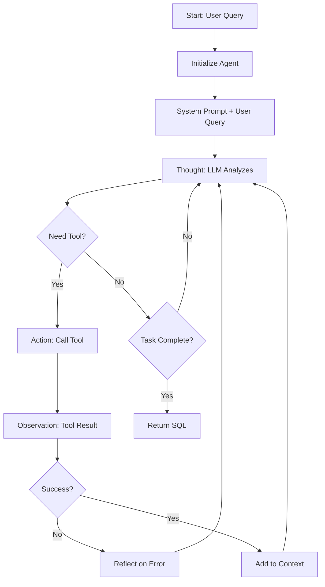

# SemanticSQL-Agent 架构设计文档

## 1. 项目概述

SemanticSQL-Agent 是一个基于智能体架构的自然语言到SQL转换系统，继承了 TRAEAgent 的设计理念，通过工具化的方式实现对数据库的深度理解和精准的SQL生成。

### 1.1 核心特性
- 基于 ReAct (Thought-Action-Observation) 模式
- 工具驱动的渐进式理解
- 简单有效的反思机制
- 完整的执行轨迹记录

### 1.2 设计原则
- **简洁性优先**：避免过度设计，保持代码清晰
- **工具化思维**：每个功能都是独立的工具
- **继承复用**：基于 TRAEAgent 的成熟模式
- **可扩展性**：易于添加新工具和功能

## 2. 架构层次设计

```
semanticsql-agent/
│
├── 基础设施层 (Infrastructure Layer)
│   ├── utils/
│   │   ├── llm_clients/              # LLM 客户端管理
│   │   │   ├── __init__.py
│   │   │   ├── llm_basics.py        # LLM 基础类型定义
│   │   │   ├── llm_client.py        # LLM 客户端统一接口
│   │   │   ├── base_client.py       # 客户端基类
│   │   │   └── openai_client.py     # OpenAI 实现
│   │   │
│   │   ├── config.py                 # 配置管理
│   │   ├── constants.py              # 常量定义
│   │   ├── database_connector.py     # 数据库连接管理
│   │   └── trajectory_recorder.py    # 轨迹记录
│   │
│   └── cli/                          # CLI 支持
│       ├── __init__.py
│       ├── console_factory.py        # 控制台工厂
│       └── simple_console.py         # 简单控制台实现
│
├── 智能体核心层 (Agent Core Layer)
│   └── agent/
│       ├── __init__.py
│       ├── agent_basics.py           # 智能体基础类型定义
│       ├── base_agent.py             # 通用智能体基类
│       └── nl2sql_agent.py           # NL2SQL 智能体实现
│
├── 工具层 (Tools Layer)
│   └── tools/
│       ├── __init__.py
│       ├── base.py                   # 工具基类和执行器
│       │
│       ├── 分析工具 (Analysis Tools)
│       │   ├── schema_extraction_tool.py      # 数据库结构提取
│       │   ├── domain_analysis_tool.py        # 业务领域分析
│       │   └── er_analysis_tool.py            # 实体关系分析
│       │
│       ├── 生成工具 (Generation Tools)
│       │   ├── sql_generation_tool.py         # SQL 生成
│       │   └── sql_validation_tool.py         # SQL 验证
│       │
│       ├── 思考工具 (Thinking Tools)
│       │   └── sequential_thinking_tool.py    # 深度思考（可选）
│       │
│       └── 控制工具 (Control Tools)
│           └── task_done_tool.py              # 任务完成标记
│
└── 提示词层 (Prompt Layer)
    └── prompt/
        ├── __init__.py
        └── agent_prompt.py           # 系统提示词定义
```

## 3. 核心组件设计

### 3.1 智能体基类设计

```python
# agent/base_agent.py
class BaseAgent(ABC):
    """
    通用智能体基类 - 参考 TRAEAgent 的 BaseAgent
    实现 ReAct 的 TAO 循环
    """
    
    def __init__(self, config: AgentConfig):
        self._llm_client = LLMClient(config.model)
        self._tools: List[Tool] = []
        self._trajectory_recorder: TrajectoryRecorder | None = None
        self._max_steps = config.max_steps
        
    async def execute_task(self) -> AgentExecution:
        """
        执行任务的主循环 - 实现 TAO 循环
        1. Thought: AgentStepState.THINKING
        2. Action: AgentStepState.CALLING_TOOL  
        3. Observation: Tool Results + reflect_on_result()
        """
        execution = AgentExecution(task=self._task)
        messages = self._initial_messages
        
        for step_number in range(1, self._max_steps + 1):
            step = AgentStep(step_number=step_number)
            
            # Thought 阶段
            step.state = AgentStepState.THINKING
            llm_response = await self._llm_client.chat(messages, self._tools)
            
            # Action 阶段
            if llm_response.tool_calls:
                step.state = AgentStepState.CALLING_TOOL
                tool_results = await self._execute_tools(llm_response.tool_calls)
                
                # Observation 阶段
                messages.extend(self._create_observation_messages(tool_results))
                
                # 简单反思（可选）
                reflection = self.reflect_on_result(tool_results)
                if reflection:
                    step.state = AgentStepState.REFLECTING
                    messages.append(LLMMessage(role="assistant", content=reflection))
            
            execution.steps.append(step)
            
            if self._is_task_completed(llm_response):
                break
                
        return execution
    
    def reflect_on_result(self, tool_results: List[ToolResult]) -> str | None:
        """简单的反思机制 - 仅在工具失败时提供建议"""
        # 默认实现：只对失败结果进行简单反思
        pass
```

### 3.2 NL2SQL 智能体实现

```python
# agent/nl2sql_agent.py
class NL2SQLAgent(BaseAgent):
    """
    NL2SQL 智能体实现
    继承 BaseAgent，专注于 SQL 生成任务
    """
    
    def __init__(self, config: NL2SQLConfig):
        super().__init__(config)
        self.db_connector = DatabaseConnector(config.database)
        self._initialize_tools()
        
    def _initialize_tools(self):
        """初始化 NL2SQL 相关工具"""
        self._tools = [
            SchemaExtractionTool(self.db_connector),
            DomainAnalysisTool(),
            SQLGenerationTool(),
            SequentialThinkingTool(),  # 可选，LLM 自主决定使用
            TaskDoneTool(),
        ]
        
    def new_task(self, query: str, database_url: str):
        """创建新的 NL2SQL 任务"""
        self._task = query
        self._initial_messages = [
            LLMMessage(role="system", content=NL2SQL_SYSTEM_PROMPT),
            LLMMessage(role="user", content=f"""
                Database URL: {database_url}
                User Query: {query}
                
                Please analyze the database schema and generate the appropriate SQL query.
            """)
        ]
        
    def reflect_on_result(self, tool_results: List[ToolResult]) -> str | None:
        """NL2SQL 特定的反思逻辑"""
        failed_results = [r for r in tool_results if not r.success]
        if not failed_results:
            return None
            
        reflections = []
        for result in failed_results:
            if "schema" in result.tool_name:
                reflections.append(
                    f"Schema extraction failed: {result.error}. "
                    "Please check database connection and permissions."
                )
            elif "sql" in result.tool_name:
                reflections.append(
                    f"SQL generation failed: {result.error}. "
                    "The query might be ambiguous or too complex."
                )
                
        return "\n".join(reflections) if reflections else None
```

### 3.3 工具接口设计

```python
# tools/base.py
class Tool(ABC):
    """工具基类 - 所有工具必须实现此接口"""
    
    @abstractmethod
    def get_name(self) -> str:
        """工具名称"""
        pass
        
    @abstractmethod
    def get_description(self) -> str:
        """工具描述 - 用于 LLM 理解工具用途"""
        pass
        
    @abstractmethod
    def get_parameters(self) -> List[ToolParameter]:
        """工具参数定义"""
        pass
        
    @abstractmethod
    async def execute(self, **kwargs) -> ToolResult:
        """执行工具"""
        pass

# 工具实现示例
class SchemaExtractionTool(Tool):
    """数据库结构提取工具"""
    
    def __init__(self, db_connector: DatabaseConnector):
        self.db_connector = db_connector
        
    def get_name(self) -> str:
        return "schema_extraction"
        
    def get_description(self) -> str:
        return """Extract database schema including:
        - Tables and their columns
        - Data types
        - Primary keys and foreign keys
        - Indexes
        """
        
    async def execute(self, **kwargs) -> ToolResult:
        try:
            schema = await self.db_connector.extract_schema()
            return ToolResult(
                success=True,
                data={
                    "tables": schema.tables,
                    "relationships": schema.relationships,
                    "summary": f"Found {len(schema.tables)} tables"
                }
            )
        except Exception as e:
            return ToolResult(success=False, error=str(e))
```

## 4. 执行流程

### 4.1 TAO 循环实现



### 4.2 典型执行序列

```
用户查询: "Show me total sales by region for last month"

Step 1 - TAO Cycle:
  Thought: "I need to understand the database schema first"
  Action: schema_extraction_tool()
  Observation: {"tables": ["sales", "regions", ...], "relationships": [...]}

Step 2 - TAO Cycle:  
  Thought: "Now I understand the schema. Let me analyze the business domain"
  Action: domain_analysis_tool(schema=..., query=...)
  Observation: {"domain": "sales", "key_entities": ["sales", "regions"], ...}

Step 3 - TAO Cycle:
  Thought: "I have enough information to generate the SQL"
  Action: sql_generation_tool(schema=..., domain=..., query=...)
  Observation: {"sql": "SELECT r.name, SUM(s.amount)...", "confidence": 0.95}

Step 4 - TAO Cycle:
  Thought: "The SQL looks correct. Task is complete"
  Action: task_done()
  Observation: Task marked as complete
```

## 5. 配置管理

```yaml
# nl2sql_config.yaml
agent:
  max_steps: 15
  timeout: 30
  
model:
  provider: openai
  name: gpt-4
  temperature: 0.1
  
database:
  connection_pool_size: 5
  query_timeout: 10
  
tools:
  enabled:
    - schema_extraction
    - domain_analysis  
    - sql_generation
    - sequential_thinking
    - task_done
    
logging:
  level: INFO
  trajectory: true
```

## 6. 开发指南

### 6.1 添加新工具

1. 在 `tools/` 目录创建新工具文件
2. 继承 `Tool` 基类
3. 实现所有抽象方法
4. 在 `tools/__init__.py` 注册工具
5. 在智能体中添加到工具列表

### 6.2 扩展智能体

1. 继承 `BaseAgent` 或 `NL2SQLAgent`
2. 重写 `reflect_on_result()` 方法（如需自定义反思）
3. 添加特定领域的工具
4. 自定义系统提示词

### 6.3 测试规范

```python
# 单元测试示例
async def test_schema_extraction():
    tool = SchemaExtractionTool(mock_connector)
    result = await tool.execute()
    assert result.success
    assert "tables" in result.data

# 集成测试示例
async def test_nl2sql_flow():
    agent = NL2SQLAgent(test_config)
    execution = await agent.execute_task(
        "SELECT total sales by region"
    )
    assert execution.success
    assert "SELECT" in execution.final_result
```

## 7. 最佳实践

1. **工具设计**
   - 保持工具职责单一
   - 提供清晰的错误信息
   - 返回结构化的观察数据

2. **提示词优化**
   - 明确说明可用工具
   - 强调 TAO 思考模式
   - 提供具体的输出格式

3. **错误处理**
   - 工具级别的异常捕获
   - 有意义的错误反思
   - 优雅的降级策略

4. **性能优化**
   - Schema 缓存
   - 并行工具执行（当可能时）
   - Token 使用优化