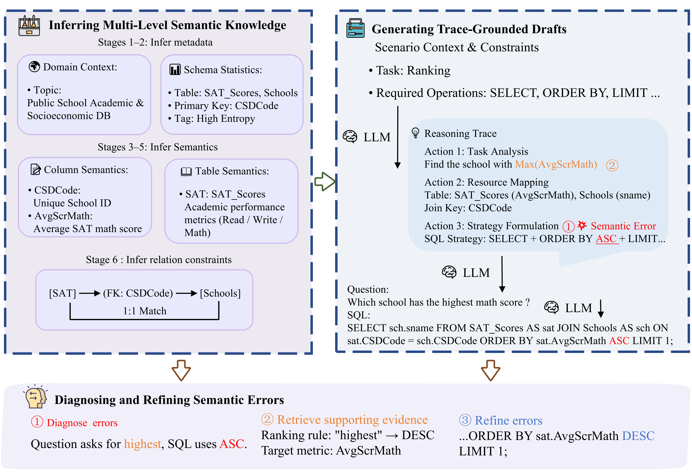
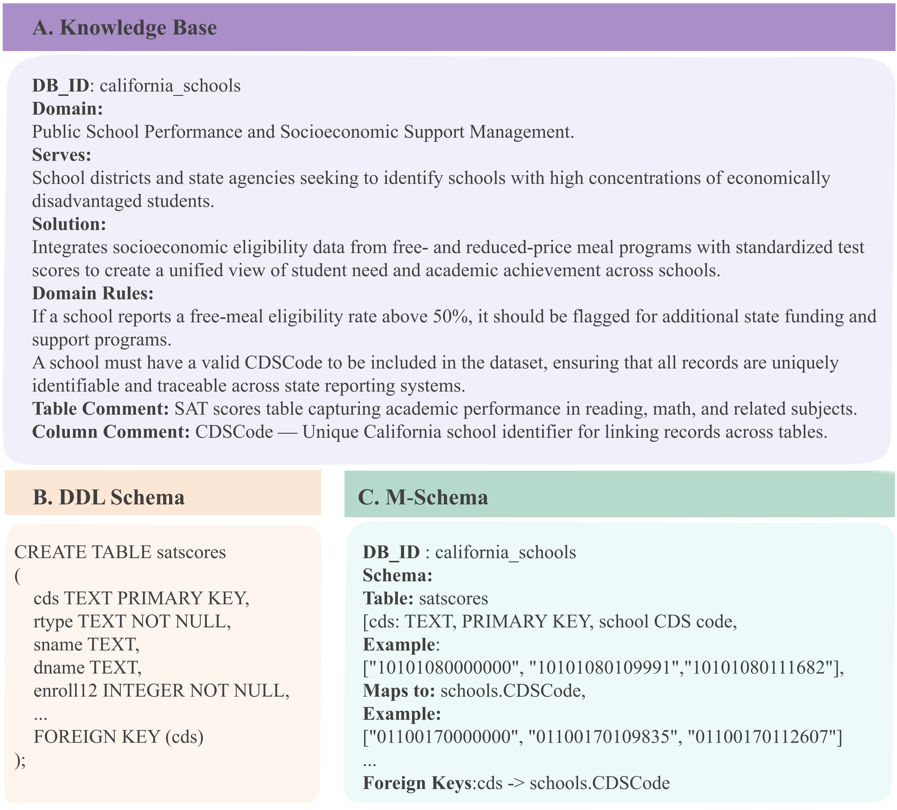
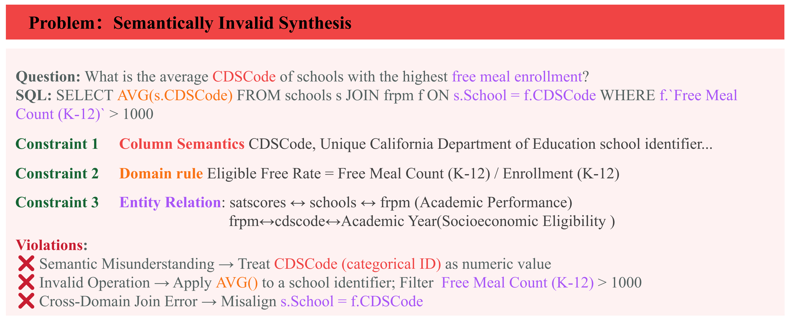

<div align="center">

# SemanticAgent

### A Semantics-Aware Framework for Text-to-SQL Data Synthesis

[](https://github.com/lizhenping/SemanticSQL-Agent)
[](LICENSE)
[](https://www.python.org/downloads/)
[](Dockerfile)

**Explicit semantic supervision for text-to-SQL data synthesis — beyond execution-based validation.**

</div>

---

## Overview

Existing text-to-SQL synthesis pipelines conflate **executability** with **semantic validity**: syntactic checks and execution-based validation retain queries that execute successfully while **violating database semantics**. For example, `AVG(CDSCode)` runs without error, yet averaging an identifier is semantically meaningless.

**SemanticAgent** replaces implicit semantic modeling with **explicit semantic supervision**. It organizes synthesis around three specialized tools that execute in a fixed three-stage protocol, transforming execution-based validation into a traceable, constraint-grounded verification process.

<div align="center">


*Overview: SemanticAgent (1) infers a multi-level semantic knowledge base, (2) generates trace-grounded question-SQL drafts under semantic guidance, and (3) diagnoses and refines semantic errors by retrieving supporting evidence from the knowledge base.*
</div>

### Three Core Tools

| Tool | Role | Function |
|------|------|----------|
| **DA** (Data Analysis) | Domain Analyst | Identifies business rules and semantic constraints from schema → builds knowledge base K (K1–K6) |
| **DS** (Data Synthesis) | Data Author | Composes question-SQL pairs with operation rationales under explicit semantic supervision |
| **DT** (Diagnosis) | Semantic Reviewer | Inspects outputs against domain constraints, detects semantic inconsistencies, repairs invalid samples |

### Key Results

- **+2.6 EX** on BIRD over OmniSQL (Qwen2.5-Coder-7B fine-tuned on synthetic data)
- Higher semantic fidelity and diversity than baseline synthesis methods
- **100K** synthetic question-SQL pairs across 5 benchmarks (330 databases)

---

## Method

### Phase 1: Semantic Analysis (DA Tool)

Extracts a **six-level structured knowledge base** K from database schema and sampled data:

<div align="center">


*The six-stage semantic extraction: schema metadata, domain knowledge, field types, column semantics, table semantics, and cross-table relations.*
</div>

| Layer | Knowledge | Source |
|-------|-----------|--------|
| K1 | Schema Metadata | Table/column/PK/FK structure |
| K2 | Domain Knowledge | Business domain type & concepts |
| K3 | Field Type Analysis | identifier / measure / dimension / datetime / text / boolean |
| K4 | Column Semantics | Business description per column |
| K5 | Table Semantics | Business type & key columns |
| K6 | Cross-Table Relations | ER relationships & foreign keys |

> **K3 is the programmatic basis for the Fig.1 counterexample**: `AVG(CDSCode)` is detected because K3 classifies `CDSCode` as `identifier` (non-aggregatable).

### Phase 2: Controlled Authoring (DS Tool)

Generates triples `(q, s, r)` — question, SQL, and rationale — guided by K. The rationale records semantically grounded table selection, type-constrained column operations, and SQL strategies aligned with domain rules.

### Phase 3: Diagnosis (DT Tool)

Iterative **Diagnose → Retrieve → Correct** loop (Eq.4) until convergence:

<div align="center">


*Case study: the diagnosis loop detects a semantic error, retrieves corrective evidence Φ from K, and repairs the triple.*
</div>

The Diagnose function combines:
- **Deterministic checks**: column existence (K4), JOIN validity (K6), aggregation type (K3), execution
- **LLM semantic review**: holistic consistency between question intent and SQL

---

## Quick Start

### 1. Setup

**Option A: Pull prebuilt image (no build needed)**

```bash
# Pull from Aliyun Container Registry
docker pull crpi-h14b49yx0jj9g6su.cn-beijing.personal.cr.aliyuncs.com/lizhenping/paper:latest
```

**Option B: Build from source**

```bash
git clone https://github.com/lizhenping/SemanticSQL-Agent.git
cd SemanticSQL-Agent
docker compose build
```

**Configure API key & datasets:**

```bash
# Configure your DeepSeek API key
cp .env.example .env
# Edit .env: DEEPSEEK_API_KEY=sk-your-key

# Download datasets (see datasets/README.md)
# Extract data.tar to get datasets/ directory
tar xf data.tar
```

Datasets go under `datasets/` (see [Datasets](#datasets) below). Output goes to `data-assets/`. Both are gitignored.

<details>
<summary><b>Local install (without Docker)</b></summary>

```bash
pip install -r semanticsql-agent/requirements.txt

# Set environment variables (or use .env)
export SEMANTICSQL_LLM_MODEL=deepseek-v4-flash
export SEMANTICSQL_LLM_BASE_URL=https://api.deepseek.com
export SEMANTICSQL_LLM_API_KEY=sk-your-key
export SEMANTICSQL_DB_ROOT=datasets
export SEMANTICSQL_DB_TYPE=sqlite
```

Then replace `docker compose run --rm semanticsql` with `python semanticsql-agent/cli.py` in all commands below.

</details>

### 2. Command Reference

| Command | What it does | Test isolation |
|---------|-------------|----------------|
| **`run-benchmark`** | **One command per benchmark** — iterate all train DBs, auto-skip dev/test | ✅ Blocks eval DBs |
| `run` | Run all 3 phases for a single database | ✅ Blocks eval DBs |
| `analyze` | Phase 1 only — extract knowledge base K1-K6 | ✅ Blocks eval DBs |
| `generate` | Phase 2 only — synthesize (q, s, r) triples | ✅ Blocks eval DBs |
| `diagnose` | Phase 3 only — Eq.4 diagnose-retrieve-correct loop | — |
| `list-dbs` | Show which DBs are available vs blocked | — |

### 3. Usage

**Recommended: synthesize an entire benchmark in one command**

```bash
# Each train database gets N synthetic pairs; dev/test DBs are auto-excluded
docker compose run --rm semanticsql run-benchmark -b ehrsql -n 50
docker compose run --rm semanticsql run-benchmark -b bird -n 50
docker compose run --rm semanticsql run-benchmark -b spider -n 40
```

Features:
- **Test isolation**: dev/test databases are automatically blocked (see [Data Leakage Prevention](#data-leakage-prevention))
- **Resume**: if interrupted, re-run the same command — completed databases are skipped automatically
- **Debug**: add `--limit 2` to process only the first 2 databases

```bash
# Check which databases are available vs blocked
docker compose run --rm semanticsql list-dbs -b spider
```

**Single database (debugging or targeted runs)**

```bash
# All three phases for one database
docker compose run --rm semanticsql run -b spider -d poker_player -n 100

# Or run phases separately
docker compose run --rm semanticsql analyze -b spider -d poker_player --summary
docker compose run --rm semanticsql generate -b spider -d poker_player -n 50
docker compose run --rm semanticsql diagnose -b spider -d poker_player \
    -i data-assets/spider/poker_player/training_data.jsonl --max-iters 3
```

### 4. Output

All generated data is stored under `data-assets/{benchmark}/{database}/`:

```
data-assets/
└── spider/
    └── poker_player/
        ├── schema_extraction.jsonl   # K1 — schema metadata
        ├── domain_analysis.jsonl     # K2 — domain knowledge
        ├── field_analysis.jsonl      # K3 — field type classification
        ├── column_analysis.jsonl     # K4 — column semantics
        ├── table_analysis.jsonl      # K5 — table semantics
        ├── er_analysis.jsonl         # K6 — cross-table relations
        ├── questions.jsonl           # Phase 2 — synthesized questions
        ├── sql_results.jsonl         # Phase 2 — SQL + execution results
        └── training_data.jsonl       # Final (q, s, r) triples — training corpus
```

### Programmatic Usage

```python
from semanticsql_agent.core.pipeline import PipelineExecutor

pipeline = PipelineExecutor.for_sqlite(
    sqlite_path="datasets/spider/databases/poker_player/poker_player.sqlite",
    benchmark="spider",
)
kbase = pipeline.run_analysis()           # Phase 1
triples = pipeline.run_generation(count=100)  # Phase 2
triples = pipeline.run_diagnosis(triples, max_iters=3)  # Phase 3
```

---

## Datasets

We synthesize on **5 benchmarks** (330 databases, ~100K pairs) and evaluate on **3 additional** robustness benchmarks:

| Benchmark | DBs | Domains | Avg Tbl/DB | Synth. Pairs | Role |
|-----------|-----|---------|-----------|-------------|------|
| Spider 1.0 | 200 | 138 | 5.11 | 40,000 | Cross-domain parsing |
| Spider 2.0-SQLite | 30 | 8 | 13.8 | 20,000 | Enterprise complexity |
| BIRD | 95 | 37 | 7.64 | 30,000 | Knowledge-intensive |
| EHRSQL | 2 | 1 | 31.55 | 5,000 | Clinical domain |
| ScienceBenchmark | 3 | 3 | 16.67 | 5,000 | Scientific domain |
| Spider-Syn | — | — | — | — | Eval only (robustness) |
| Spider-Realistic | — | — | — | — | Eval only (robustness) |
| Spider-DK | — | — | — | — | Eval only (domain knowledge) |

### Where to put datasets

Place benchmarks under `datasets/` (gitignored — too large for git):

```
datasets/                             ← input (gitignored, 35GB)
├── spider/
│   └── databases/{db}/{db}.sqlite
├── bird/
│   └── databases/{db}/{db}.sqlite
├── spider2/
├── ehrsql/
└── science_benchmark/
```

Download `data.tar` from Aliyun Drive and extract to project root — see `datasets/README.md` for details.

### Data leakage prevention

Evaluation databases (dev/test) are **automatically blocked** from synthesis:

- **spider**: 60 dev/test DBs blacklisted (train: 140 DBs)
- **bird**: 11 dev DBs blacklisted (train: 69 DBs)
- **science_benchmark / ehrsql**: train & eval share DBs, but the pipeline never reads official QA files — it synthesizes questions from schema alone, so no overlap

Enforced by `infra/dataset_split.py` (`assert_train_only`). Any command (`run`, `run-benchmark`, `analyze`, `generate`) will **refuse** an eval database with a clear error. `list-dbs` shows which DBs are allowed vs blocked.

```bash
$ python cli.py analyze -b spider -d concert_singer
Error: Data leakage prevention: database 'concert_singer' belongs to the spider evaluation set (dev/test) and cannot be used for synthetic training data.
```

---

## Project Structure

```
SemanticSQL-Agent/
├── semanticsql-agent/              # Python package
│   ├── cli.py                      # Entry: run-benchmark/run/analyze/generate/diagnose/list-dbs
│   ├── core/
│   │   ├── pipeline.py             # PipelineExecutor (3-phase orchestration)
│   │   └── knowledge_store.py      # KnowledgeBase (K1-K6 + check_* + retrieve_evidence)
│   ├── tools/
│   │   ├── base_tool.py            # BaseSemanticTool (DI base class)
│   │   ├── analysis/               # Phase 1: K1-K6 extraction (6 tools)
│   │   ├── synthesis/              # Phase 2: QuestionSynth + SQLSynth
│   │   └── diagnosis/              # Phase 3: Diagnose + Correct (Eq.4 loop)
│   ├── infra/
│   │   ├── llm.py                  # LLMClient protocol + ChatOpenAI/Fake
│   │   ├── database.py             # DatabaseManager (MySQL + SQLite)
│   │   ├── storage.py              # JSONLKnowledgeStore + InMemory
│   │   ├── sql_ast.py              # SQLAstParser (sqlglot)
│   │   └── dataset_split.py        # Data leakage prevention
│   ├── models/                     # knowledge / synthesis / diagnosis
│   ├── prompts/templates/          # Jinja2 prompts
│   └── config/settings.py          # Environment configuration
├── pic/                            # Architecture figures (for README)
├── Dockerfile / docker-compose.yml
├── datasets/                       # 5 benchmarks input (gitignored, 35GB)
└── data-assets/                    # Synthetic output (gitignored)
```

**Dependency direction** (strict, single-way): `cli → core → tools → infra → models`

---

## Paper Mapping

| Paper (§) | Code |
|-----------|------|
| §III.C Knowledge base K = K1-K6 | `core/knowledge_store.py`, `models/knowledge.py` |
| §III.C Table II (K1-K6 definitions) | `tools/analysis/*.py` |
| §III.D Phase 2 (q, s, r) triples | `models/synthesis.py`, `tools/synthesis/` |
| §III.E Diagnose (4 checks) | `core/knowledge_store.py` `check_columns/check_joins/check_aggregation`, `tools/diagnosis/diagnose.py` |
| §III.E Retrieve Φ | `core/knowledge_store.py` `retrieve_evidence` |
| §III.E Eq.4 refinement loop | `core/pipeline.py` `run_diagnosis()` + `_eq4_loop()` |
| Fig.1 AVG(CDSCode) counterexample | `check_aggregation` → K3 `identifier` → error |

---

## Citation

If you find this work useful, please cite:

```bibtex
@misc{gao2026semanticagentsemanticsawareframeworktexttosql,
      title={SemanticAgent: A Semantics-Aware Framework for Text-to-SQL Data Synthesis},
      author={Qiang Gao and Zhenping Li and Anqi Zhuo and Yingxiao Zhao and Weibo Geng and Xiaosong Li},
      year={2026},
      eprint={2604.21414},
      archivePrefix={arXiv},
      primaryClass={cs.AI},
      url={https://arxiv.org/abs/2604.21414},
}
```

---

## License

[MIT](LICENSE)
