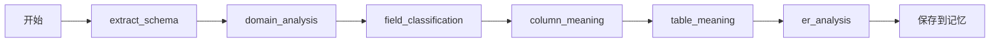
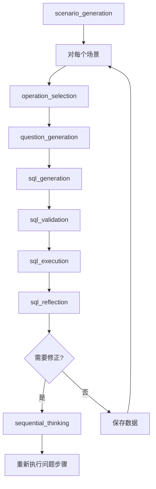

# SemanticSQL Agent API 总览

## 系统架构

SemanticSQL Agent 是一个基于 LangChain 框架的智能 SQL 生成系统，专注于生成高质量的 NL2SQL 训练数据。

### 核心特性

1. **基于 LangChain**：利用成熟的 Agent 框架
2. **智能分析**：深度理解数据库结构和业务语义
3. **批量生成**：高效生成大量训练数据
4. **质量保证**：执行验证和反思优化
5. **MySQL 专注**：专门优化 MySQL 数据库

## 快速开始

### 安装

```bash
pip install semanticsql-agent
```

### 基础使用

```python
from semanticsql_agent import SQLAgent
from semanticsql_agent.config import Settings, DatabaseConfig

# 配置
settings = Settings()
db_config = DatabaseConfig(
    host="localhost",
    port=3306,
    database="mydb",
    username="root",
    password="password"
)

# 创建 Agent
agent = SQLAgent(settings, db_config)

# 单次查询
response = agent.query("查询所有订单的总金额")
print(f"SQL: {response.sql}")
print(f"结果: {response.result}")

# 批量生成训练数据
training_data = agent.generate_training_data(
    count=100,
    output_file="nl2sql_training.json"
)
```

## API 结构

### 1. Agent API

#### SQLAgent

主要的智能体类，支持两种模式：

```python
class SQLAgent:
    def __init__(
        self,
        settings: Settings,
        db_config: DatabaseConfig,
        callbacks: Optional[List[BaseCallbackHandler]] = None
    ):
        """
        初始化 SQL Agent
        
        Args:
            settings: 系统配置
            db_config: 数据库配置
            callbacks: LangChain 回调处理器列表
        """
    
    def query(self, question: str) -> SQLQueryResult:
        """
        单次 SQL 查询生成
        
        Args:
            question: 自然语言问题
            
        Returns:
            SQLQueryResult: 包含 SQL 和执行结果
        """
    
    def generate_training_data(
        self,
        count: int,
        output_file: str,
        scenarios_per_batch: int = 10
    ) -> TrainingDataResult:
        """
        批量生成训练数据
        
        Args:
            count: 生成数据条数
            output_file: 输出文件路径
            scenarios_per_batch: 每批场景数量
            
        Returns:
            TrainingDataResult: 生成结果统计
        """
```

### 2. 工具 API

所有工具都继承自 `langchain.tools.BaseTool`：

#### 分析工具

```python
class SchemaExtractionTool(BaseTool):
    """提取数据库结构"""
    name = "extract_schema"
    description = "提取数据库的表结构、列信息、约束等"
    
    def _run(self, database_name: str) -> Dict[str, Any]:
        """返回数据库结构信息"""

class DomainAnalysisTool(BaseTool):
    """识别业务领域"""
    name = "domain_analysis"
    description = "基于表名和字段名识别业务领域"
    
    def _run(self, schema_info: Dict[str, Any]) -> Dict[str, Any]:
        """返回领域分析结果"""

# 其他分析工具...
```

#### 生成工具

```python
class ScenarioTool(BaseTool):
    """场景生成"""
    name = "scenario_generation"
    description = "基于预定义模板生成查询场景"
    
    def _run(
        self,
        domain_info: Dict[str, Any],
        count: int = 10
    ) -> List[QueryScenario]:
        """批量生成场景"""

class SQLGenerationTool(BaseTool):
    """SQL 生成"""
    name = "sql_generation"
    description = "根据问题生成 SQL 查询"
    
    def _run(
        self,
        question: str,
        schema_info: Dict[str, Any]
    ) -> Dict[str, Any]:
        """生成 SQL"""
```

### 3. 数据模型

```python
# 查询结果
@dataclass
class SQLQueryResult:
    question: str          # 原始问题
    sql: str              # 生成的 SQL
    result: Any           # 执行结果
    execution_time: float # 执行时间
    error: Optional[str]  # 错误信息

# 场景定义
@dataclass
class QueryScenario:
    id: str
    category: str         # 场景类别
    description: str      # 场景描述
    difficulty: str       # 难度：easy/medium/hard
    tables: List[str]     # 涉及的表

# 训练数据
@dataclass
class TrainingExample:
    id: str
    scenario_id: str
    question: str         # 自然语言问题
    sql: str             # 对应的 SQL
    validated: bool      # 是否验证通过
    execution_result: Dict[str, Any]
```

### 4. 记忆管理

```python
class DatabaseAnalysisMemory(BaseMemory):
    """
    管理数据库分析结果的记忆
    
    存储内容：
    - schema_info: 数据库结构
    - domain_analysis: 领域分析
    - field_classification: 字段分类
    - column_meanings: 列业务含义
    - table_meanings: 表业务含义
    - er_analysis: 关系分析
    """
    
    def load_memory_variables(self, inputs: Dict) -> Dict:
        """加载相关的分析结果"""
    
    def save_context(self, inputs: Dict, outputs: Dict) -> None:
        """保存或更新分析结果"""
```

### 5. 配置管理

```python
class Settings(BaseSettings):
    """全局配置"""
    # LLM 配置
    llm_model: str = "Qwen"
    llm_base_url: str = "http://localhost:9991/v1"
    llm_temperature: float = 0.7
    
    # Agent 配置
    max_iterations: int = 20
    enable_reflection: bool = True
    
    # 工具配置
    enable_thinking_tool: bool = True
    
class DatabaseConfig(BaseModel):
    """MySQL 数据库配置"""
    host: str
    port: int = 3306
    database: str
    username: str
    password: str
    charset: str = "utf8mb4"
```

## 执行流程

### 1. 数据库分析阶段



### 2. 数据生成循环



## 错误处理

所有 API 都遵循统一的错误处理模式：

```python
try:
    result = agent.query("查询订单")
except ToolExecutionError as e:
    print(f"工具执行错误: {e.tool_name} - {e.message}")
except AgentExecutionError as e:
    print(f"Agent 执行错误: {e.message}")
except DatabaseConnectionError as e:
    print(f"数据库连接错误: {e.message}")
```

## 扩展开发

### 自定义工具

```python
from langchain.tools import BaseTool
from pydantic import BaseModel, Field

class MyCustomTool(BaseTool):
    name = "my_custom_tool"
    description = "自定义工具描述"
    
    class InputSchema(BaseModel):
        param1: str = Field(description="参数1")
        param2: int = Field(description="参数2")
    
    args_schema = InputSchema
    
    def _run(self, param1: str, param2: int) -> Dict[str, Any]:
        # 实现工具逻辑
        return {"result": "success"}
```

### 自定义回调

```python
from langchain.callbacks import BaseCallbackHandler

class MyCallback(BaseCallbackHandler):
    def on_tool_start(self, serialized, input_str, **kwargs):
        print(f"工具开始: {serialized['name']}")
    
    def on_tool_end(self, output, **kwargs):
        print(f"工具结束: {output}")

# 使用自定义回调
agent = SQLAgent(settings, db_config, callbacks=[MyCallback()])
```

## 最佳实践

1. **批量生成时设置合理的批次大小**：避免内存溢出
2. **使用回调监控执行过程**：便于调试和优化
3. **定期清理轨迹记录**：避免占用过多磁盘空间
4. **合理设置 LLM 温度**：平衡创造性和准确性

## 性能优化

1. **使用数据库连接池**：提高数据库访问效率
2. **启用 LLM 缓存**：避免重复调用
3. **并行处理场景**：提高批量生成速度
4. **优化提示词**：减少 LLM 调用次数

---

更多详细信息请参考各模块的 API 文档。