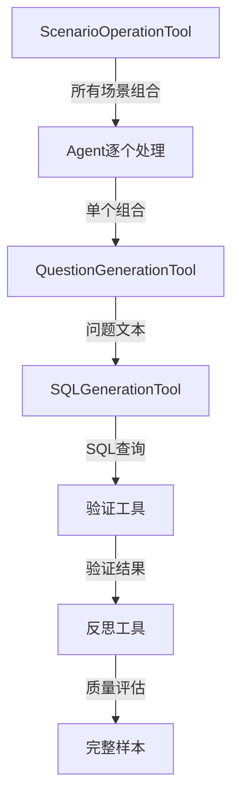

# 生成工具 API 文档

## 概述

生成工具负责创建高质量的 NL2SQL 训练数据，包括场景-操作组合生成、问题生成和 SQL 生成。所有工具都基于数据库分析结果工作，确保生成的内容符合实际业务需求。

## 1. ScenarioOperationTool（核心工具）

合并了原来的场景选择和操作选择功能，内部封装三层for循环，生成所有场景-操作组合。

### 工具信息

- **名称**: `scenario_operation_generation`
- **描述**: 生成所有场景-操作组合，内部处理三层for循环遍历，为每个组合生成专用提示词
- **类型**: 核心生成工具

### 输入参数

```python
class ScenarioOperationInput(BaseModel):
    mode: str = Field(
        default="get_all_combinations",
        description="生成模式：get_all_combinations（获取所有组合）或 get_single_combination（获取单个组合）"
    )
    iteration: int = Field(
        default=0,
        description="迭代次数（仅在get_single_combination模式下使用）"
    )
```

### 输出格式

#### get_all_combinations 模式
```python
{
    "success": true,
    "total_combinations": 48,
    "combinations": [
        {
            "combination_id": "sales_analysis_simple",
            "index": 0,
            "scenario": {
                "main_key": "sales_analysis",
                "main_name": "销售分析",
                "main_description": "销售数据分析和统计",
                "sub_key": "sales_statistics",
                "sub_name": "销售统计",
                "focus_areas": ["销售额", "订单量", "客户数"],
                "complexity": "simple"
            },
            "operations": ["SELECT", "WHERE"],
            "generated_prompt": "基于销售分析场景的销售统计任务，生成simple级别的问题...",
            "complexity_config": {
                "level": 1,
                "description": "基础查询"
            }
        }
        // ... 更多组合
    ],
    "generation_strategy": "三层遍历：主场景×子场景×复杂度"
}
```

#### get_single_combination 模式
```python
{
    "success": true,
    "combination": {
        "combination_id": "sales_analysis_moderate",
        "scenario": {...},
        "operations": ["SELECT", "GROUP BY", "HAVING"],
        "generated_prompt": "..."
    },
    "total_available": 48,
    "selected_index": 5
}
```

### 场景分类

#### 主场景类别
- **销售分析** (sales_analysis)
  - 销售统计 (sales_statistics): 销售额、订单量、客户数
  - 销售趋势 (sales_trends): 时间趋势、增长率、季节性

- **库存管理** (inventory_management)
  - 库存状态 (inventory_status): 库存量、库存预警、周转率

### 复杂度级别

- **simple**: 基础查询 - ["SELECT", "WHERE"]
- **moderate**: 聚合分析 - ["SELECT", "GROUP BY", "HAVING"]  
- **complex**: 多表关联 - ["SELECT", "JOIN", "SUBQUERY"]
- **expert**: 高级特性 - ["SELECT", "WINDOW_FUNCTION", "CTE"]

### 使用示例

```python
# Agent 调用格式 - 获取所有组合
Action: scenario_operation_generation
Action Input: {"mode": "get_all_combinations"}

# Agent 调用格式 - 获取单个组合
Action: scenario_operation_generation  
Action Input: {"mode": "get_single_combination", "iteration": 5}
```

## 2. QuestionGenerationTool

基于场景-操作组合生成自然语言问题。

### 工具信息

- **名称**: `question_generation`
- **描述**: 基于场景组合和数据库分析结果生成自然语言问题

### 依赖条件

- 需要记忆中有完整的数据库分析结果
- 需要场景-操作组合信息（来自ScenarioOperationTool）

### 输入参数

```python
{
    "combination_index": int,  # 组合索引
    "use_combination": dict    # 特定的场景组合信息
}
```

### 输出格式

```python
{
    "question": "查询本月的销售订单总数",
    "scenario_used": {
        "main_name": "销售分析",
        "sub_name": "销售统计", 
        "complexity": "simple"
    },
    "generated_context": "基于销售分析场景，生成关于销售统计的简单查询问题"
}
```

## 3. SQLGenerationTool

将自然语言问题转换为SQL查询。

### 工具信息

- **名称**: `sql_generation`
- **描述**: 基于问题、场景信息和数据库分析结果生成SQL查询

### 依赖条件

- 需要记忆中有完整的数据库分析结果
- 需要问题文本（来自QuestionGenerationTool）
- 需要场景信息

### 输入参数

```python
{
    "question": str,           # 自然语言问题
    "combination": dict        # 场景组合信息
}
```

### 输出格式

```python
{
    "sql": "SELECT COUNT(*) FROM orders WHERE MONTH(order_date) = MONTH(NOW())",
    "explanation": "查询当前月份的订单总数",
    "tables_used": ["orders"],
    "operations_used": ["SELECT", "WHERE", "COUNT"],
    "complexity_level": "simple"
}
```

## 工具协作流程



## 核心特点

1. **内部批处理**: ScenarioOperationTool内部处理所有组合生成
2. **Agent自主**: Agent完全自主决策处理流程
3. **记忆驱动**: 工具间通过记忆系统自动协作
4. **质量保证**: 每个样本都经过完整的验证流程

---

*本文档基于最新的架构实现，反映了ScenarioOperationTool合并场景选择和操作选择的设计*