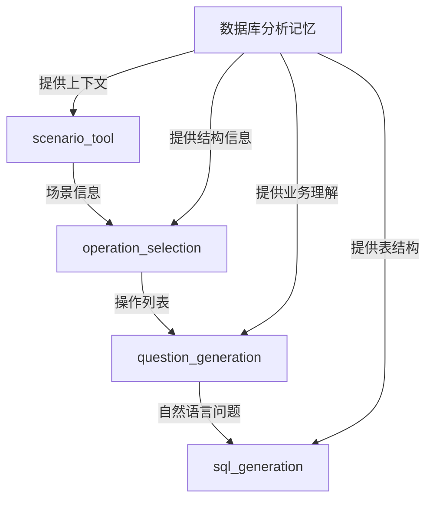

# 生成工具 API 文档

## 概述

生成工具负责创建高质量的 NL2SQL 训练数据，包括场景选择、操作确定、问题生成和 SQL 生成。所有工具都基于数据库分析结果工作，确保生成的内容符合实际业务需求。

## 1. ScenarioTool

从预定义的场景模板中选择适合的业务场景。

### 工具信息

- **名称**: `scenario_tool`
- **描述**: 从预定义的场景模板中选择一个适合当前数据库的业务场景

### 输入参数

```python
class ScenarioToolInput(BaseModel):
    iteration: int = Field(default=0, description="当前迭代次数")
    memory: Optional[Dict[str, Any]] = Field(default=None, description="数据库分析记忆")
```

### 输出格式

```python
{
    "scenario": {
        "id": "sales_analysis_001",
        "category": "销售分析",
        "business_purpose": "分析特定时间段的销售业绩",
        "description": "查询某个时间段内的销售总额、订单数量等关键指标",
        "complexity": "medium",
        "applicable_tables": ["orders", "order_items", "products"],
        "suggested_operations": ["JOIN", "GROUP", "SUM", "COUNT"],
        "business_context": "管理层需要了解销售趋势"
    }
}
```

### 场景模板类别

- **销售分析**: 销售额、订单量、增长趋势
- **库存管理**: 库存状态、补货建议、滞销商品
- **客户分析**: 客户价值、购买行为、留存分析
- **商品分析**: 热销商品、商品关联、价格分析
- **财务报表**: 收入统计、成本分析、利润计算
- **运营监控**: 系统使用、异常检测、性能指标

### 使用示例

```python
# Agent 调用格式
Action: scenario_tool
Action Input: {"iteration": 0}

# 输出
Observation: {
    "scenario": {
        "id": "customer_behavior_002",
        "category": "客户分析",
        "business_purpose": "识别高价值客户群体",
        ...
    }
}
```

## 2. OperationSelectionTool

根据场景复杂度选择合适的 SQL 操作。

### 工具信息

- **名称**: `operation_selection`
- **描述**: 根据场景复杂度和业务需求选择合适的SQL操作组合

### 输入参数

```python
{
    "scenario": Dict[str, Any],  # 场景信息
    "memory": Dict[str, Any]     # 数据库分析记忆
}
```

### 输出格式

```python
{
    "operations": ["JOIN", "GROUP BY", "HAVING", "ORDER BY"],
    "operation_details": {
        "join_type": "INNER JOIN",
        "join_tables": ["orders", "users"],
        "group_by_fields": ["user_id", "order_date"],
        "aggregations": ["SUM", "COUNT", "AVG"],
        "filter_conditions": ["date_range", "status_filter"]
    },
    "complexity_assessment": {
        "level": "medium",
        "reasoning": "需要关联多表并进行分组统计"
    }
}
```

### 操作复杂度映射

- **简单 (easy)**:
  - 单表查询
  - 基础 WHERE 条件
  - 简单排序

- **中等 (medium)**:
  - 2-3 表 JOIN
  - GROUP BY 聚合
  - HAVING 过滤
  - 子查询

- **复杂 (hard)**:
  - 多表复杂 JOIN
  - 嵌套子查询
  - 窗口函数
  - CTE (公共表表达式)

### 使用示例

```python
# Agent 调用格式
Action: operation_selection
Action Input: {
    "scenario": {
        "complexity": "medium",
        "suggested_operations": ["JOIN", "GROUP"]
    },
    "memory": <数据库分析结果>
}
```

## 3. QuestionGenerationTool

生成自然语言问题。

### 工具信息

- **名称**: `question_generation`
- **描述**: 根据场景和数据库结构生成自然语言问题

### 输入参数

```python
{
    "scenario": Dict[str, Any],      # 场景信息
    "operations": List[str],         # SQL操作列表
    "memory": Dict[str, Any]         # 数据库分析记忆
}
```

### 输出格式

```python
{
    "question": "查询2024年1月份销售额最高的前10个商品及其销售数量",
    "question_type": "statistical_analysis",
    "question_elements": {
        "time_range": "2024年1月份",
        "metric": "销售额",
        "target": "商品",
        "operation": "排名前10",
        "additional_info": ["销售数量"]
    },
    "complexity_features": [
        "时间范围过滤",
        "聚合计算",
        "结果排序",
        "多指标查询"
    ]
}
```

### 问题生成策略

1. **基于场景模板**: 使用预定义的问题模板
2. **结合业务术语**: 使用领域特定的业务词汇
3. **自然表达**: 模拟真实用户的提问方式
4. **明确具体**: 避免歧义，指标明确

### 问题类型

- `data_retrieval`: 数据查询
- `statistical_analysis`: 统计分析
- `comparison`: 对比分析
- `trend_analysis`: 趋势分析
- `ranking`: 排名查询
- `calculation`: 计算推导

## 4. SQLGenerationTool

根据自然语言问题生成 SQL 查询。

### 工具信息

- **名称**: `sql_generation`
- **描述**: 根据自然语言问题和数据库结构生成对应的SQL查询

### 输入参数

```python
class SQLGenerationInput(BaseModel):
    question: str = Field(description="自然语言问题")
    memory: Dict[str, Any] = Field(description="包含数据库分析结果的记忆")
    operations: List[str] = Field(default_factory=list, description="建议的SQL操作")
    dialect: str = Field(default="mysql", description="SQL方言")
```

### 输出格式

```python
{
    "sql": """
        SELECT 
            p.name AS product_name,
            SUM(oi.quantity * oi.price) AS total_sales,
            SUM(oi.quantity) AS total_quantity
        FROM order_items oi
        INNER JOIN orders o ON oi.order_id = o.id
        INNER JOIN products p ON oi.product_id = p.id
        WHERE o.order_date >= '2024-01-01' 
          AND o.order_date < '2024-02-01'
          AND o.status = 'completed'
        GROUP BY p.id, p.name
        ORDER BY total_sales DESC
        LIMIT 10
    """,
    "sql_explanation": {
        "main_table": "order_items",
        "joined_tables": ["orders", "products"],
        "filters": ["日期范围", "订单状态"],
        "aggregations": ["销售额汇总", "数量汇总"],
        "grouping": "按商品分组",
        "ordering": "按销售额降序",
        "limit": "前10条"
    },
    "confidence": 0.95
}
```

### SQL 生成原则

1. **准确性**: 确保 SQL 准确实现问题意图
2. **性能考虑**: 使用合适的索引和连接顺序
3. **可读性**: 格式清晰，包含必要的别名
4. **安全性**: 避免 SQL 注入风险
5. **方言特定**: 使用 MySQL 特定语法

### 使用示例

```python
# Agent 调用格式
Action: sql_generation
Action Input: {
    "question": "查询上个月购买次数最多的10个客户",
    "memory": <包含所有分析结果>,
    "operations": ["JOIN", "GROUP BY", "COUNT", "ORDER BY", "LIMIT"]
}
```

## 工具协作流程



## 错误处理

所有生成工具都实现了统一的错误处理：

```python
from models.exceptions import ToolExecutionError

try:
    result = tool._run(**params)
    if not result:
        raise ToolExecutionError(
            tool_name=tool.name,
            reason="生成失败：结果为空"
        )
except Exception as e:
    raise ToolExecutionError(
        tool_name=tool.name,
        reason=f"生成过程出错: {str(e)}"
    )
```

## 质量保证

生成工具通过以下机制确保质量：

1. **基于分析**: 充分利用数据库分析结果
2. **模板指导**: 使用经过验证的场景模板
3. **逐步细化**: 从场景到操作到问题到SQL
4. **上下文传递**: 每步都基于前面的结果
5. **后续验证**: 生成的SQL会经过验证和执行测试

## 最佳实践

1. **迭代多样性**: 使用 iteration 参数确保场景多样
2. **复杂度平衡**: 生成不同难度的训练数据
3. **业务相关**: 确保问题符合实际业务场景
4. **SQL 优化**: 生成的 SQL 应该是生产级质量
5. **错误处理**: 妥善处理生成失败的情况