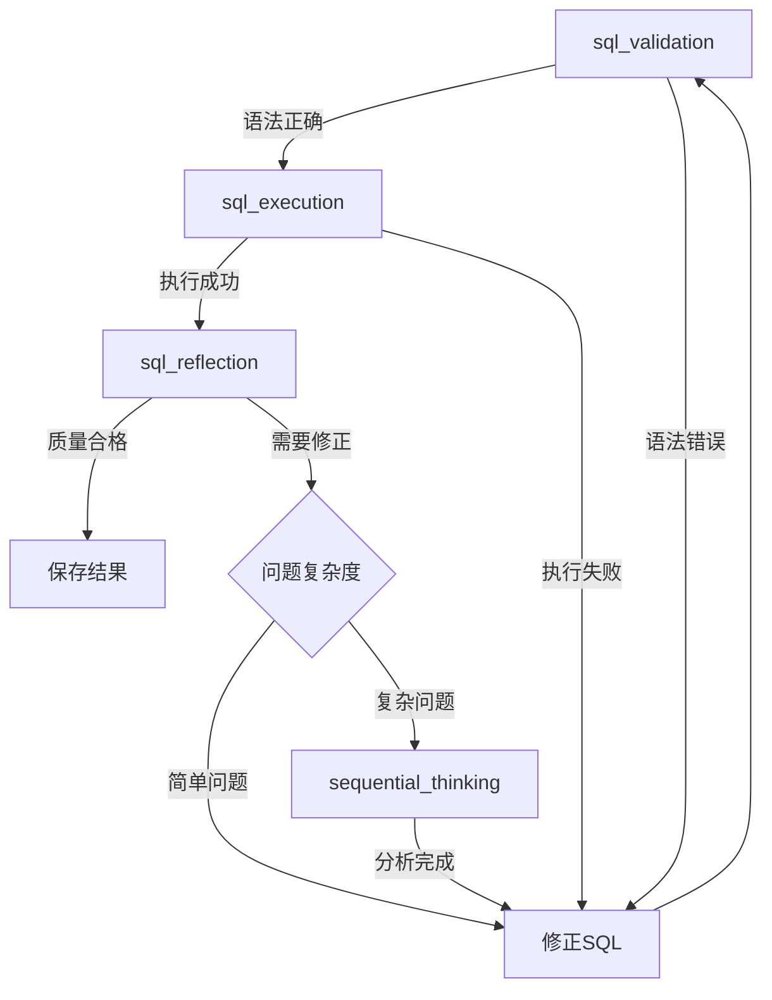

# 验证与反思工具 API 文档

## 概述

验证与反思工具负责确保生成的 NL2SQL 数据质量。包括 SQL 语法验证、执行测试、质量评估和深度分析。这些工具是质量保证的关键环节。

## 1. SQLValidationTool

验证 SQL 语句的语法正确性。

### 工具信息

- **名称**: `sql_validation`
- **描述**: 验证SQL语句的语法正确性

### 输入参数

```python
class SQLValidationInput(BaseModel):
    sql: str = Field(description="要验证的SQL语句")
    memory: Dict[str, Any] = Field(description="包含数据库分析结果的记忆")
```

### 输出格式

```python
{
    "is_valid": true,
    "validation_details": {
        "syntax_check": "passed",
        "table_existence": "passed",
        "column_existence": "passed",
        "function_usage": "passed"
    },
    "warnings": [
        "使用了 SELECT *，建议明确指定列名",
        "缺少 ORDER BY，结果顺序可能不确定"
    ],
    "optimization_suggestions": [
        "考虑在 user_id 上添加索引",
        "可以使用 EXISTS 替代 IN 子查询"
    ]
}

# 验证失败时
{
    "is_valid": false,
    "error": "Unknown column 'usr_id' in field list",
    "error_location": "line 2, column 5",
    "suggestion": "是否想要使用 'user_id'？",
    "validation_details": {
        "syntax_check": "passed",
        "table_existence": "passed",
        "column_existence": "failed"
    }
}
```

### 验证项目

1. **语法检查**: SQL 语法是否正确
2. **表存在性**: 引用的表是否存在
3. **列存在性**: 引用的列是否存在
4. **数据类型**: 操作是否类型兼容
5. **函数使用**: 函数调用是否正确

### 使用示例

```python
# Agent 调用格式
Action: sql_validation
Action Input: {
    "sql": "SELECT * FROM users WHERE created_at > '2024-01-01'",
    "memory": <数据库分析结果>
}
```

## 2. SQLExecutionTool

执行 SQL 查询并返回结果。

### 工具信息

- **名称**: `sql_execution`
- **描述**: 执行SQL查询并返回结果

### 输入参数

```python
class SQLExecutionInput(BaseModel):
    sql: str = Field(description="要执行的SQL语句")
    limit: int = Field(default=100, description="结果限制")
```

### 输出格式

```python
{
    "success": true,
    "data": [
        {
            "product_name": "iPhone 15",
            "total_sales": 1250000.00,
            "total_quantity": 100
        },
        {
            "product_name": "MacBook Pro",
            "total_sales": 980000.00,
            "total_quantity": 50
        }
    ],
    "row_count": 10,
    "column_count": 3,
    "columns": ["product_name", "total_sales", "total_quantity"],
    "execution_time": 0.125,
    "warnings": [],
    "query_plan": "Using index on orders.order_date"
}

# 执行失败时
{
    "success": false,
    "error": "Table 'shop.userss' doesn't exist",
    "error_code": "1146",
    "sql": "SELECT * FROM userss",
    "execution_time": 0.002
}
```

### 执行安全措施

1. **只读执行**: 只允许 SELECT 语句
2. **结果限制**: 默认限制返回 100 行
3. **超时控制**: 防止长时间运行的查询
4. **资源限制**: 限制内存使用

### 使用示例

```python
# Agent 调用格式
Action: sql_execution
Action Input: {
    "sql": "SELECT COUNT(*) as user_count FROM users",
    "limit": 10
}
```

## 3. SQLReflectionTool

分析 SQL 执行结果，评估质量并提供改进建议。

### 工具信息

- **名称**: `sql_reflection`
- **描述**: 分析SQL执行结果，识别问题来源并建议下一步行动

### 输入参数

```python
class SQLReflectionInput(BaseModel):
    question: str = Field(description="自然语言问题")
    sql: str = Field(description="生成的SQL")
    execution_result: Dict[str, Any] = Field(description="SQL执行结果")
    memory: Dict[str, Any] = Field(description="包含数据库分析结果的记忆")
```

### 输出格式

```python
{
    "needs_revision": false,
    "quality_assessment": {
        "correctness": 0.95,
        "completeness": 0.90,
        "efficiency": 0.85,
        "readability": 0.88
    },
    "issues": [],
    "strengths": [
        "SQL正确实现了问题意图",
        "使用了合适的聚合函数",
        "包含了必要的过滤条件"
    ],
    "recommendations": [
        "可以添加注释提高可读性",
        "考虑使用 WITH 子句简化复杂查询"
    ]
}

# 需要修正时
{
    "needs_revision": true,
    "quality_assessment": {
        "correctness": 0.60,
        "completeness": 0.70,
        "efficiency": 0.80,
        "readability": 0.75
    },
    "issues": [
        {
            "type": "semantic_mismatch",
            "description": "查询结果与问题意图不符",
            "details": "问题要求'上个月'，但SQL查询的是'本月'"
        },
        {
            "type": "missing_condition",
            "description": "缺少状态过滤",
            "details": "应该只统计已完成的订单"
        }
    ],
    "recommended_action": {
        "tool": "sql_generation",
        "reason": "需要重新生成SQL，修正时间范围和添加状态过滤"
    },
    "revision_hints": [
        "使用 DATE_SUB 计算上个月的日期范围",
        "添加 WHERE status = 'completed' 条件"
    ]
}
```

### 评估维度

1. **正确性** (Correctness): SQL 是否准确实现问题意图
2. **完整性** (Completeness): 是否包含所有必要的条件和字段
3. **效率** (Efficiency): 查询性能是否合理
4. **可读性** (Readability): SQL 是否易于理解和维护

### 问题类型

- `semantic_mismatch`: 语义不匹配
- `missing_condition`: 缺少条件
- `wrong_aggregation`: 错误的聚合
- `incorrect_join`: 错误的连接
- `performance_issue`: 性能问题
- `logic_error`: 逻辑错误

## 4. SequentialThinkingTool

进行深度分析，制定问题解决策略。

### 工具信息

- **名称**: `sequential_thinking`
- **描述**: 进行深度分析，制定问题解决策略

### 输入参数

```python
class SequentialThinkingInput(BaseModel):
    problem_description: str = Field(description="问题描述")
    context: Dict[str, Any] = Field(description="上下文信息")
    memory: Dict[str, Any] = Field(description="包含数据库分析结果的记忆")
```

### 输出格式

```python
{
    "analysis": {
        "problem_understanding": "SQL查询结果为空，可能是条件过于严格或数据不存在",
        "root_cause": "日期范围计算错误，使用了未来的日期",
        "affected_components": ["date_filter", "sql_generation"]
    },
    "solution_strategy": {
        "approach": "修正日期计算逻辑",
        "steps": [
            "1. 使用 CURDATE() 获取当前日期",
            "2. 使用 DATE_SUB 计算上个月的起止日期",
            "3. 重新生成 SQL 的 WHERE 子句"
        ],
        "expected_outcome": "正确查询上个月的数据"
    },
    "recommended_actions": [
        {
            "tool": "sql_generation",
            "params": {
                "focus": "date_calculation",
                "hints": ["使用 DATE_SUB(CURDATE(), INTERVAL 1 MONTH)"]
            }
        }
    ],
    "alternative_approaches": [
        "使用 YEAR() 和 MONTH() 函数直接比较",
        "创建日期维度表简化日期查询"
    ]
}
```

### 使用场景

1. **复杂错误诊断**: 当简单修正无法解决问题时
2. **多次失败分析**: 同一问题反复出错时
3. **策略制定**: 需要制定整体执行计划时
4. **根因分析**: 深入分析问题根源时
5. **优化建议**: 寻求更好的解决方案时

### 分析维度

- **问题理解**: 准确理解当前面临的问题
- **根因分析**: 找出问题的根本原因
- **影响评估**: 评估问题的影响范围
- **解决策略**: 制定清晰的解决步骤
- **替代方案**: 提供多种解决思路

## 工具协作流程



## 反思-修正机制

### 简单修正流程

1. `sql_reflection` 识别简单问题（如字段名错误）
2. 直接调用建议的工具进行修正
3. 重新验证和执行

### 深度分析流程

1. `sql_reflection` 识别复杂问题
2. 调用 `sequential_thinking` 进行深度分析
3. 根据分析结果制定修正策略
4. 执行多步修正计划
5. 验证最终结果

## 最佳实践

1. **先验证后执行**: 总是先进行语法验证
2. **限制执行结果**: 使用合理的 limit 避免大量数据
3. **充分反思**: 每个生成的SQL都应该经过反思
4. **适度分析**: 不是所有问题都需要深度思考
5. **记录轨迹**: 保存修正过程便于学习改进

## 错误处理

```python
from models.exceptions import (
    SQLValidationError,
    DatabaseExecutionError,
    ToolExecutionError
)

# 验证错误
try:
    validation_result = sql_validation_tool._run(sql=sql, memory=memory)
except SQLValidationError as e:
    print(f"SQL验证失败: {e.errors}")

# 执行错误
try:
    execution_result = sql_execution_tool._run(sql=sql)
except DatabaseExecutionError as e:
    print(f"SQL执行失败: {e.query} - {e.message}")

# 工具错误
try:
    reflection_result = sql_reflection_tool._run(**params)
except ToolExecutionError as e:
    print(f"反思工具错误: {e.tool_name} - {e.reason}")
```