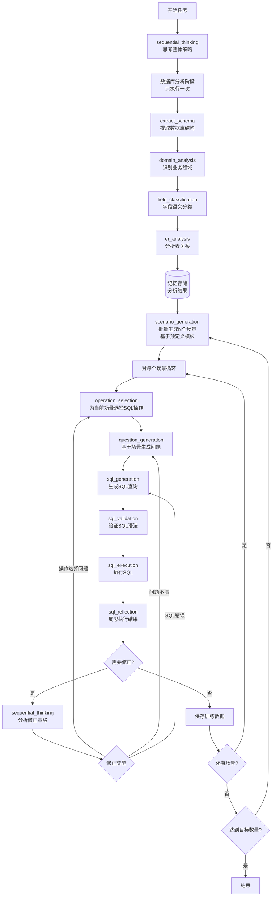

# SemanticSQL Agent 设计规范

## 1. 项目概述

### 1.1 项目定位
SemanticSQL Agent 是一个基于 ReAct 智能体架构的 **NL2SQL 训练数据生成系统**。

**核心功能**：
- 📊 **智能数据库分析**：自动提取数据库结构、识别业务领域、分析表关系
- 🎯 **场景化数据生成**：基于业务场景批量生成自然语言问题和对应的 SQL 查询对
- ✅ **执行验证机制**：实际执行生成的 SQL，验证正确性和可行性
- 🔄 **智能反思优化**：分析执行结果，自动优化 SQL 质量和性能
- 📦 **标准化输出**：生成符合训练标准的 JSON/JSONL 格式数据集

**目标用途**：为 NL2SQL 模型训练提供高质量、大规模的合成训练数据，减少人工标注成本，提升模型在特定领域的表现。

### 1.2 核心价值
- **自动化生成**：减少人工标注成本，快速生成大量训练数据
- **高质量保证**：通过验证和反思机制确保数据质量
- **领域适应**：自动识别业务领域，生成符合领域特征的数据
- **灵活扩展**：基于工具的架构，易于添加新功能

### 1.3 设计原则
- **智能体驱动**：采用 ReAct 模式，智能体自主决策执行流程
- **模块化设计**：工具职责单一，通过智能体协调
- **简洁实用**：避免过度设计，保持代码简单高效
- **可追踪性**：完整记录执行过程，便于调试和优化

## 2. 功能规范

### 2.1 核心功能

#### 2.1.1 数据库分析（一次性执行，结果记忆）

**执行时机**：任务开始时执行一次，结果保存在Agent记忆中供全程使用

**分析工具链**：
1. **extract_schema**：提取数据库物理结构
   - 表结构、列信息、数据类型
   - 主键、外键、索引信息
   - 约束条件（唯一、非空等）

2. **domain_analysis**：识别业务领域特征
   - 基于表名和字段名的语义分析
   - 识别业务实体（用户、订单、产品等）
   - 推断业务流程和关系

3. **field_classification**：字段语义分类
   - 标识符字段（ID、编码）
   - 时间戳字段（创建时间、更新时间）
   - 数值字段（金额、数量、比率）
   - 分类字段（状态、类型、级别）
   - 描述字段（名称、备注、说明）

4. **er_analysis**：实体关系分析
   - 显式关系（外键约束）
   - 隐式关系（命名规律推断）
   - 关系类型（一对一、一对多、多对多）
   - 实体重要性评估

#### 2.1.2 智能体驱动的数据生成流程

**关键设计原则**：
- **❌ 错误**：流程步骤硬编码在代码中
- **✅ 正确**：流程完全由提示词引导，Agent自主决策

**ReAct 自主决策模式**：Agent通过思考-行动-观察循环，自主决定执行策略

**完整执行流程图**：


**Agent的智能决策过程**：
1. **初始思考**：使用sequential_thinking规划整体执行策略
2. **一次性分析**：完整分析数据库，结果存入记忆供后续使用
3. **场景批量生成**：
   - scenario_generation基于预定义模板和数据库结构生成N个场景
   - 场景包含：业务目的、适用表、复杂度等信息
4. **循环处理每个场景**：
   - operation_selection：根据场景复杂度选择合适的SQL操作组合
   - question_generation：基于场景和操作生成自然语言问题
   - sql_generation：将问题转换为SQL查询
   - sql_validation + sql_execution：验证并执行SQL
   - sql_reflection：评估执行结果质量
5. **智能修正**：
   - 反思发现问题时，调用sequential_thinking分析原因
   - 精准回退到问题源头（操作选择/问题生成/SQL生成）
   - 只修正当前场景，不影响已处理的其他场景

**记忆机制**：
- **数据库分析结果必须完整记忆**：一次性分析数据库，结果贯穿整个过程
- **上下文保持**：Agent在整个执行过程中维护分析结果的记忆
- **避免重复分析**：已分析的结构信息在后续步骤中直接使用

**工具类型区分**：
- **思考工具（sequential_thinking）**：用于深度分析和推理，在需要复杂决策时调用
- **反思工具（sql_reflection）**：SQL执行后的质量评估和问题诊断

**反思-修正循环机制**：
```
数据库分析（只执行一次，结果记忆）
    ↓
场景批量生成（基于预定义模板）
    ↓
对每个场景：
    操作选择 → 问题生成 → SQL生成 → SQL执行 
       ↑         ↑         ↑         ↓
       ←─────────←─────────←──── SQL反思分析
                                     ↓
                               需要修正？
                                     ├─ 否 → 保存数据，处理下一个场景
                                     └─ 是 → 调用sequential_thinking
                                             ↓
                                       决定修正点：
                                             ├─ 操作选择不当 → 重新选择操作
                                             ├─ 问题表述不清 → 重新生成问题
                                             └─ SQL生成错误 → 重新生成SQL
```

**重要原则**：
1. **分析工具只执行一次**：数据库分析（schema_extraction、domain_analysis、field_classification、er_analysis）在开始时执行一次，结果保存在记忆中
2. **生成和验证工具可多次执行**：根据反思结果，可能需要重新执行生成工具
3. **反思只针对当前步骤**：sql_reflection只分析当前SQL的执行结果，不重新分析整个数据库

**思考工具（sequential_thinking）调用时机**：
- **初始规划**：开始任务时，思考整体执行策略
- **复杂场景设计**：当需要设计涉及多表关联的复杂查询场景时
- **错误诊断**：当SQL执行失败且原因不明时，进行深度分析
- **优化决策**：当有多种可能的SQL实现方式时，评估最优方案
- **跨步骤决策**：当需要决定是否回退到更早的步骤时

**反思工具（sql_reflection）调用时机**：
- **每次SQL执行后**：必须调用，评估执行结果
- **质量检查**：检查SQL的正确性、效率、结果合理性
- **问题诊断**：识别具体问题类型（语法错误、逻辑错误、性能问题等）
- **修正建议**：提供具体的修正方向，指导Agent决定回退到哪个步骤

**核心特点**：
- **动态适应**：Agent根据数据库特征调整生成策略
- **智能反思**：执行SQL后主动反思结果质量
- **自主优化**：根据反思结果自动优化或重新生成
- **完全自主**：所有决策由Agent基于提示词引导做出，无硬编码步骤

#### 2.1.3 验证与优化
- **语法验证**：检查 SQL 语法正确性
- **执行测试**：实际执行 SQL 验证可行性
- **反思优化**：分析执行结果，提供优化建议

#### 2.1.4 工具使用总结

**工具分类及使用原则**：

| 工具类别 | 工具名称 | 执行次数 | 使用时机 | 说明 |
|---------|---------|---------|---------|------|
| 分析工具 | extract_schema<br>domain_analysis<br>field_classification<br>er_analysis | 一次 | 任务开始时 | 结果保存在记忆中 |
| 生成工具 | scenario_generation | 多批次 | 每批生成N个场景 | 基于预定义模板批量生成 |
| 生成工具 | operation_selection | 每场景一次 | 为每个场景选择SQL操作 | 根据场景复杂度选择 |
| 生成工具 | question_generation<br>sql_generation | 每场景多次 | 基于场景和操作生成 | 可能因反思而重新生成 |
| 验证工具 | sql_validation<br>sql_execution | 每SQL一次 | 每个SQL必须验证执行 | 确保SQL正确可执行 |
| 反思工具 | sql_reflection | 每次执行后 | SQL执行后立即反思 | 评估质量决定是否修正 |
| 思考工具 | sequential_thinking | 按需 | 初始规划/修正决策 | 复杂问题深度分析 |

**记忆机制核心要点**：
1. 分析工具的输出必须保存在记忆中
2. 生成工具自动从记忆中获取所需的分析结果
3. 反思工具不会触发重新分析整个数据库
4. 只有在反思发现需要时，才会局部重新分析特定内容

**场景处理示例**：
```python
# 1. 场景批量生成（假设生成10个场景）
scenarios = scenario_generation(schema_info=memory["schema_info"], count=10)
# 返回: [场景1: 销售分析-简单, 场景2: 库存统计-中等, ...]

# 2. 对每个场景循环处理
for scenario in scenarios:
    # 2.1 选择SQL操作
    operations = operation_selection(scenario=scenario, schema_info=memory["schema_info"])
    # 返回: {"operations": ["SELECT", "GROUP", "ORDER"], ...}
    
    # 2.2 生成问题
    question = question_generation(scenario=scenario, operations=operations)
    # 返回: {"question": "查询上个月各产品类别的销售总额并按金额排序"}
    
    # 2.3 生成SQL
    sql = sql_generation(question=question, schema_info=memory["schema_info"])
    # 返回: {"sql": "SELECT category, SUM(amount)..."}
    
    # 2.4 验证执行
    validation = sql_validation(sql=sql)
    execution = sql_execution(sql=sql)
    
    # 2.5 反思评估
    reflection = sql_reflection(sql=sql, execution_result=execution, question=question)
    
    # 2.6 如果需要修正，只影响当前场景
    if reflection["needs_revision"]:
        # 分析问题并决定修正点
        fix_strategy = sequential_thinking(problem="SQL执行结果不符合预期", context=...)
        # 回退到适当步骤重新生成
```

### 2.2 数据生成规范

#### 2.2.1 场景类型
- **基础查询**：单表查询、条件筛选
- **关联查询**：多表 JOIN、子查询
- **聚合统计**：GROUP BY、聚合函数
- **时间分析**：时间范围、趋势分析
- **复杂查询**：窗口函数、CTE、复杂条件

#### 2.2.2 难度分布
```yaml
difficulty_distribution:
  easy: 30%    # 基础单表查询
  medium: 20%  # 关联和聚合查询
  hard: 30%    # 复杂查询和高级特性
  expert: 20%    # 专家级别查询和高级特性
```

#### 2.2.3 质量标准
- SQL 语法必须正确
- 问题表述自然流畅
- SQL 与问题语义匹配
- 执行结果合理有效

## 3. 实现规范

### 3.1 Agent实现规范

#### 3.1.1 DataGenerationAgent设计要求

**核心实现原则**：
```python
# ✅ 正确实现：提示词驱动的Agent
class DataGenerationAgent(BaseAgent):
    """
    完整的训练数据生成Agent
    - 拥有完整工具链：分析、生成、验证、反思、思考
    - 通过提示词引导完整流程
    - 自主决策工具调用顺序
    - 实现反思-修正循环
    """
    
    def _initialize_tools(self):
        """必须注册完整工具链"""
        # 分析工具
        self.register_tool("extract_schema", SchemaExtractionTool(...))
        self.register_tool("domain_analysis", DomainAnalysisTool(...))
        self.register_tool("field_classification", FieldClassificationTool(...))
        self.register_tool("er_analysis", ERAnalysisTool(...))
        
        # 生成工具
        self.register_tool("scenario_generation", ScenarioGenerationTool(...))
        self.register_tool("question_generation", QuestionGenerationTool(...))
        self.register_tool("sql_generation", SQLGenerationTool(...))
        
        # 验证工具
        self.register_tool("sql_execution", SQLExecutionTool(...))
        self.register_tool("sql_reflection", SQLReflectionTool(...))
        
        # 思考工具
        self.register_tool("sequential_thinking", SequentialThinkingTool(...))
    
    def generate_training_data(self, count: int, output_file: str):
        """
        ✅ 正确：完全由Agent自主执行，无硬编码步骤
        """
        task = f"生成{count}条高质量NL2SQL训练数据"
        execution = self.new_task(task)  # 进入ReAct循环
        return self._extract_results(execution)
    
    def get_system_prompt(self) -> str:
        """
        关键：提示词必须引导Agent执行完整流程
        包含：
        1. 数据库完整分析并记忆
        2. SQL执行后反思
        3. 反思发现问题时回退修正
        4. 思考工具使用时机
        """
        return comprehensive_prompt_template()
```

**❌ 错误实现：硬编码流程**
```python
# 不要这样做 - 违反Agent自主决策原则
def generate_training_data(self):
    schema = self.call_tool('extract_schema')    # 硬编码顺序
    domain = self.call_tool('domain_analysis')   # 硬编码顺序
    # ... 更多硬编码步骤
```

#### 3.1.2 提示词系统设计

**完整系统提示词必须包含**：
1. **数据库分析指导**：如何完整分析并记忆数据库结构
2. **生成流程指导**：如何基于分析结果生成数据
3. **执行验证指导**：如何执行SQL并获取反馈
4. **反思修正指导**：如何根据执行结果决定是否回退
5. **思考工具指导**：何时调用sequential_thinking进行深度分析

**记忆机制实现**：
```
Agent第一次调用extract_schema后：
├─ 记忆：数据库有5个表，主要是合同和援助业务
├─ 后续调用sql_generation时：
│  └─ 提示词引导：使用已记忆的数据库结构信息
└─ 无需重复调用extract_schema
```

#### 3.1.3 反思-修正循环实现

**记忆管理策略**：
```python
class AgentMemory:
    """Agent记忆管理"""
    def __init__(self):
        self.analysis_memory = {  # 分析结果记忆（只保存一份）
            "schema_info": None,
            "domain_analysis": None,
            "field_classification": None,
            "er_analysis": None
        }
        self.generation_memory = []  # 生成历史（可多份）
        self.current_context = {}    # 当前执行上下文
```

**执行后反思决策流程**：
```
SQL执行完成
    ↓
sql_reflection工具分析
    ├─ 评估维度：
    │  ├─ SQL语法正确性
    │  ├─ 执行时间合理性
    │  ├─ 返回结果数量
    │  ├─ 数据逻辑合理性
    │  └─ 问题与SQL匹配度
    ↓
生成反思报告
    ├─ quality_score: 0-100分
    ├─ issues: [问题列表]
    ├─ suggestions: [改进建议]
    └─ needs_revision: true/false
    ↓
Agent根据反思报告决策
    ├─ needs_revision = false → 保存数据，继续下一个
    └─ needs_revision = true → 调用sequential_thinking分析修正策略
                                    ↓
                              确定修正目标
                                    ├─ 场景设计问题 → 回到scenario_generation
                                    ├─ 问题表述不清 → 回到question_generation  
                                    ├─ SQL生成错误 → 回到sql_generation
                                    └─ 需要调整分析 → 重新分析特定表（局部）
```

**关键实现细节**：

1. **分析工具的记忆保持**：
```python
# 第一次执行分析工具时
if tool_name == "extract_schema" and result["success"]:
    self.memory.analysis_memory["schema_info"] = result["data"]
    
# 后续工具自动注入记忆
if tool_name == "sql_generation":
    tool_input["schema_info"] = self.memory.analysis_memory["schema_info"]
```

2. **反思工具的精准分析**：
```python
# sql_reflection只分析当前SQL
reflection_input = {
    "sql": current_sql,
    "execution_result": execution_result,
    "question": current_question,
    "schema_context": self.memory.analysis_memory["schema_info"]
}
```

3. **思考工具的决策支持**：
```python
# sequential_thinking用于复杂决策
thinking_input = {
    "problem": "SQL执行失败，需要分析原因",
    "context": {
        "error": execution_error,
        "sql": failed_sql,
        "schema": relevant_schema,
        "history": recent_attempts
    },
    "thinking_steps": ["分析错误类型", "定位问题根源", "制定修正方案"]
}
```

## 4. 接口规范

### 3.1 工具接口

```python
class BaseTool(ABC):
    """工具基类接口规范"""
    
    @property
    @abstractmethod
    def name(self) -> str:
        """工具唯一标识，用于注册和调用"""
        pass
    
    @property
    @abstractmethod
    def description(self) -> str:
        """工具功能描述，用于 LLM 理解"""
        pass
    
    @abstractmethod
    def run(self, **kwargs) -> Dict[str, Any]:
        """
        工具执行接口
        
        返回格式：
        {
            "success": bool,      # 执行是否成功
            "data": Any,         # 成功时的返回数据
            "error": str,        # 失败时的错误信息
            "metadata": dict     # 可选的元数据
        }
        """
        pass
```

### 3.2 智能体接口

```python
class BaseAgent(ABC):
    """智能体基类接口规范"""
    
    @abstractmethod
    def run(self, task: str, context: Dict = None) -> AgentExecution:
        """执行任务"""
        pass
    
    @abstractmethod
    def get_system_prompt(self) -> str:
        """获取系统提示词"""
        pass
    
    def register_tool(self, tool: BaseTool) -> None:
        """注册工具"""
        pass
```

### 3.3 命令行接口

```bash
# 基础生成命令
semanticsql-agent generate [OPTIONS]

Options:
  --config PATH           配置文件路径
  --count INTEGER        生成数据条数 [default: 100]
  --db-type TEXT         数据库类型 [mysql|postgresql|sqlite]
  --host TEXT            数据库主机
  --port INTEGER         数据库端口
  --database TEXT        数据库名称
  --username TEXT        用户名
  --password TEXT        密码
  --output PATH          输出文件路径
  --format TEXT          输出格式 [json|jsonl|csv]
  --verbose              详细输出
  --help                 显示帮助信息

# 其他命令
semanticsql-agent test-connection  # 测试数据库连接
semanticsql-agent init            # 初始化配置
semanticsql-agent version         # 显示版本信息
```

## 4. 数据模型规范

### 4.1 核心数据结构

#### 4.1.1 执行记录
```python
@dataclass
class AgentStep:
    """单个执行步骤"""
    step_type: AgentStepType  # thought/action/observation
    content: str              # 步骤内容
    timestamp: datetime       # 时间戳
    tool_name: Optional[str]  # 使用的工具
    tool_output: Optional[Any]  # 工具输出
    error: Optional[str]      # 错误信息

@dataclass
class AgentExecution:
    """完整执行记录"""
    task_id: str              # 任务ID
    task: str                 # 任务描述
    started_at: datetime      # 开始时间
    completed_at: Optional[datetime]  # 结束时间
    steps: List[AgentStep]    # 执行步骤
    final_result: Optional[Any]  # 最终结果
    status: str               # running/completed/failed
    error: Optional[str]      # 错误信息
```

#### 4.1.2 生成数据
```python
@dataclass
class QueryScenario:
    """查询场景"""
    id: str
    category: str            # 场景类别
    business_purpose: str    # 业务目的
    complexity: str          # easy/medium/hard
    applicable_tables: List[str]

@dataclass
class GeneratedExample:
    """生成的训练样本"""
    id: str
    scenario_id: str
    question: str            # 自然语言问题
    sql: str                # SQL 查询
    difficulty: str          # 难度级别
    validation_result: Dict  # 验证结果
    execution_result: Dict   # 执行结果
    quality_score: float     # 质量分数
```

### 4.2 配置规范

```yaml
# 完整配置示例
database:
  type: mysql              # 数据库类型
  host: localhost         
  port: 3306              
  username: root          
  password: ${DB_PASSWORD}  # 支持环境变量
  database: shop_db       
  
llm:
  model: Qwen3-14B        # 模型名称
  base_url: http://192.168.200.216:9991/v1
  api_key: ${DASHSCOPE_API_KEY}
  temperature: 0.7        # 生成温度
  max_tokens: 4096        # 最大token数
  
agent:
  max_steps: 30           # 最大执行步骤
  enable_reflection: true # 启用反思
  verbose: true           # 详细日志
  
generation:
  scenarios_per_batch: 10      # 每批场景数
  questions_per_scenario: 5    # 每场景问题数
  sql_complexity_weights:      # SQL复杂度权重
    simple: 0.3
    medium: 0.5
    complex: 0.2
    
output:
  directory: ./output     # 输出目录
  format: json           # 默认格式
  save_intermediate: false  # 是否保存中间结果
```

## 5. 错误处理规范

### 5.1 错误分类
- **配置错误**：配置文件缺失、格式错误、必需参数缺失
- **连接错误**：数据库连接失败、LLM API 连接失败
- **执行错误**：工具执行失败、SQL 执行错误
- **验证错误**：SQL 语法错误、数据验证失败
- **系统错误**：内存不足、权限问题

### 5.2 错误处理策略
```python
# 工具级错误处理
def run(self, **kwargs) -> Dict[str, Any]:
    try:
        # 执行逻辑
        result = self._execute(**kwargs)
        return {
            "success": True,
            "data": result
        }
    except ValidationError as e:
        return {
            "success": False,
            "error": f"参数验证失败: {e}",
            "error_type": "validation"
        }
    except Exception as e:
        self.logger.error(f"工具执行失败: {e}", exc_info=True)
        return {
            "success": False,
            "error": str(e),
            "error_type": "execution"
        }

# Agent 级错误恢复
def _execute_with_retry(self, action: Dict, max_retries: int = 3):
    """带重试的执行"""
    for attempt in range(max_retries):
        try:
            return self._execute_tool(action)
        except Exception as e:
            if attempt == max_retries - 1:
                raise
            self.logger.warning(f"执行失败，重试 {attempt + 1}/{max_retries}")
            time.sleep(2 ** attempt)  # 指数退避
```

## 6. 日志规范

### 6.1 日志级别
- **DEBUG**：详细的调试信息，包括 LLM 交互
- **INFO**：正常的执行流程信息
- **WARNING**：警告信息，如重试、降级
- **ERROR**：错误信息，但不影响继续执行
- **CRITICAL**：严重错误，导致程序终止

### 6.2 日志格式
```python
# 日志配置
LOGGING_CONFIG = {
    'version': 1,
    'disable_existing_loggers': False,
    'formatters': {
        'standard': {
            'format': '%(asctime)s [%(levelname)s] %(name)s: %(message)s',
            'datefmt': '%Y-%m-%d %H:%M:%S'
        },
        'detailed': {
            'format': '%(asctime)s [%(levelname)s] %(name)s.%(funcName)s:%(lineno)d - %(message)s'
        }
    },
    'handlers': {
        'console': {
            'class': 'logging.StreamHandler',
            'formatter': 'standard',
            'stream': 'ext://sys.stdout'
        },
        'file': {
            'class': 'logging.handlers.RotatingFileHandler',
            'formatter': 'detailed',
            'filename': 'semanticsql-agent.log',
            'maxBytes': 10485760,  # 10MB
            'backupCount': 5
        }
    },
    'root': {
        'level': 'INFO',
        'handlers': ['console', 'file']
    }
}
```

## 7. 文档规范

### 7.1 代码文档
- 所有公共接口必须有 docstring
- 复杂逻辑添加行内注释
- 示例代码保持可运行

### 7.2 用户文档
- README.md：项目介绍和快速开始
- INSTALL.md：详细安装指南
- USAGE.md：使用教程
- API.md：API 参考

### 7.3 开发文档
- CONTRIBUTING.md：贡献指南
- DEVELOPMENT.md：开发环境搭建
- ARCHITECTURE.md：架构设计
- DESIGN.md：设计决策