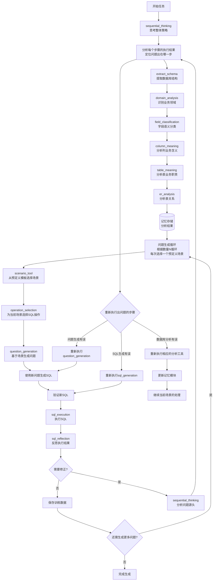

# SemanticSQL Agent 设计规范

## 1. 项目概述

### 1.1 项目定位
SemanticSQL Agent 是一个基于 ReAct 智能体架构的 **NL2SQL 训练数据生成系统**。

**核心功能**：
- 📊 **智能数据库分析**：自动提取数据库结构、识别业务领域、分析表关系
- 🎯 **场景化问题生成**：基于预定义业务场景模板，按设定数量生成自然语言问题和对应的 SQL 查询对
- ✅ **执行验证机制**：实际执行生成的 SQL，验证正确性和可行性
- 🔄 **智能反思优化**：分析执行结果，自动优化 SQL 质量和性能
- 📦 **标准化输出**：生成符合训练标准的 JSON/JSONL 格式数据集

**目标用途**：为 NL2SQL 模型训练提供高质量、大规模的合成训练数据，减少人工标注成本，提升模型在特定领域的表现。

### 1.2 核心价值
- **自动化生成**：减少人工标注成本，快速生成大量训练数据
- **高质量保证**：通过验证和反思机制确保数据质量
- **领域适应**：自动识别业务领域，生成符合领域特征的数据
- **灵活扩展**：基于工具的架构，易于添加新功能

### 1.3 设计原则
- **智能体驱动**：采用 ReAct 模式，智能体自主决策执行流程
- **模块化设计**：工具职责单一，通过智能体协调
- **简洁实用**：避免过度设计，保持代码简单高效
- **可追踪性**：完整记录执行过程，便于调试和优化

## 2. 功能规范

### 2.1 核心功能

#### 2.1.1 数据库分析（一次性执行，结果记忆）

**执行时机**：任务开始时执行一次，结果保存在Agent记忆中供全程使用

**分析工具链（按推荐执行顺序）**：
1. **extract_schema**：提取数据库物理结构
   - 表结构、列信息、数据类型
   - 主键、外键、索引信息
   - 约束条件（唯一、非空等）

2. **domain_analysis**：识别业务领域特征
   - 基于表名和字段名的语义分析
   - 识别业务实体（用户、订单、产品等）
   - 推断业务流程和关系

3. **field_classification**：字段语义分类
   - 标识符字段（ID、编码）
   - 时间戳字段（创建时间、更新时间）
   - 数值字段（金额、数量、比率）
   - 分类字段（状态、类型、级别）
   - 描述字段（名称、备注、说明）

4. **column_meaning**：列业务含义分析
   - 分析每个列在业务中的具体作用
   - 识别关键业务字段（如订单金额、用户等级）
   - 理解列值的业务规则和约束

5. **table_meaning**：表业务含义分析
   - 分析每个表的业务职责和功能
   - 识别核心业务表（如用户表、订单表）
   - 理解表在业务流程中的位置

6. **er_analysis**：实体关系分析
   - 显式关系（外键约束）
   - 隐式关系（命名规律推断）
   - 关系类型（一对一、一对多、多对多）
   - 实体重要性评估

#### 2.1.2 智能体驱动的数据生成流程

**关键设计原则**：
- **❌ 错误**：流程步骤硬编码在代码中
- **✅ 正确**：流程完全由提示词引导，Agent自主决策

**ReAct 自主决策模式**：Agent通过思考-行动-观察循环，自主决定执行策略

**完整执行流程图**：


**Agent的智能决策过程**：

1. **初始思考**：使用sequential_thinking规划整体执行策略

2. **一次性数据库分析**：
   - 执行四个分析工具，获取完整的数据库理解
   - 分析结果保存在记忆中，供全程使用
   - 这些记忆是后续所有生成步骤的基础

3. **基于预定义模板的场景生成**：
   - scenario_generation使用预定义的业务场景模板
   - 结合数据库结构生成具体场景实例
   - 每批生成N个不同类型和复杂度的场景

4. **循环处理每个场景**：
   - **操作选择**：基于预定义规则，根据场景复杂度选择SQL操作组合
   - **问题生成**：使用场景、操作和数据库记忆生成自然语言问题
   - **SQL生成**：基于问题和数据库记忆生成SQL查询
   - **验证执行**：确保SQL语法正确且可执行
   - **综合反思**：评估整个生成链的质量

5. **反思的多层次评估**：
   - **执行层**：SQL是否成功执行，结果是否合理
   - **语义层**：SQL是否准确实现了问题意图
   - **质量层**：问题和SQL的质量是否达标
   - **记忆层**：是否充分利用了数据库分析信息

6. **智能修正机制**：
   - 反思发现问题时，先用sequential_thinking深度分析
   - 根据问题根源，精准回退到相应步骤
   - 修正时仍然基于预定义规则和记忆信息
   - 每个场景独立处理，互不影响

**记忆机制**：
- **数据库分析结果必须完整记忆**：一次性分析数据库，结果贯穿整个过程
- **上下文保持**：Agent在整个执行过程中维护分析结果的记忆
- **避免重复分析**：已分析的结构信息在后续步骤中直接使用

**工具类型区分**：
- **思考工具（sequential_thinking）**：用于深度分析和推理，在需要复杂决策时调用
- **反思工具（sql_reflection）**：SQL执行后的质量评估和问题诊断

**反思-修正循环机制**：
```
数据库分析（初始执行，结果保存到记忆模块）
    ├─ extract_schema → 表结构信息 → 记忆模块
    ├─ domain_analysis → 业务领域理解 → 记忆模块
    ├─ field_classification → 字段语义分类 → 记忆模块
    ├─ column_meaning → 列业务含义 → 记忆模块
    ├─ table_meaning → 表业务职责 → 记忆模块
    └─ er_analysis → 表关系信息 → 记忆模块
            ↓
问题生成循环（基于设定数量N）
    ↓
对每次循环（从预定义场景模板中选择）：
    ↓
操作选择（基于预定义规则）
    ↓
问题生成（使用场景+操作+记忆模块）
    ↓
SQL生成（使用问题+记忆模块）
    ↓
SQL验证执行
    ↓
SQL反思分析
    ├─ 评估内容：
    │  1. SQL执行是否成功
    │  2. 执行结果是否合理
    │  3. SQL是否准确实现了问题意图
    │  4. 问题描述是否清晰准确
    │  5. 数据库分析是否有误或不足
    ↓
需要修正？
    ├─ 否 → 保存训练数据，继续下一个场景
    └─ 是 → 调用sequential_thinking分析问题根源
            ↓
      分析问题出在哪里：
            ├─ 数据库分析有误？
            │  ├─ schema理解错误 → 重新执行extract_schema
            │  ├─ 领域理解偏差 → 重新执行domain_analysis
            │  ├─ 字段分类错误 → 重新执行field_classification
            │  ├─ 列含义理解错误 → 重新执行column_meaning
            │  ├─ 表职责理解错误 → 重新执行table_meaning
            │  └─ 关系分析不足 → 重新执行er_analysis
            │           ↓
            │      更新记忆模块中对应的分析结果
            │
            ├─ 问题生成有误？
            │  └─ 重新执行question_generation（使用更新后的记忆）
            │
            └─ SQL生成有误？
               └─ 重新执行sql_generation（使用更新后的记忆）
```

**重要原则**：
1. **分析工具初始执行一次**：数据库分析工具在开始时执行，结果保存在记忆模块中
2. **分析工具可按需重新执行**：如果反思发现分析有误，可以重新执行特定的分析工具并更新记忆
3. **记忆模块动态更新**：重新执行分析工具后，记忆模块中相应的内容会被更新
4. **生成工具使用最新记忆**：问题生成和SQL生成始终使用记忆模块中的最新数据

**思考工具（sequential_thinking）调用时机**：
- **初始规划**：开始任务时，思考整体执行策略
- **复杂场景设计**：当需要设计涉及多表关联的复杂查询场景时
- **错误诊断**：当SQL执行失败且原因不明时，进行深度分析
- **优化决策**：当有多种可能的SQL实现方式时，评估最优方案
- **跨步骤决策**：当需要决定是否回退到更早的步骤时

**反思工具（sql_reflection）的综合评估**：

1. **执行结果层面**：
   - SQL是否成功执行
   - 返回数据量是否合理
   - 执行时间是否可接受
   - 结果数据是否符合业务逻辑

2. **语义匹配层面**：
   - SQL是否准确实现了问题的意图
   - 问题描述与SQL逻辑是否一致
   - 是否遗漏或多余了查询条件

3. **生成质量层面**：
   - 问题的自然语言是否清晰、无歧义
   - SQL是否符合最佳实践
   - 是否充分利用了数据库结构信息

4. **工具链合理性**：
   - 场景→操作→问题→SQL的逻辑链是否连贯
   - 操作选择是否适合当前场景的复杂度
   - 是否正确使用了数据库分析记忆

**反思工具的智能分析**：

sql_reflection 不仅评估质量，还能：
- 定位问题源头（哪个工具/步骤出错）
- 分析根本原因（为什么出错）
- 推荐修正工具（应该调用哪个工具）
- 提供参数建议（如何调用工具）

**反思后的决策流程**：
```
sql_reflection 发现问题并给出建议
    ↓
Agent 根据 recommended_action 决定：
├─ 直接调用建议的工具（简单问题）
└─ 先调用 sequential_thinking 深度分析（复杂问题）
    ↓
执行修正：
    1. 问题生成是否准确？
       - 输入：场景+操作+数据库记忆
       - 输出：自然语言问题
       - 检查：问题是否清晰、完整、无歧义
       - 检查：是否正确使用了数据库记忆
    
    2. SQL生成是否正确？
       - 输入：问题+数据库记忆
       - 输出：SQL查询
       - 检查：SQL是否准确实现问题意图
       - 检查：是否正确使用了数据库记忆
    
    3. 数据库记忆的使用情况：
       - schema_info：是否使用了正确的表名和字段名
       - field_classification：是否理解了字段的实际含义和类型
       - er_analysis：是否正确处理了表之间的关系
       - domain_analysis：是否符合业务领域的惯例
    ↓
定位问题源头步骤
    ↓
只重新执行该步骤，保持其他步骤结果不变
```

**问题源头分析示例**：

示例1 - SQL生成错误：
```python
reflection_analysis = {
    "执行错误": "Table 'orders' doesn't exist",
    "步骤分析": {
        "SQL生成": "使用了orders表，但schema中只有order_info表",
        "问题生成": "问题中提到'订单'，正确",
        "记忆检查": "memory['schema_info']中确实只有order_info表"
    },
    "问题源头": "SQL生成步骤 - 没有正确使用schema_info",
    "修正方案": "重新执行sql_generation，确保使用memory['schema_info']中的正确表名"
}
```

示例2 - 记忆使用不当：
```python
reflection_analysis = {
    "执行结果": "SQL执行成功但结果不合理",
    "步骤分析": {
        "SQL": "SELECT * FROM users WHERE status = 'active'",
        "问题": "查询所有有效用户",
        "记忆检查": {
            "field_classification": "status字段被分类为'状态码'，值为0/1",
            "domain_analysis": "该系统使用数字表示状态"
        }
    },
    "问题源头": "SQL生成时没有参考field_classification的字段类型信息",
    "修正方案": "重新执行sql_generation，使用field_classification理解status字段"
}

# 修正执行
new_sql = sql_generation(
    question="查询所有有效用户",
    schema_info=memory["schema_info"],
    field_info=memory["field_classification"]  # 确保使用字段分类信息
)
# 结果：SELECT * FROM users WHERE status = 1
```

**核心特点**：
- **动态适应**：Agent根据数据库特征调整生成策略
- **智能反思**：执行SQL后主动反思结果质量
- **自主优化**：根据反思结果自动优化或重新生成
- **完全自主**：所有决策由Agent基于提示词引导做出，无硬编码步骤

#### 2.1.3 验证与优化
- **语法验证**：检查 SQL 语法正确性
- **执行测试**：实际执行 SQL 验证可行性
- **反思优化**：分析执行结果，提供优化建议

#### 2.1.4 工具使用总结

**工具分类及使用原则**：

| 工具类别 | 工具名称 | 执行次数 | 使用时机 | 说明 |
|---------|---------|---------|---------|------|
| 分析工具 | extract_schema<br>domain_analysis<br>field_classification<br>column_meaning<br>table_meaning<br>er_analysis | 初始一次 | 任务开始时 | 结果保存在记忆中，必要时可重新执行 |
| 生成工具 | scenario_generation | 每个问题一次 | 从预定义模板选择场景 | 基于问题数量循环调用 |
| 生成工具 | operation_selection | 每场景一次 | 为每个场景选择SQL操作 | 根据场景复杂度选择 |
| 生成工具 | question_generation<br>sql_generation | 每场景多次 | 基于场景和操作生成 | 可能因反思而重新生成 |
| 验证工具 | sql_validation<br>sql_execution | 每SQL一次 | 每个SQL必须验证执行 | 确保SQL正确可执行 |
| 反思工具 | sql_reflection | 每次执行后 | SQL执行后立即反思 | 评估质量、定位问题、推荐修正工具 |
| 思考工具 | sequential_thinking | 按需 | 初始规划/修正决策 | 复杂问题深度分析 |

**记忆机制核心要点**：
1. 分析工具的输出必须保存在记忆中
2. 生成工具自动从记忆中获取所需的分析结果
3. 反思工具不会触发重新分析整个数据库
4. 只有在反思发现需要时，才会局部重新分析特定内容

**问题生成的详细流程**：

1. **基于数量的循环生成**：
```python
# 根据设定的问题数量进行循环
for i in range(question_count):
    # scenario_generation 从预定义模板中选择一个场景
    scenario = scenario_generation(
        schema_info=memory["schema_info"],  # 使用数据库分析记忆
        iteration=i  # 当前迭代次数，用于场景轮转
    )
    # 预定义场景类型包括：
    # - 基础查询场景（单表、简单条件）
    # - 统计分析场景（聚合、分组）
    # - 关联查询场景（多表JOIN）
    # - 时间序列场景（时间范围查询）
```

2. **每个循环的完整处理流程**：
```python
    # 在循环内，对当前场景进行完整处理
    # operation_selection 根据预定义规则选择操作
    operations = operation_selection(
        scenario=scenario,
        schema_info=memory["schema_info"]
    )
    # 基于场景复杂度的预定义规则：
    # - 简单场景 → ["SELECT", "WHERE"]
    # - 中等场景 → ["SELECT", "JOIN", "GROUP"]
    # - 复杂场景 → ["SELECT", "JOIN", "GROUP", "HAVING", "ORDER"]
```

3. **基于记忆的生成过程**：
```python
# 问题生成：结合场景、操作和数据库记忆
question = question_generation(
    scenario=scenario,
    operations=operations,
    schema_info=memory["schema_info"],      # 表结构
    domain_info=memory["domain_analysis"],   # 业务领域理解
    field_info=memory["field_classification"] # 字段语义
)

# SQL生成：使用问题和完整的数据库记忆
sql = sql_generation(
    question=question["text"],
    schema_info=memory["schema_info"],
    er_info=memory["er_analysis"]  # 表关系信息
)
```

4. **综合反思评估**：
```python
# 反思不仅看执行结果，还要评估整个生成链
reflection = sql_reflection(
    sql=sql,
    execution_result=execution,
    question=question,
    scenario=scenario,
    operations=operations,
    memory_usage={  # 评估是否正确使用了记忆
        "schema": memory["schema_info"],
        "domain": memory["domain_analysis"]
    }
)

# 反思可能发现的问题类型：
# - 执行错误：SQL语法错误或执行失败
# - 语义不匹配：SQL没有正确实现问题意图
# - 问题质量：问题描述不清或有歧义
# - 操作不当：选择的操作不适合场景
# - 记忆利用不足：没有充分使用数据库分析信息
```

5. **智能修正策略**：
```python
if reflection["needs_revision"]:
    # 使用思考工具深度分析
    fix_strategy = sequential_thinking(
        problem=reflection["issues"],
        context={
            "scenario": scenario,
            "operations": operations,
            "question": question,
            "sql": sql,
            "execution": execution,
            "memory": memory
        }
    )
    
    # 只修正出问题的步骤
    if fix_strategy["problem_step"] == "operations":
        # 只重新选择操作，保留场景
        new_operations = operation_selection(scenario, schema_info=memory["schema_info"])
        operations = new_operations  # 更新操作
        # 继续使用新操作执行后续步骤
        
    elif fix_strategy["problem_step"] == "question":
        # 只重新生成问题，保留场景和操作
        new_question = question_generation(
            scenario=scenario,
            operations=operations,
            schema_info=memory["schema_info"]
        )
        question = new_question  # 更新问题
        # 继续使用新问题执行后续步骤
        
    elif fix_strategy["problem_step"] == "sql":
        # 只重新生成SQL，保留前面所有步骤
        new_sql = sql_generation(
            question=question["text"],
            schema_info=memory["schema_info"]
        )
        sql = new_sql  # 更新SQL
        # 重新验证和执行新SQL
        
    elif fix_strategy["problem_step"] == "database_analysis":
        # 某个数据库分析有误，需要重新执行
        if fix_strategy["analysis_type"] == "field_classification":
            # 例如：字段分类有误导致SQL错误
            new_field_analysis = field_classification_tool.run(
                schema_info=memory["schema_info"],
                tables=fix_strategy["target_tables"]
            )
            # 更新记忆模块
            memory["field_classification"] = new_field_analysis["data"]
            
        elif fix_strategy["analysis_type"] == "column_meaning":
            # 例如：列业务含义理解错误
            new_column_meaning = column_meaning_tool.run(
                schema_info=memory["schema_info"],
                domain_info=memory["domain_analysis"],
                focus_columns=fix_strategy["target_columns"]
            )
            # 更新记忆模块
            memory["column_meanings"] = new_column_meaning["data"]
            
        elif fix_strategy["analysis_type"] == "table_meaning":
            # 例如：表业务职责理解错误
            new_table_meaning = table_meaning_tool.run(
                schema_info=memory["schema_info"],
                domain_info=memory["domain_analysis"],
                column_meanings=memory["column_meanings"],
                focus_tables=fix_strategy["target_tables"]
            )
            # 更新记忆模块
            memory["table_meanings"] = new_table_meaning["data"]
            
        elif fix_strategy["analysis_type"] == "er_analysis":
            # 例如：表关系分析不完整
            new_er_analysis = er_analysis_tool.run(
                schema_info=memory["schema_info"],
                table_meanings=memory["table_meanings"],
                focus_tables=fix_strategy["target_tables"]
            )
            # 更新记忆模块
            memory["er_analysis"] = new_er_analysis["data"]
            
        # 使用更新后的记忆重新执行后续步骤
```

**修正原则**：
- 精准定位问题源头，只修正出问题的部分
- 如果是数据库分析有误，重新执行特定的分析工具并更新记忆
- 如果是生成步骤有误，重新执行该步骤（使用最新的记忆）
- 记忆模块是动态的，可以被更新和改进
- 所有后续步骤都使用记忆模块中的最新数据

**完整的问题生成循环示例**：
```python
# 设定要生成的问题数量
question_count = 100
generated_data = []

# 主循环：生成N个问题
for i in range(question_count):
    # 1. 选择场景（从预定义模板）
    scenario = scenario_tool.run({
        "schema_info": memory["schema_info"],
        "iteration": i % len(predefined_scenarios)  # 轮转使用场景
    })
    
    # 2. 为场景选择操作
    operations = operation_selection_tool.run({
        "scenario": scenario,
        "schema_info": memory["schema_info"]
    })
    
    # 3. 生成问题
    question = question_generation_tool.run({
        "scenario": scenario,
        "operations": operations,
        "memory": memory  # 使用所有分析结果
    })
    
    # 4. 生成SQL
    sql = sql_generation_tool.run({
        "question": question,
        "memory": memory
    })
    
    # 5. 验证和执行
    validation = sql_validation_tool.run({"sql": sql})
    execution = sql_execution_tool.run({"sql": sql})
    
    # 6. 反思评估
    reflection = sql_reflection_tool.run({
        "sql": sql,
        "execution": execution,
        "question": question,
        "scenario": scenario,
        "memory_usage": memory
    })
    
    # 7. 如果需要修正，执行修正流程
    if reflection["needs_revision"]:
        # 使用 sequential_thinking 分析并修正
        # ... 修正逻辑 ...
        pass
    
    # 8. 保存生成的数据
    generated_data.append({
        "question": question,
        "sql": sql,
        "scenario": scenario,
        "validated": True
    })
    
    print(f"Progress: {i+1}/{question_count}")

# 生成完成
print(f"Successfully generated {len(generated_data)} questions")
```

### 2.2 分析工具详细说明

#### 2.2.1 列业务含义分析工具（column_meaning）

**功能定位**：
- 深入理解每个列在业务中的具体含义和作用
- 识别列的业务规则、取值范围、业务约束
- 为后续的问题生成和SQL生成提供列级别的业务理解

**输入依赖**：
- `schema_info`：基础的表结构信息
- `domain_analysis`：业务领域信息，帮助理解业务上下文
- `field_classification`：字段分类结果，了解字段的基本类型

**分析内容**：
1. **业务含义识别**：
   - 订单金额列 → 记录每笔订单的总金额，包含税费
   - 用户等级列 → 表示用户的会员等级（普通/银牌/金牌/钻石）
   - 创建时间列 → 记录数据首次创建的时间戳

2. **业务规则推断**：
   - 状态列的有效值（如：待支付/已支付/已取消/已退款）
   - 金额列的取值范围（如：必须大于0）
   - 日期列的有效范围（如：不能早于系统上线日期）

3. **列间关系理解**：
   - 订单总额 = 商品金额 + 运费 - 优惠金额
   - 更新时间必须晚于或等于创建时间

#### 2.2.2 表业务含义分析工具（table_meaning）

**功能定位**：
- 理解每个表在整个业务系统中的职责和定位
- 识别核心业务表、辅助表、字典表等不同类型
- 为场景生成提供表级别的业务理解

**输入依赖**：
- `schema_info`：基础的表结构信息
- `domain_analysis`：业务领域信息
- `column_meanings`：列的业务含义，帮助理解表的整体职责

**分析内容**：
1. **表职责识别**：
   - 用户表：存储系统所有注册用户的基本信息和状态
   - 订单表：记录所有交易订单的详细信息
   - 商品表：维护商品目录和库存信息

2. **表类型分类**：
   - 核心业务表：用户表、订单表、商品表
   - 关系表：用户收藏表、购物车表
   - 字典表：地区表、分类表、配置表
   - 日志表：操作日志表、登录日志表

3. **表在业务流程中的位置**：
   - 上游表：基础数据表（用户、商品）
   - 中游表：交易过程表（购物车、订单）
   - 下游表：结果数据表（评价、售后）

### 2.3 数据生成规范

#### 2.3.1 场景类型
- **基础查询**：单表查询、条件筛选
- **关联查询**：多表 JOIN、子查询
- **聚合统计**：GROUP BY、聚合函数
- **时间分析**：时间范围、趋势分析
- **复杂查询**：窗口函数、CTE、复杂条件

#### 2.3.2 难度分布
```yaml
difficulty_distribution:
  easy: 30%    # 基础单表查询
  medium: 20%  # 关联和聚合查询
  hard: 30%    # 复杂查询和高级特性
  expert: 20%    # 专家级别查询和高级特性
```

#### 2.3.3 质量标准
- SQL 语法必须正确
- 问题表述自然流畅
- SQL 与问题语义匹配
- 执行结果合理有效

## 3. 实现规范（基于 LangChain 框架）

### 3.1 LangChain 集成策略

#### 3.1.1 核心组件映射

**使用 LangChain 实现的组件**：
1. **Agent 框架**：
   - 使用 `langchain.agents.create_react_agent` 实现 ReAct 模式
   - 使用 `AgentExecutor` 管理执行流程
   - 利用 LangChain 的工具调用机制

2. **记忆管理**：
   - 基于 `langchain.memory.BaseMemory` 实现自定义记忆
   - 可选使用 `ConversationSummaryMemory` 存储摘要
   - 支持 `VectorStoreMemory` 进行相似性检索

3. **LLM 调用**：
   - 使用 `langchain.chat_models.ChatOpenAI` 连接 Qwen
   - 自动的重试和错误处理
   - 支持流式输出（如需要）

4. **工具系统**：
   - 继承 `langchain.tools.BaseTool`
   - 自动的参数验证和序列化
   - 与 Agent 的无缝集成

5. **提示词管理**：
   - 使用 `langchain.prompts` 模块
   - 结构化的提示词模板
   - 支持 Few-shot 学习

6. **回调系统**：
   - 基于 `langchain.callbacks`
   - 自动的执行跟踪
   - 支持自定义回调

### 3.2 Agent实现规范

#### 3.2.1 DataGenerationAgent设计要求

**核心实现原则**：
```python
# ✅ 正确实现：基于 LangChain 的提示词驱动 Agent
from langchain.agents import create_react_agent, AgentExecutor
from langchain.memory import BaseMemory
from langchain.chat_models import ChatOpenAI

class DataGenerationAgent(BaseAgent):
    """
    基于 LangChain 的训练数据生成 Agent
    - 使用 LangChain AgentExecutor 管理执行流程
    - 自定义 DatabaseAnalysisMemory 存储分析结果
    - 所有工具继承自 langchain.tools.BaseTool
    - 利用 LangChain 回调系统记录轨迹
    """
    
    def _initialize_langchain_tools(self):
        """创建 LangChain 工具列表"""
        # 所有工具都继承自 langchain.tools.BaseTool
        tools = [
            # 分析工具
            SchemaExtractionTool(),
            DomainAnalysisTool(),
            FieldClassificationTool(),
            ColumnMeaningTool(),      # 新增
            TableMeaningTool(),       # 新增
            ERAnalysisTool(),
            
            # 生成工具
            ScenarioGenerationTool(),
            OperationSelectionTool(),
            QuestionGenerationTool(),
            SQLGenerationTool(),
            
            # 验证和反思工具
            SQLValidationTool(),
            SQLExecutionTool(),
            SQLReflectionTool(),
            SequentialThinkingTool()
        ]
        return tools
    
    def __init__(self, config):
        """初始化 LangChain 组件"""
        # LLM
        self.llm = ChatOpenAI(
            openai_api_base=config.llm_base_url,
            model_name=config.llm_model,
            temperature=0.7
        )
        
        # Memory
        self.memory = DatabaseAnalysisMemory()
        
        # Tools
        self.tools = self._initialize_langchain_tools()
        
        # Agent
        prompt = self._get_react_prompt()
        self.agent = create_react_agent(self.llm, self.tools, prompt)
        
        # Executor
        self.agent_executor = AgentExecutor(
            agent=self.agent,
            tools=self.tools,
            memory=self.memory,
            verbose=True,
            callbacks=[TrajectoryCallback()]
        )
    
    def generate_training_data(self, count: int, output_file: str):
        """
        ✅ 正确：使用 LangChain AgentExecutor 执行任务
        """
        task = f"生成{count}条高质量NL2SQL训练数据"
        
        # 通过 AgentExecutor 运行
        result = self.agent_executor.run(input=task)
        return self._extract_results(result)
    
    def get_system_prompt(self) -> str:
        """
        关键：提示词必须引导Agent执行完整流程
        包含：
        1. 数据库完整分析并记忆
        2. SQL执行后反思
        3. 反思发现问题时回退修正
        4. 思考工具使用时机
        """
        return comprehensive_prompt_template()
```

**❌ 错误实现：硬编码流程**
```python
# 不要这样做 - 违反Agent自主决策原则
def generate_training_data(self):
    schema = self.call_tool('extract_schema')    # 硬编码顺序
    domain = self.call_tool('domain_analysis')   # 硬编码顺序
    # ... 更多硬编码步骤
```

#### 3.2.2 提示词系统设计（LangChain PromptTemplate）

**完整系统提示词必须包含**：
1. **数据库分析指导**：如何完整分析并记忆数据库结构
2. **生成流程指导**：如何基于分析结果生成数据
3. **执行验证指导**：如何执行SQL并获取反馈
4. **反思修正指导**：如何根据执行结果决定是否回退
5. **思考工具指导**：何时调用sequential_thinking进行深度分析

**使用 LangChain PromptTemplate**：
```python
from langchain.prompts import ChatPromptTemplate, SystemMessagePromptTemplate

# 系统提示词模板
system_prompt = SystemMessagePromptTemplate.from_template("""
你是一个专业的SQL训练数据生成专家。你的任务是生成高质量的NL2SQL训练数据。

工作流程：
1. 首先分析数据库（按顺序）：
   - extract_schema：提取表结构
   - domain_analysis：识别业务领域
   - field_classification：字段分类
   - column_meaning：分析列含义
   - table_meaning：分析表职责
   - er_analysis：分析表关系
   
2. 基于分析结果生成数据：
   - scenario_generation：选择场景（每次从预定义模板选一个）
   - 对每个场景：
     - operation_selection：选择SQL操作
     - question_generation：生成问题
     - sql_generation：生成SQL
     - sql_validation：验证语法
     - sql_execution：执行测试
     - sql_reflection：反思质量

3. 反思后的处理：
   - 如果质量不达标，使用sequential_thinking分析问题
   - 精确定位问题步骤并重新执行

记住：数据库分析结果要保存在记忆中，后续步骤直接使用记忆！

当前数据库：{database_name}
已分析的信息：{memory_summary}
""")

# 创建完整的提示词
prompt = ChatPromptTemplate.from_messages([
    system_prompt,
    ("user", "{input}"),
    ("assistant", "{agent_scratchpad}")
])
```

**记忆机制实现（LangChain Memory）**：
```python
from langchain.memory import BaseMemory

class DatabaseAnalysisMemory(BaseMemory):
    """专门管理数据库分析结果的记忆"""
    
    def __init__(self):
        self.analysis_results = {
            "schema_info": None,
            "domain_analysis": None,
            "field_classification": None,
            "column_meanings": None,
            "table_meanings": None,
            "er_analysis": None
        }
    
    @property
    def memory_variables(self) -> List[str]:
        return ["memory_summary", "schema_info", "domain_info"]
    
    def load_memory_variables(self, inputs: Dict[str, Any]) -> Dict[str, Any]:
        """加载相关的分析结果供Agent使用"""
        return {
            "memory_summary": self._get_summary(),
            "schema_info": self.analysis_results.get("schema_info", {}),
            "domain_info": self.analysis_results.get("domain_analysis", {})
        }
    
    def save_context(self, inputs: Dict[str, Any], outputs: Dict[str, Any]) -> None:
        """保存工具执行结果到记忆"""
        # 识别是哪个分析工具的输出
        if "schema_extraction" in str(outputs):
            self.analysis_results["schema_info"] = outputs
        # ... 其他工具的保存逻辑
```

#### 3.2.3 反思-修正循环实现（基于 LangChain）

**记忆管理策略**：
```python
class AgentMemory:
    """Agent记忆管理"""
    def __init__(self):
        self.analysis_memory = {  # 分析结果记忆（只保存一份）
            "schema_info": None,
            "domain_analysis": None,
            "field_classification": None,
            "er_analysis": None
        }
        self.generation_memory = []  # 生成历史（可多份）
        self.current_context = {}    # 当前执行上下文
```

**执行后反思决策流程**：
```
SQL执行完成
    ↓
sql_reflection工具分析
    ├─ 评估维度：
    │  ├─ SQL语法正确性
    │  ├─ 执行时间合理性
    │  ├─ 返回结果数量
    │  ├─ 数据逻辑合理性
    │  └─ 问题与SQL匹配度
    ↓
生成反思报告
    ├─ quality_score: 0-100分
    ├─ issues: [问题列表]
    ├─ suggestions: [改进建议]
    └─ needs_revision: true/false
    ↓
Agent根据反思报告决策
    ├─ needs_revision = false → 保存数据，继续下一个
    └─ needs_revision = true → 调用sequential_thinking分析修正策略
                                    ↓
                              确定修正目标
                                    ├─ 场景设计问题 → 回到scenario_generation
                                    ├─ 问题表述不清 → 回到question_generation  
                                    ├─ SQL生成错误 → 回到sql_generation
                                    └─ 需要调整分析 → 重新分析特定表（局部）
```

**关键实现细节**：

1. **分析工具的记忆保持**：
```python
# 第一次执行分析工具时
if tool_name == "extract_schema" and result["success"]:
    self.memory.analysis_memory["schema_info"] = result["data"]
    
# 后续工具自动注入记忆
if tool_name == "sql_generation":
    tool_input["schema_info"] = self.memory.analysis_memory["schema_info"]
```

2. **反思工具的精准分析**：
```python
# sql_reflection只分析当前SQL
reflection_input = {
    "sql": current_sql,
    "execution_result": execution_result,
    "question": current_question,
    "schema_context": self.memory.analysis_memory["schema_info"]
}
```

3. **思考工具的决策支持**：
```python
# sequential_thinking用于复杂决策
thinking_input = {
    "problem": "SQL执行失败，需要分析原因",
    "context": {
        "error": execution_error,
        "sql": failed_sql,
        "schema": relevant_schema,
        "history": recent_attempts
    },
    "thinking_steps": ["分析错误类型", "定位问题根源", "制定修正方案"]
}
```

## 4. 接口规范

### 4.1 工具接口（基于 LangChain）

```python
from langchain.tools import BaseTool as LangChainBaseTool
from langchain.pydantic_v1 import BaseModel, Field

class BaseTool(LangChainBaseTool):
    """继承 LangChain 的工具基类"""
    
    @property
    @abstractmethod
    def name(self) -> str:
        """工具唯一标识，用于注册和调用"""
        pass
    
    @property
    @abstractmethod
    def description(self) -> str:
        """工具功能描述，用于 LLM 理解"""
        pass
    
    @abstractmethod
    def run(self, **kwargs) -> Dict[str, Any]:
        """
        工具执行接口
        
        返回格式：
        {
            "success": bool,      # 执行是否成功
            "data": Any,         # 成功时的返回数据
            "error": str,        # 失败时的错误信息
            "metadata": dict     # 可选的元数据
        }
        """
        pass

# 示例：基于 LangChain 的工具实现
class SchemaExtractionTool(BaseTool):
    """数据库结构提取工具"""
    name = "extract_schema"
    description = "提取数据库的表结构、列信息、约束等"
    
    # 定义输入参数
    class InputSchema(BaseModel):
        database_name: str = Field(description="要分析的数据库名称")
    
    args_schema = InputSchema
    
    def _run(self, database_name: str) -> dict:
        """同步执行"""
        # 连接数据库
        # 提取结构信息
        # 返回结果
        return {
            "tables": [...],
            "columns": [...],
            "constraints": [...]
        }
    
    async def _arun(self, database_name: str) -> dict:
        """异步执行（可选）"""
        # 异步实现
        pass
```

### 4.2 智能体接口

```python
class BaseAgent(ABC):
    """智能体基类接口规范"""
    
    @abstractmethod
    def run(self, task: str, context: Dict = None) -> AgentExecution:
        """执行任务"""
        pass
    
    @abstractmethod
    def get_system_prompt(self) -> str:
        """获取系统提示词"""
        pass
    
    def register_tool(self, tool: BaseTool) -> None:
        """注册工具"""
        pass
```

### 4.3 命令行接口

```bash
# 基础生成命令
semanticsql-agent generate [OPTIONS]

Options:
  --config PATH           配置文件路径
  --count INTEGER        生成数据条数 [default: 100]
  --db-type TEXT         数据库类型 [mysql]
  --host TEXT            数据库主机
  --port INTEGER         数据库端口
  --database TEXT        数据库名称
  --username TEXT        用户名
  --password TEXT        密码
  --output PATH          输出文件路径
  --format TEXT          输出格式 [json|jsonl|csv]
  --verbose              详细输出
  --help                 显示帮助信息

# 其他命令
semanticsql-agent test-connection  # 测试数据库连接
semanticsql-agent init            # 初始化配置
semanticsql-agent version         # 显示版本信息
```

## 4. 数据模型规范

### 4.1 核心数据结构

#### 4.1.1 执行记录
```python
@dataclass
class AgentStep:
    """单个执行步骤"""
    step_type: AgentStepType  # thought/action/observation
    content: str              # 步骤内容
    timestamp: datetime       # 时间戳
    tool_name: Optional[str]  # 使用的工具
    tool_output: Optional[Any]  # 工具输出
    error: Optional[str]      # 错误信息

@dataclass
class AgentExecution:
    """完整执行记录"""
    task_id: str              # 任务ID
    task: str                 # 任务描述
    started_at: datetime      # 开始时间
    completed_at: Optional[datetime]  # 结束时间
    steps: List[AgentStep]    # 执行步骤
    final_result: Optional[Any]  # 最终结果
    status: str               # running/completed/failed
    error: Optional[str]      # 错误信息
```

#### 4.1.2 生成数据
```python
@dataclass
class QueryScenario:
    """查询场景"""
    id: str
    category: str            # 场景类别
    business_purpose: str    # 业务目的
    complexity: str          # easy/medium/hard
    applicable_tables: List[str]

@dataclass
class GeneratedExample:
    """生成的训练样本"""
    id: str
    scenario_id: str
    question: str            # 自然语言问题
    sql: str                # SQL 查询
    difficulty: str          # 难度级别
    validation_result: Dict  # 验证结果
    execution_result: Dict   # 执行结果
    quality_score: float     # 质量分数
```

### 4.2 配置规范

```yaml
# 完整配置示例
database:
  type: mysql              # 数据库类型
  host: localhost         
  port: 3306              
  username: root          
  password: ${DB_PASSWORD}  # 支持环境变量
  database: shop_db       
  
llm:
  model: Qwen3-14B        # 模型名称
  base_url: http://192.168.200.216:9991/v1
  api_key: ${DASHSCOPE_API_KEY}
  temperature: 0.7        # 生成温度
  max_tokens: 4096        # 最大token数
  
agent:
  max_steps: 30           # 最大执行步骤
  enable_reflection: true # 启用反思
  verbose: true           # 详细日志
  
generation:
  scenarios_per_batch: 10      # 每批场景数
  questions_per_scenario: 5    # 每场景问题数
  sql_complexity_weights:      # SQL复杂度权重
    simple: 0.3
    medium: 0.5
    complex: 0.2
    
output:
  directory: ./output     # 输出目录
  format: json           # 默认格式
  save_intermediate: false  # 是否保存中间结果
```

## 5. 错误处理规范

### 5.1 错误分类
- **配置错误**：配置文件缺失、格式错误、必需参数缺失
- **连接错误**：数据库连接失败、LLM API 连接失败
- **执行错误**：工具执行失败、SQL 执行错误
- **验证错误**：SQL 语法错误、数据验证失败
- **系统错误**：内存不足、权限问题

### 5.2 错误处理策略
```python
# 工具级错误处理
def run(self, **kwargs) -> Dict[str, Any]:
    try:
        # 执行逻辑
        result = self._execute(**kwargs)
        return {
            "success": True,
            "data": result
        }
    except ValidationError as e:
        return {
            "success": False,
            "error": f"参数验证失败: {e}",
            "error_type": "validation"
        }
    except Exception as e:
        self.logger.error(f"工具执行失败: {e}", exc_info=True)
        return {
            "success": False,
            "error": str(e),
            "error_type": "execution"
        }

# Agent 级错误恢复
def _execute_with_retry(self, action: Dict, max_retries: int = 3):
    """带重试的执行"""
    for attempt in range(max_retries):
        try:
            return self._execute_tool(action)
        except Exception as e:
            if attempt == max_retries - 1:
                raise
            self.logger.warning(f"执行失败，重试 {attempt + 1}/{max_retries}")
            time.sleep(2 ** attempt)  # 指数退避
```

## 6. 日志规范

### 6.1 日志级别
- **DEBUG**：详细的调试信息，包括 LLM 交互
- **INFO**：正常的执行流程信息
- **WARNING**：警告信息，如重试、降级
- **ERROR**：错误信息，但不影响继续执行
- **CRITICAL**：严重错误，导致程序终止

### 6.2 日志格式
```python
# 日志配置
LOGGING_CONFIG = {
    'version': 1,
    'disable_existing_loggers': False,
    'formatters': {
        'standard': {
            'format': '%(asctime)s [%(levelname)s] %(name)s: %(message)s',
            'datefmt': '%Y-%m-%d %H:%M:%S'
        },
        'detailed': {
            'format': '%(asctime)s [%(levelname)s] %(name)s.%(funcName)s:%(lineno)d - %(message)s'
        }
    },
    'handlers': {
        'console': {
            'class': 'logging.StreamHandler',
            'formatter': 'standard',
            'stream': 'ext://sys.stdout'
        },
        'file': {
            'class': 'logging.handlers.RotatingFileHandler',
            'formatter': 'detailed',
            'filename': 'semanticsql-agent.log',
            'maxBytes': 10485760,  # 10MB
            'backupCount': 5
        }
    },
    'root': {
        'level': 'INFO',
        'handlers': ['console', 'file']
    }
}
```

## 7. 文档规范

### 7.1 代码文档
- 所有公共接口必须有 docstring
- 复杂逻辑添加行内注释
- 示例代码保持可运行

### 7.2 用户文档
- README.md：项目介绍和快速开始
- INSTALL.md：详细安装指南
- USAGE.md：使用教程
- API.md：API 参考

### 7.3 开发文档
- CONTRIBUTING.md：贡献指南
- DEVELOPMENT.md：开发环境搭建
- ARCHITECTURE.md：架构设计
- DESIGN.md：设计决策