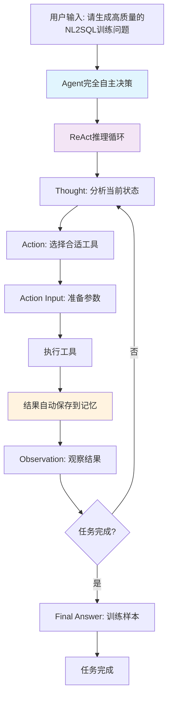

# SemanticSQL Agent 设计规范

## 1. 项目概述

### 1.1 项目定位
SemanticSQL Agent 是一个基于 ReAct 智能体架构的 **NL2SQL 训练数据生成系统**。

**核心功能**：
- 📊 **智能数据库分析**：自动提取数据库结构、识别业务领域、分析表关系
- 🎯 **场景化问题生成**：基于预定义业务场景模板，按设定数量生成自然语言问题和对应的 SQL 查询对
- ✅ **执行验证机制**：实际执行生成的 SQL，验证正确性和可行性
- 🔄 **智能反思优化**：分析执行结果，自动优化 SQL 质量和性能
- 📦 **标准化输出**：生成符合训练标准的 JSON/JSONL 格式数据集

**目标用途**：为 NL2SQL 模型训练提供高质量、大规模的合成训练数据，减少人工标注成本，提升模型在特定领域的表现。

### 1.2 核心价值
- **自动化生成**：减少人工标注成本，快速生成大量训练数据
- **高质量保证**：通过验证和反思机制确保数据质量
- **领域适应**：自动识别业务领域，生成符合领域特征的数据
- **灵活扩展**：基于工具的架构，易于添加新功能

### 1.3 设计原则
- **智能体驱动**：采用 ReAct 模式，智能体自主决策执行流程
- **模块化设计**：工具职责单一，通过智能体协调
- **简洁实用**：避免过度设计，保持代码简单高效
- **可追踪性**：完整记录执行过程，便于调试和优化

## 2. 功能规范

### 2.1 核心功能

#### 2.1.1 数据库分析（一次性执行，结果记忆）

**执行时机**：任务开始时执行一次，结果保存在Agent记忆中供全程使用

**分析工具链（按推荐执行顺序）**：
1. **extract_schema**：提取数据库物理结构
   - 表结构、列信息、数据类型
   - 主键、外键、索引信息
   - 约束条件（唯一、非空等）

2. **domain_analysis**：识别业务领域特征
   - 基于表名和字段名的语义分析
   - 识别业务实体（用户、订单、产品等）
   - 推断业务流程和关系

3. **field_classification**：字段语义分类
   - 标识符字段（ID、编码）
   - 时间戳字段（创建时间、更新时间）
   - 数值字段（金额、数量、比率）
   - 分类字段（状态、类型、级别）
   - 描述字段（名称、备注、说明）

4. **column_meaning**：列业务含义分析
   - 分析每个列在业务中的具体作用
   - 识别关键业务字段（如订单金额、用户等级）
   - 理解列值的业务规则和约束

5. **table_meaning**：表业务含义分析
   - 分析每个表的业务职责和功能
   - 识别核心业务表（如用户表、订单表）
   - 理解表在业务流程中的位置

6. **er_analysis**：实体关系分析
   - 显式关系（外键约束）
   - 隐式关系（命名规律推断）
   - 关系类型（一对一、一对多、多对多）
   - 实体重要性评估

#### 2.1.2 基于纯ReAct模式的数据生成流程

**核心设计原则**：
- **完全Agent自主**：无外部循环控制，Agent根据任务自主决策所有执行流程
- **记忆驱动协作**：工具调用结果自动保存到记忆，后续工具自动从记忆中获取信息
- **提示词引导**：通过提示词提供思考流程指导，但Agent有完全的自主决策权
- **工具内部批处理**：复杂的遍历逻辑封装在工具内部，Agent只需调用工具获取结果

**真正的ReAct自主决策模式**：Agent接收简单任务输入，通过思考-行动-观察循环，完全自主决定执行策略和工具调用顺序

**极简的执行架构图**：


**极简的Agent决策模式**：

Agent接收到"请生成高质量的NL2SQL训练问题"的任务后，完全自主决策执行流程：

1. **自主分析**：检查记忆状态，按需调用数据库分析工具
2. **获取方案**：调用 `scenario_operation_generation` 获取场景和操作方案
3. **方案记忆**：工具返回的方案自动保存到记忆中
4. **问题生成**：调用 `question_generation`，工具自动从记忆中读取场景信息
5. **SQL生成**：调用 `sql_generation`，工具自动从记忆中读取问题和场景信息
6. **验证反思**：验证SQL正确性，执行测试，反思质量
7. **自主修正**：如果质量不佳，基于反思建议自主选择修正策略

**关键特点**：
- **无外部控制**：没有任何外部循环或数量控制逻辑
- **记忆驱动**：工具之间通过记忆自动协作，无需手动传参
- **完全自主**：Agent根据任务需求自主决定所有工具调用
- **质量导向**：专注于单个样本的高质量生成，包含完整的反思修正机制

**记忆驱动机制**：
- **工具结果自动保存**：每个工具的调用结果通过 `save_context()` 自动保存到 `utils/memory.py` 的 `DatabaseAnalysisMemory.memories` 字典中
- **智能键映射**：工具名称自动映射到记忆键，参考实际实现：
  - `schema_extraction` → `memories["schema_info"]`
  - `domain_analysis` → `memories["domain_info"]`
  - `field_analysis` → `memories["field_classification"]`
  - `column_analysis` → `memories["column_meanings"]`
  - `table_analysis` → `memories["table_meanings"]`
  - `er_analysis` → `memories["er_relations"]`
- **工具间自动协作**：后续工具通过 `load_memory_variables()` 自动从 `memories` 字典中读取所需信息
- **Agent无需传参**：Agent只需调用工具，工具间的数据传递完全通过 `DatabaseAnalysisMemory` 自动完成

### **完整的Agent自主执行示例**

```
用户输入: "请生成高质量的NL2SQL训练问题"
    ↓
Thought: 我需要生成训练问题，先检查是否了解数据库
Action: schema_extraction
Observation: 数据库结构信息 → 自动保存到 memories["schema_info"]
    ↓
Thought: 需要理解业务领域
Action: domain_analysis  
Observation: 电商领域信息 → 自动保存到 memories["domain_info"]
    ↓
Thought: 现在获取场景和操作方案
Action: scenario_operation_generation
Action Input: {"mode": "get_single_combination"}
Observation: {
    "scenario": {"name": "销售分析", "complexity": "moderate"},
    "operations": ["SELECT", "GROUP BY", "HAVING"]
} → 自动保存到 memories["scenario_operation"]
    ↓
Thought: 我有了场景方案，现在生成具体问题
Action: question_generation
Action Input: {}  # 工具自动从 memories["scenario_operation"] 读取场景信息
Observation: "统计每月销售总额" → 自动保存到 memories["question"]
    ↓
Thought: 生成对应的SQL
Action: sql_generation
Action Input: {}  # 工具自动从 memories["question"] 和 memories["schema_info"] 读取信息
Observation: "SELECT MONTH(order_date), SUM(amount) FROM orders GROUP BY MONTH(order_date)"
    ↓
Thought: 验证SQL语法
Action: sql_validation
Observation: 语法正确
    ↓
Thought: 执行SQL测试
Action: sql_execution
Observation: 成功返回12条记录
    ↓
Thought: 反思生成质量
Action: sql_reflection
Observation: {"quality_score": 0.85, "needs_revision": false}
    ↓
Thought: 质量良好，训练样本生成完成
Final Answer: {"question": "统计每月销售总额", "sql": "SELECT...", "quality_score": 0.85}
```

**工具类型区分**：
- **分析工具**：提取和分析数据库信息，结果保存到记忆供后续使用
- **生成工具**：基于记忆中的信息生成场景、问题、SQL等内容
- **验证工具**：验证SQL语法和执行结果
- **反思工具**：评估生成质量，提供简单的修正建议
- **思考工具**：用于复杂问题的深度分析

**极简的执行机制**：

```python
# 完全Agent自主驱动，无外部循环控制
class SQLAgent:
    def generate_training_data(self):
        """完全由Agent自主驱动的训练数据生成"""
        
        # 极简任务输入
        task = "请生成高质量的NL2SQL训练问题"
        
        # 完全交给Agent自主决策
        result = self.agent_executor.invoke({
            "input": task,
            "database_name": self.db_config.database
        })
        
        return self._extract_samples(result)
```

### **核心设计优势**

1. **架构极简**：
   - 用户只需调用一个方法：`agent.generate_training_data()`
   - 无任何外部循环或数量控制逻辑
   - Agent完全自主决策执行流程

2. **记忆驱动**：
   - 工具调用结果自动保存到记忆
   - 后续工具自动从记忆读取信息
   - 无需手动传递参数

3. **真正ReAct**：
   - Agent根据任务自主选择工具调用顺序
   - 基于工具输出自主决定下一步行动
   - 完全符合ReAct的自主决策原则

**Agent内部的自主推理示例**：
```
用户: "请生成高质量的NL2SQL训练问题"

Thought: 需要生成训练样本。先检查是否了解数据库。
Action: 检查记忆状态，必要时调用schema_extraction
Observation: 获得数据库结构信息

Thought: 需要获取场景和操作方案
Action: scenario_operation_generation
Action Input: {"mode": "get_single_combination"}
Observation: {
    "scenario": {"name": "销售分析", "complexity": "moderate"},
    "operations": ["SELECT", "GROUP BY", "HAVING"]
}

Thought: 基于场景和操作生成问题。
Action: question_generation  
Observation: "统计每月销售总额"

Thought: 将问题转换为SQL。
Action: sql_generation
Observation: "SELECT MONTH(order_date), SUM(amount) FROM orders GROUP BY MONTH(order_date)"

Thought: 验证SQL并执行测试。
Action: sql_validation -> sql_execution
Observation: 执行成功，返回12行数据

Thought: 评估生成质量。
Action: sql_reflection
Observation: 质量良好，无需修正

Thought: 样本生成完成。
Final Answer: {"question": "统计每月销售总额", "sql": "SELECT...", "quality_score": 0.85}
```

**新的设计原则**：
1. **Agent完全自主**：没有外部的阶段控制，Agent根据需求自主选择工具
2. **记忆自动管理**：分析结果自动保存和加载，跨样本共享
3. **按需分析**：只有缺少必要信息时才执行分析工具
4. **提示词引导**：通过提示词提供思考流程建议，但不强制执行

**思考工具（sequential_thinking）调用时机**：
- **初始规划**：开始任务时，思考整体执行策略
- **复杂场景设计**：当需要设计涉及多表关联的复杂查询场景时
- **错误诊断**：当SQL执行失败且原因不明时，进行深度分析
- **优化决策**：当有多种可能的SQL实现方式时，评估最优方案
- **跨步骤决策**：当需要决定是否回退到更早的步骤时

**反思工具（sql_reflection）的综合评估**：

1. **执行结果层面**：
   - SQL是否成功执行
   - 返回数据量是否合理
   - 执行时间是否可接受
   - 结果数据是否符合业务逻辑

2. **语义匹配层面**：
   - SQL是否准确实现了问题的意图
   - 问题描述与SQL逻辑是否一致
   - 是否遗漏或多余了查询条件

3. **生成质量层面**：
   - 问题的自然语言是否清晰、无歧义
   - SQL是否符合最佳实践
   - 是否充分利用了数据库结构信息

4. **记忆使用的正确性**：
   - 是否正确使用了数据库分析记忆
   - 领域理解是否准确
   - 表关系是否正确识别
   - 字段含义是否理解正确

**反思工具的智能分析**：

sql_reflection 基于SQL执行结果，能够：
- 定位问题源头（数据库分析、问题生成、SQL生成）
- 分析根本原因（为什么出错）
- 推荐修正工具（重新分析或重新生成）
- 提供参数建议（如何调用工具）

**注意**：场景和操作选择是预定义的，不会被修正

**反思后的决策流程**：
```
sql_reflection 发现问题并给出建议
    ↓
Agent 根据 recommended_action 决定：
├─ 直接调用建议的工具（简单问题）
└─ 先调用 sequential_thinking 深度分析（复杂问题）
    ↓
执行修正：
    1. 问题生成是否准确？
       - 输入：场景+操作+数据库记忆
       - 输出：自然语言问题
       - 检查：问题是否清晰、完整、无歧义
       - 检查：是否正确使用了数据库记忆
    
    2. SQL生成是否正确？
       - 输入：问题+数据库记忆
       - 输出：SQL查询
       - 检查：SQL是否准确实现问题意图
       - 检查：是否正确使用了数据库记忆
    
    3. 数据库记忆的使用情况：
       - schema_info：是否使用了正确的表名和字段名
       - field_analysis：是否理解了字段的实际含义和类型
       - column_analysis：是否正确理解了列的业务含义
       - table_analysis：是否正确理解了表的业务职责
       - er_analysis：是否正确处理了表之间的关系
       - domain_analysis：是否符合业务领域的惯例
    ↓
定位问题源头步骤
    ↓
只重新执行该步骤，保持其他步骤结果不变
```

**反思工具返回格式示例**：

示例1 - SQL生成错误：
```python
reflection_analysis = {
    "quality_score": 0.3,  # 质量分数
    "needs_revision": True,  # 是否需要修正
    
    # 问题分析
    "issue_analysis": {
        "execution_error": "Table 'orders' doesn't exist",
        "error_type": "schema_mismatch",
        "step_analysis": {
            "sql_generation": "使用了orders表，但schema中只有order_info表",
            "question_generation": "问题中提到'订单'，正确",
            "memory_usage": "tool_results['schema_extraction']中确实只有order_info表"
        },
        "root_cause": "SQL生成步骤没有正确使用schema信息"
    },
    
    # 简单的修正建议
    "suggested_tool": "sql_generation",  # 建议调用的工具
    "suggestion": "重新生成SQL，使用正确的表名order_info"
}
```

示例2 - 记忆使用不当：
```python
reflection_analysis = {
    "quality_score": 0.4,
    "needs_revision": True,
    
    "issue_analysis": {
        "execution_result": "SQL执行成功但结果不合理",
        "error_type": "semantic_mismatch",
        "step_analysis": {
            "sql_generation": "生成了 WHERE status = 'active'，但字段实际是数字类型",
            "question_generation": "问题'查询所有有效用户'正确",
            "memory_usage": "没有正确使用 tool_results['field_analysis'] 中的字段类型信息"
        },
        "root_cause": "SQL生成时没有参考字段分析结果"
    },
    
    # 简单的修正建议
    "suggested_tool": "sql_generation",  # 建议调用的工具
    "suggestion": "重新生成SQL，status字段使用数字1表示active状态"
}
```

### **🎯 Agent使用简化反思格式的流程**

```
Thought: SQL执行失败了，我需要反思分析原因
Action: sql_reflection
Action Input: {"sql": "SELECT * FROM orders", "execution_result": {...}}
Observation: {
    "quality_score": 0.3,
    "needs_revision": True,
    "suggested_tool": "sql_generation",
    "suggestion": "重新生成SQL，使用正确的表名order_info"
}
    ↓
Thought: 反思建议我重新调用sql_generation，使用正确的表名。这很合理。
Action: sql_generation
Action Input: {"question": "查询所有订单信息", "focus": "使用order_info表"}
Observation: "SELECT * FROM order_info"  # 修正后的SQL
    ↓
Thought: 现在重新验证修正后的SQL
Action: sql_validation
Observation: 语法正确，修正成功
```

### **🔧 简化反思格式的优势**

1. **简单实用**：
   - 只有4个关键字段：`quality_score`, `needs_revision`, `suggested_tool`, `suggestion`
   - Agent容易理解和使用
   - 无复杂的嵌套结构

2. **Agent友好**：
   - Agent可以选择接受建议或自主决策
   - 建议只是参考，不强制执行
   - 保持了Agent的完全自主性

### **📋 最终简化的反思工具格式**

```python
# 极简的反思工具返回格式
{
    "quality_score": 0.3,              # 质量分数 0-1
    "needs_revision": True,             # 是否需要修正
    "suggested_tool": "sql_generation", # 建议的工具（可选）
    "suggestion": "重新生成SQL，使用正确的表名"  # 简单的文字建议
}
```

**关键设计原则**：
- **极简结构**：只有4个字段，易于理解
- **建议性质**：Agent可以接受建议或自主决策
- **无强制性**：不包含复杂的参数或强制执行逻辑
- **Agent自主**：Agent根据建议自主决定如何调用工具

**核心特点**：
- **动态适应**：Agent根据数据库特征调整生成策略
- **智能反思**：执行SQL后主动反思结果质量
- **自主优化**：根据反思结果自动优化或重新生成
- **可操作建议**：反思工具提供简单的修正建议
- **完全自主**：所有决策由Agent基于提示词引导做出，无硬编码步骤

#### 2.1.3 验证与优化
- **语法验证**：检查 SQL 语法正确性
- **执行测试**：实际执行 SQL 验证可行性
- **反思优化**：分析执行结果，提供优化建议

#### 2.1.4 简化的工具使用规范

**统一的工具访问原则**：
- Agent拥有所有工具的访问权限，无外部限制
- 根据任务需求和当前状态自主选择工具
- 记忆系统自动管理分析结果的保存和加载

**工具分类及特点**：

| 工具类别 | 工具名称 | 主要特点 | Agent使用策略 |
|---------|---------|---------|-------------|
| 分析工具 | schema_extraction<br>domain_analysis<br>field_analysis<br>column_analysis<br>table_analysis<br>er_analysis | 结果保存在记忆中<br>可重复执行更新记忆 | 按需调用，优先检查记忆 |
| 生成工具 | scenario_operation_generation<br>question_generation<br>sql_generation | 基于记忆和上下文生成内容 | 每个样本都需要调用 |
| 验证工具 | sql_validation<br>sql_execution | 确保SQL正确性和可执行性 | 生成SQL后必须验证 |
| 反思工具 | sql_reflection | 评估质量，提供修正建议 | 执行后自主决定是否反思 |
| 思考工具 | sequential_thinking | 深度分析复杂问题 | 遇到复杂情况时自主调用 |

**记忆机制简化要点**：
1. 所有分析结果自动保存在记忆中
2. Agent自动从记忆中获取所需信息
3. 记忆内容可以动态更新
4. 跨样本自动共享分析结果

**工具使用的核心原则**：

Agent通过提示词指导，自主决策工具的使用时机和顺序：

```python
# 极简的Agent架构（完全自主驱动）
class SQLAgent:
    def generate_training_data(self):
        """完全由Agent自主驱动的训练数据生成"""
        
        # 极简的任务输入，无任何循环控制
        task = "请生成高质量的NL2SQL训练问题"
        
        # 完全交给Agent自主决策
        result = self.agent_executor.invoke({
            "input": task,
            "database_name": self.db_config.database
        })
        
        return self._extract_samples(result)
```

**Agent内部的完全自主流程**：
```
用户: "请生成高质量的NL2SQL训练问题"
    ↓
Thought: 我需要生成训练问题，先获取场景和操作方案
Action: scenario_operation_generation
Action Input: {"mode": "get_scenario_and_operations"}
Observation: {
    "scenario": {"name": "销售分析", "complexity": "moderate"},
    "operations": ["SELECT", "GROUP BY", "HAVING"]
} → 自动保存到记忆 tool_results["scenario_operation_generation"]
    ↓
Thought: 我有了场景方案，现在生成具体问题
Action: question_generation  
Action Input: {}  # 工具自动从记忆中读取场景信息
Observation: "统计每月销售总额"
    ↓
Thought: 生成对应的SQL
Action: sql_generation
Action Input: {}  # 工具自动从记忆中读取问题和场景信息
Observation: "SELECT MONTH(order_date), SUM(amount) FROM orders GROUP BY MONTH(order_date)"
    ↓
Thought: 验证SQL
Action: sql_validation
Observation: 语法正确
    ↓
Thought: 执行SQL测试
Action: sql_execution
Observation: 成功返回12条记录
    ↓
Thought: 反思质量
Action: sql_reflection
Observation: {"quality_score": 0.85, "needs_revision": false}
    ↓
Thought: 质量良好，任务完成
Final Answer: {"question": "统计每月销售总额", "sql": "SELECT...", "quality_score": 0.85}
```

### **🎯 Agent完全自主的工作流程**

1. **用户简单输入**：`"请生成高质量的NL2SQL训练问题"`

2. **Agent自主决策**：
   - 自主调用 `scenario_operation_generation` 获取场景方案
   - 场景方案自动保存到记忆中
   - 自主调用 `question_generation`，工具从记忆中读取场景信息
   - 自主调用 `sql_generation`，工具从记忆中读取问题和场景信息
   - 自主进行验证、执行、反思

3. **记忆驱动**：
   - 所有工具调用结果自动保存到记忆
   - 后续工具自动从记忆中获取所需信息
   - 无需外部传参，完全依赖记忆机制

### **🔧 关键优势**

1. **极简架构**：
   - 无外部循环控制
   - 无数量限制逻辑
   - 完全由Agent自主驱动

2. **记忆驱动**：
   - 工具调用结果自动保存到记忆
   - 后续工具自动从记忆中读取信息
   - Agent无需手动传递参数

3. **完全ReAct**：
   - Agent根据任务自主选择工具调用顺序
   - 工具之间通过记忆自动协作
   - 用户只需要给出简单的任务描述
   - 基于反思结果自主选择修正策略

### 2.2 分析工具详细说明

#### 2.2.1 列业务含义分析工具（column_meaning）

**功能定位**：
- 深入理解每个列在业务中的具体含义和作用
- 识别列的业务规则、取值范围、业务约束
- 为后续的问题生成和SQL生成提供列级别的业务理解

**输入依赖**：
- `schema_info`：基础的表结构信息
- `domain_analysis`：业务领域信息，帮助理解业务上下文
- `field_classification`：字段分类结果，了解字段的基本类型

**分析内容**：
1. **业务含义识别**：
   - 订单金额列 → 记录每笔订单的总金额，包含税费
   - 用户等级列 → 表示用户的会员等级（普通/银牌/金牌/钻石）
   - 创建时间列 → 记录数据首次创建的时间戳

2. **业务规则推断**：
   - 状态列的有效值（如：待支付/已支付/已取消/已退款）
   - 金额列的取值范围（如：必须大于0）
   - 日期列的有效范围（如：不能早于系统上线日期）

3. **列间关系理解**：
   - 订单总额 = 商品金额 + 运费 - 优惠金额
   - 更新时间必须晚于或等于创建时间

#### 2.2.2 表业务含义分析工具（table_meaning）

**功能定位**：
- 理解每个表在整个业务系统中的职责和定位
- 识别核心业务表、辅助表、字典表等不同类型
- 为场景生成提供表级别的业务理解

**输入依赖**：
- `schema_info`：基础的表结构信息
- `domain_analysis`：业务领域信息
- `column_meanings`：列的业务含义，帮助理解表的整体职责

**分析内容**：
1. **表职责识别**：
   - 用户表：存储系统所有注册用户的基本信息和状态
   - 订单表：记录所有交易订单的详细信息
   - 商品表：维护商品目录和库存信息

2. **表类型分类**：
   - 核心业务表：用户表、订单表、商品表
   - 关系表：用户收藏表、购物车表
   - 字典表：地区表、分类表、配置表
   - 日志表：操作日志表、登录日志表

3. **表在业务流程中的位置**：
   - 上游表：基础数据表（用户、商品）
   - 中游表：交易过程表（购物车、订单）
   - 下游表：结果数据表（评价、售后）

### 2.3 数据生成规范

#### 2.3.1 场景类型
- **基础查询**：单表查询、条件筛选
- **关联查询**：多表 JOIN、子查询
- **聚合统计**：GROUP BY、聚合函数
- **时间分析**：时间范围、趋势分析
- **复杂查询**：窗口函数、CTE、复杂条件

#### 2.3.2 难度分布
```yaml
difficulty_distribution:
  easy: 30%    # 基础单表查询
  medium: 20%  # 关联和聚合查询
  hard: 30%    # 复杂查询和高级特性
  expert: 20%    # 专家级别查询和高级特性
```

#### 2.3.3 质量标准
- SQL 语法必须正确
- 问题表述自然流畅
- SQL 与问题语义匹配
- 执行结果合理有效

## 3. 实现规范（基于 LangChain 框架）

### 3.1 LangChain 集成策略

#### 3.1.1 核心组件映射

**使用 LangChain 实现的组件**：
1. **Agent 框架**：
   - 使用 `langchain.agents.create_react_agent` 实现 ReAct 模式
   - 使用 `AgentExecutor` 管理执行流程
   - 利用 LangChain 的工具调用机制

2. **记忆管理**：
   - 使用最简单的 `langchain_core.memory.BaseMemory` 
   - 只负责存储和加载工具调用结果
   - 无需复杂的摘要或向量检索功能

3. **LLM 调用**：
   - 使用 `langchain.chat_models.ChatOpenAI` 连接 Qwen
   - 自动的重试和错误处理
   - 支持流式输出（如需要）

4. **工具系统**：
   - 继承 `langchain.tools.BaseTool`
   - 自动的参数验证和序列化
   - 与 Agent 的无缝集成

5. **提示词管理**：
   - 使用 `langchain.prompts` 模块
   - 结构化的提示词模板
   - 支持 Few-shot 学习

6. **回调系统**：
   - 基于 `langchain.callbacks`
   - 自动的执行跟踪
   - 支持自定义回调

### 3.2 Agent实现规范

#### 3.2.1 简化的SQLAgent设计

**核心实现原则**：
```python
# ✅ 简化的ReAct Agent实现
from langchain.agents import create_react_agent, AgentExecutor
from langchain.chat_models import ChatOpenAI

class SQLAgent:
    """简化的SQL Agent - 真正的ReAct模式"""
    
    def __init__(self, settings, db_config):
        # 初始化LLM
        self.llm = ChatOpenAI(
            openai_api_base=settings.llm_base_url,
            model=settings.llm_model,
            temperature=0.7
        )
        
        # 初始化记忆
        self.memory = DatabaseAnalysisMemory()
        
        # 创建所有工具（不分类，不过滤）
        self.tools = self._initialize_all_tools()
        
        # 创建统一的Agent（拥有所有工具访问权限）
        prompt = self._get_simple_prompt()
        agent = create_react_agent(self.llm, self.tools, prompt)
        
        self.agent_executor = AgentExecutor(
            agent=agent,
            tools=self.tools,
            memory=self.memory,
            verbose=True,
            max_iterations=30,
            callbacks=[TrajectoryCallback()]
        )
    
    def generate_training_data(self, count: int) -> List[Dict]:
        """外部大循环 + 内部纯ReAct"""
        results = []
        
        # 🔄 统一的大循环
        for i in range(count):
            print(f"🎯 生成第 {i+1}/{count} 个样本...")
            
            # 每次迭代都是独立的ReAct任务
            sample = self._generate_single_sample(i)
            
            if sample:
                results.append(sample)
                print(f"✅ 成功生成样本 {i+1}")
            else:
                print(f"❌ 样本 {i+1} 生成失败")
        
        return results
    
    def _generate_single_sample(self, iteration: int) -> Optional[Dict]:
        """生成单个样本 - 完全由Agent自主决策"""
        
        task = f"""生成一个高质量的NL2SQL训练样本（第{iteration + 1}个）。
        
要求：
1. 确保对数据库有充分理解
2. 选择合适的业务场景  
3. 生成清晰的自然语言问题
4. 生成正确的SQL查询
5. 验证SQL可执行性
6. 确保问题与SQL语义匹配

请完全自主决策执行流程。"""

        try:
            # 完全交给Agent自主决策
            result = self.agent_executor.invoke({
                "input": task,
                "iteration": iteration,
                "database_name": self.db_config.database
            })
            
            return self._extract_sample_from_result(result)
            
        except Exception as e:
            self.logger.error(f"Sample {iteration + 1} generation failed: {e}")
            return None
```

**关键简化点**：
- **去除阶段管理**：删除所有`_determine_execution_stage()`等复杂逻辑
- **统一工具访问**：Agent拥有所有工具，无外部过滤
- **简单循环控制**：外部只负责数量控制，内部完全自主
- **提示词驱动**：通过提示词引导，而非硬编码流程

#### 3.2.2 简化的提示词系统设计

**关键原则**：在提示词中提供思考流程指导，但不强制执行顺序

**简化的系统提示词模板**：
```python
from langchain.prompts import ChatPromptTemplate

# 简化的系统提示词 - 提供指导但不强制流程
system_prompt = """你是专业的NL2SQL训练数据生成专家。

## 当前任务  
{{input}}

## 环境信息
- 数据库: {{database_name}}
- 样本编号: {{iteration + 1}}
- 记忆状态: {{memory_summary}}

## 可用工具
{{tools}}

## 思考流程建议（仅供参考，可自主调整）

### 🧠 生成单个样本的常见思考路径：

1. **状态检查**：
   - 我是否已经了解数据库结构？
   - 记忆中有哪些可用的分析信息？

2. **按需分析**（如果记忆中信息不足）：
   - schema_extraction: 了解表结构
   - domain_analysis: 识别业务领域
   - field_classification: 理解字段类型
   - column_meaning/table_meaning: 理解业务含义
   - er_analysis: 分析表关系

3. **场景构建**：
   - scenario_tool: 选择合适的业务场景
   - operation_selection: 根据场景选择SQL操作类型

4. **内容生成**：
   - question_generation: 生成自然语言问题
   - sql_generation: 将问题转换为SQL

5. **质量保证**：
   - sql_validation: 验证SQL语法
   - sql_execution: 执行SQL测试
   - sql_reflection: 评估质量，决定是否需要修正

6. **智能修正**（如果质量不达标）：
   - sequential_thinking: 深度分析问题根源
   - 重新调用相应工具进行修正

### 🎯 决策原则
- **记忆优先**: 优先使用已有的分析结果
- **按需执行**: 只调用真正需要的工具
- **质量导向**: 确保每个样本都是高质量的
- **自主决策**: 根据实际情况灵活调整执行策略

## ReAct格式
Thought: 分析当前情况，决定下一步
Action: 工具名称
Action Input: {{"参数": "值"}}  
Observation: 工具返回结果
... (重复直到完成)
Final Answer: 最终的训练样本

**记住**: 这些建议只是参考，你有完全的自主决策权！根据实际需求灵活选择工具和执行顺序。

### 💡 ReAct反思的正确方式

当你发现质量问题时，应该这样自主推理：

```
Thought: 反思发现问题，我需要分析具体原因。
Action: sequential_thinking
Observation: 分析结果指出具体问题

Thought: 根据分析结果，我认为需要重新生成更好的问题。
Action: question_generation
Observation: 生成了改进的问题

Thought: 现在用新问题生成SQL。
Action: sql_generation
Observation: 生成了新的SQL
```

**注意**：不要想着"回到某个步骤"，而是"我现在需要做什么"。
"""

# 创建简化的提示词模板
prompt = ChatPromptTemplate.from_messages([
    ("system", system_prompt),
    ("human", "{input}"),
    ("assistant", "{agent_scratchpad}")
])
```

### **🎯 提示词设计的ReAct兼容性原则**

#### **✅ 正确的提示词设计方式**

1. **提供思考建议，不强制执行**：
```python
# ✅ 正确：给出建议但强调自主决策
"""
## 常见思考路径（仅供参考）：
1. 检查记忆状态
2. 按需分析数据库
3. 选择场景和操作
4. 生成问题和SQL
5. 验证和反思

**记住**：这只是建议，你可以根据实际情况灵活调整！
"""

# ❌ 错误：硬性要求执行顺序
"""
## 执行步骤（必须按顺序）：
1. 首先执行 schema_extraction
2. 然后执行 domain_analysis
3. 接下来执行 question_generation
"""
```

2. **描述工具用途，不指定使用时机**：
```python
# ✅ 正确：描述工具功能
"""
可用工具：
- schema_extraction: 提取数据库表结构信息
- sql_reflection: 评估SQL质量，分析问题特征
- sequential_thinking: 深度分析复杂问题
"""

# ❌ 错误：指定使用时机
"""
工具使用规则：
- 必须先调用 schema_extraction
- SQL执行失败时必须调用 sql_reflection
- 发现问题时必须调用 sequential_thinking
"""
```

3. **鼓励自主思考，不提供决策树**：
```python
# ✅ 正确：鼓励自主推理
"""
根据当前情况自主决策：
- 我需要什么信息？
- 哪个工具能帮助我？
- 现在最重要的是什么？
"""

# ❌ 错误：提供决策树
"""
决策规则：
if 缺少schema信息:
    调用 schema_extraction
elif 需要生成问题:
    调用 question_generation
"""
```

#### **🧠 思考流程指导的最佳实践**

提示词中的思考流程指导应该：

1. **启发式而非指令式**：
   - ✅ "你可能需要考虑..."
   - ❌ "你必须执行..."

2. **示例式而非规则式**：
   - ✅ "典型的思考路径可能是..."
   - ❌ "执行规则是..."

3. **建议式而非强制式**：
   - ✅ "建议的工作流程（可自主调整）"
   - ❌ "标准工作流程（必须遵循）"

这样的提示词设计既能给Agent提供有用的指导，又完全符合ReAct的自主决策原则。

### **❌ 错误的反思决策流程 vs ✅ 正确的ReAct推理**

#### **❌ 错误示例：外部控制的决策树**
```python
# 这是错误的设计 - 违背ReAct原则
def handle_reflection_result(reflection_result):
    if reflection_result["needs_revision"]:
        if reflection_result["problem_type"] == "sql_error":
            return call_tool("sql_generation")  # 硬编码的决策
        elif reflection_result["problem_type"] == "question_unclear":
            return call_tool("question_generation")  # 硬编码的决策
    else:
        return save_sample()  # 硬编码的流程
```

#### **✅ 正确示例：Agent自主推理**
```
Agent完全自主的推理过程：

Thought: 我刚执行了SQL，现在评估一下质量。
Action: sql_reflection
Action Input: {"sql": "SELECT * FROM users", "execution_result": {...}}
Observation: {"quality_score": 0.3, "issues": ["查询过于简单，缺乏业务价值"]}

Thought: 质量分数很低，问题确实太简单了。我需要重新思考这个业务场景。
Action: sequential_thinking  
Action Input: {"problem": "生成的查询缺乏业务价值", "context": {...}}
Observation: {"analysis": "应该添加筛选条件和聚合分析，体现更复杂的业务需求"}

Thought: 分析得对，我需要重新设计一个更有价值的问题。
Action: question_generation
Action Input: {"scenario": "用户分析", "operations": ["WHERE", "GROUP BY"], "complexity": "medium"}
Observation: {"question": "统计不同城市的活跃用户数量"}

Thought: 这个问题更好，现在生成对应的SQL。
Action: sql_generation
Action Input: {"question": "统计不同城市的活跃用户数量", "schema_info": {...}}
Observation: {"sql": "SELECT city, COUNT(*) FROM users WHERE status='active' GROUP BY city"}

Thought: 验证新的SQL。
Action: sql_validation
Action Input: {"sql": "SELECT city, COUNT(*) FROM users WHERE status='active' GROUP BY city"}
Observation: {"valid": true}

Thought: 执行SQL测试。
Action: sql_execution
Action Input: {"sql": "..."}
Observation: {"success": true, "row_count": 25}

Thought: 再次评估质量。
Action: sql_reflection
Action Input: {"sql": "...", "execution_result": {...}, "question": "统计不同城市的活跃用户数量"}
Observation: {"quality_score": 0.87, "issues": [], "needs_revision": false}

Thought: 现在质量很好，样本生成完成。
Final Answer: {"question": "统计不同城市的活跃用户数量", "sql": "SELECT city, COUNT(*) FROM users WHERE status='active' GROUP BY city", "quality_score": 0.87}
```

#### **关键差异总结**

| 方面 | ❌ 错误的流程控制 | ✅ 正确的ReAct推理 |
|------|-----------------|------------------|
| **决策主体** | 外部代码根据规则决策 | Agent根据思考自主决策 |
| **工具选择** | 预设的问题类型→工具映射 | Agent根据实际需求选择工具 |
| **执行流程** | 固定的"回到某步骤"逻辑 | 自然的"我现在需要做什么"推理 |
| **错误处理** | 硬编码的if-else分支 | Agent自主分析和应对 |
| **灵活性** | 受限于预设的决策规则 | 完全灵活，适应各种情况 |

**极简的记忆机制实现**：
```python
from langchain_core.memory import BaseMemory

class DatabaseAnalysisMemory(BaseMemory):
    """极简的工具调用结果存储"""
    
    def __init__(self):
        self.tool_results = {}  # 存储工具调用结果
    
    @property
    def memory_variables(self) -> List[str]:
        return ["tool_results", "memory_summary"]
    
    def load_memory_variables(self, inputs: Dict[str, Any]) -> Dict[str, Any]:
        """加载所有工具调用结果"""
        return {
            "tool_results": self.tool_results,
            "memory_summary": self._get_summary()
        }
    
    def save_context(self, inputs: Dict[str, Any], outputs: Dict[str, Any]) -> None:
        """保存工具调用结果"""
        # 简单存储：工具名 -> 工具输出
        if "tool_name" in inputs and "tool_output" in outputs:
            self.tool_results[inputs["tool_name"]] = outputs["tool_output"]
    
    def _get_summary(self) -> str:
        """生成简单摘要"""
        tools = list(self.tool_results.keys())
        return f"已执行工具: {', '.join(tools)}" if tools else "无工具执行记录"
```

### **🎯 记忆管理的设计原则**

1. **极简设计**：
   - 只使用 `langchain_core.memory.BaseMemory` 基础类
   - 不使用复杂的 `ConversationSummaryMemory` 或 `VectorStoreMemory`
   - 简单的字典存储：`tool_name -> tool_output`

2. **功能专注**：
   - 只负责工具调用结果的存储和加载
   - 不做摘要、不做向量检索、不做复杂分析
   - Agent需要什么信息，直接从 `tool_results` 中获取

3. **与Agent的交互**：
   - Agent通过提示词中的 `{{tool_results}}` 获取所有工具输出
   - Agent自主判断需要哪些信息
   - 无需复杂的记忆检索逻辑

```python
# Agent在提示词中这样使用记忆：
"""
## 当前可用信息

- 数据库结构: {{tool_results.schema_extraction}}

  
- 业务领域: {{tool_results.domain_analysis}}


根据已有信息，决定下一步行动...
"""
```

#### 3.2.3 Agent自主的反思-修正机制

**完全由Agent自主执行的反思流程**：

Agent在生成样本过程中，会自主决定何时进行反思和修正：

```
Agent内部推理（无外部控制）：

Thought: SQL执行完成，我需要评估质量。
Action: sql_reflection
Action Input: {"sql": "...", "execution_result": "...", "question": "..."}
Observation: {"quality_score": 0.6, "needs_revision": true, "issues": ["SQL语法错误"]}

Thought: 质量不达标，有语法错误。我需要重新生成SQL。
Action: sql_generation
Action Input: {"question": "...", "schema_info": "..."}
Observation: 生成了修正后的SQL

Thought: 重新验证和执行修正后的SQL。
Action: sql_validation
Action Input: {"sql": "..."}
Observation: 语法正确

Action: sql_execution  
Action Input: {"sql": "..."}
Observation: 执行成功

Thought: 再次评估质量。
Action: sql_reflection
Action Input: {"sql": "...", "execution_result": "..."}
Observation: {"quality_score": 0.85, "needs_revision": false}

Thought: 质量达标，样本生成完成。
Final Answer: {"question": "...", "sql": "...", "quality_score": 0.85}
```

**关键特点**：
- **完全自主**：没有外部的修正控制逻辑
- **智能反思**：Agent自主决定何时反思和如何修正
- **记忆驱动**：自动利用记忆中的分析结果
- **提示词引导**：通过提示词建议，但不强制执行

**简化的实现要点**：

1. **自动记忆管理**：
```python
# 记忆系统自动识别和保存分析结果
class DatabaseAnalysisMemory(BaseMemory):
    def save_context(self, inputs, outputs):
        # 自动识别工具类型并保存结果
        self._auto_save_tool_results(outputs)
    
    def load_memory_variables(self, inputs):
        # 自动加载所有可用的分析数据
        return {"memory_summary": "...", **self.analysis_data}
```

2. **Agent自主的工具选择**：
```python
# Agent完全根据提示词和当前状态自主选择工具
# 无外部的工具过滤或流程控制
```

3. **提示词中的流程建议**：
```python
# 在提示词中提供思考建议（不强制执行）
system_prompt = """
## 思考流程建议：
1. 检查记忆中是否有足够信息
2. 按需调用分析工具
3. 选择场景和操作
4. 生成问题和SQL
5. 验证和反思
6. 必要时自主修正

**记住**：这只是建议，你可以根据实际情况灵活调整！
"""
```

## 4. 接口规范

### 4.1 工具接口（基于 LangChain）

```python
from langchain.tools import BaseTool as LangChainBaseTool
from langchain.pydantic_v1 import BaseModel, Field

class BaseTool(LangChainBaseTool):
    """继承 LangChain 的工具基类"""
    
    @property
    @abstractmethod
    def name(self) -> str:
        """工具唯一标识，用于注册和调用"""
        pass
    
    @property
    @abstractmethod
    def description(self) -> str:
        """工具功能描述，用于 LLM 理解"""
        pass
    
    @abstractmethod
    def run(self, **kwargs) -> Dict[str, Any]:
        """
        工具执行接口
        
        返回格式：
        {
            "success": bool,      # 执行是否成功
            "data": Any,         # 成功时的返回数据
            "error": str,        # 失败时的错误信息
            "metadata": dict     # 可选的元数据
        }
        """
        pass

# 示例：基于 LangChain 的工具实现
class SchemaExtractionTool(BaseTool):
    """数据库结构提取工具"""
    name = "extract_schema"
    description = "提取数据库的表结构、列信息、约束等"
    
    # 定义输入参数
    class InputSchema(BaseModel):
        database_name: str = Field(description="要分析的数据库名称")
    
    args_schema = InputSchema
    
    def _run(self, database_name: str) -> dict:
        """同步执行"""
        # 连接数据库
        # 提取结构信息
        # 返回结果
        return {
            "tables": [...],
            "columns": [...],
            "constraints": [...]
        }
    
    async def _arun(self, database_name: str) -> dict:
        """异步执行（可选）"""
        # 异步实现
        pass
```

### 4.2 智能体接口

```python
class BaseAgent(ABC):
    """智能体基类接口规范"""
    
    @abstractmethod
    def run(self, task: str, context: Dict = None) -> AgentExecution:
        """执行任务"""
        pass
    
    @abstractmethod
    def get_system_prompt(self) -> str:
        """获取系统提示词"""
        pass
    
    def register_tool(self, tool: BaseTool) -> None:
        """注册工具"""
        pass
```

### 4.3 命令行接口

```bash
# 基础生成命令（支持两种模式）
semanticsql-agent generate [OPTIONS]

Options:
  --config PATH           配置文件路径
  --mode TEXT            生成模式 [scenarios|count] [default: scenarios]
  --count INTEGER        生成数据条数（仅count模式使用） [default: 100]
  --db-type TEXT         数据库类型 [mysql]
  --host TEXT            数据库主机
  --port INTEGER         数据库端口
  --database TEXT        数据库名称
  --username TEXT        用户名
  --password TEXT        密码
  --output PATH          输出文件路径
  --format TEXT          输出格式 [json|jsonl|csv]
  --verbose              详细输出
  --help                 显示帮助信息

生成模式说明：
  scenarios: 按场景批次生成，自动遍历所有场景组合（推荐）
  count: 按数量生成，需指定--count参数

# 其他命令
semanticsql-agent test-connection  # 测试数据库连接
semanticsql-agent init            # 初始化配置
semanticsql-agent version         # 显示版本信息
```

## 4. 数据模型规范

### 4.1 核心数据结构

#### 4.1.1 执行记录
```python
@dataclass
class AgentStep:
    """单个执行步骤"""
    step_type: AgentStepType  # thought/action/observation
    content: str              # 步骤内容
    timestamp: datetime       # 时间戳
    tool_name: Optional[str]  # 使用的工具
    tool_output: Optional[Any]  # 工具输出
    error: Optional[str]      # 错误信息

@dataclass
class AgentExecution:
    """完整执行记录"""
    task_id: str              # 任务ID
    task: str                 # 任务描述
    started_at: datetime      # 开始时间
    completed_at: Optional[datetime]  # 结束时间
    steps: List[AgentStep]    # 执行步骤
    final_result: Optional[Any]  # 最终结果
    status: str               # running/completed/failed
    error: Optional[str]      # 错误信息
```

#### 4.1.2 生成数据
```python
@dataclass
class QueryScenario:
    """查询场景"""
    id: str
    category: str            # 场景类别
    business_purpose: str    # 业务目的
    complexity: str          # easy/medium/hard
    applicable_tables: List[str]

@dataclass
class GeneratedExample:
    """生成的训练样本"""
    id: str
    scenario_id: str
    question: str            # 自然语言问题
    sql: str                # SQL 查询
    difficulty: str          # 难度级别
    validation_result: Dict  # 验证结果
    execution_result: Dict   # 执行结果
    quality_score: float     # 质量分数
```

### 4.2 配置规范

```yaml
# 完整配置示例
database:
  type: mysql              # 数据库类型
  host: localhost         
  port: 3306              
  username: root          
  password: ${DB_PASSWORD}  # 支持环境变量
  database: shop_db       
  
llm:
  model: Qwen3-14B        # 模型名称
  base_url: http://192.168.200.216:9991/v1
  api_key: ${DASHSCOPE_API_KEY}
  temperature: 0.7        # 生成温度
  max_tokens: 4096        # 最大token数
  
agent:
  max_steps: 30           # 最大执行步骤
  enable_reflection: true # 启用反思
  verbose: true           # 详细日志
  
generation:
  default_count: 100           # 默认生成数量
  output_format: "jsonl"       # 输出格式
    
output:
  directory: ./output     # 输出目录
  format: json           # 默认格式
  save_intermediate: false  # 是否保存中间结果
```

## 5. 错误处理规范

### 5.1 错误分类
- **配置错误**：配置文件缺失、格式错误、必需参数缺失
- **连接错误**：数据库连接失败、LLM API 连接失败
- **执行错误**：工具执行失败、SQL 执行错误
- **验证错误**：SQL 语法错误、数据验证失败
- **系统错误**：内存不足、权限问题

### 5.2 错误处理策略

#### 使用统一的异常体系
所有异常都定义在 `models/exceptions.py` 中：
- `SemanticSQLException`: 基础异常类
- `ConfigurationError`: 配置相关异常
- `DatabaseError`: 数据库相关异常
- `LLMError`: LLM相关异常
- `ToolError`: 工具相关异常
- `AgentError`: Agent相关异常
- `ValidationError`: 验证相关异常

#### 工具级错误处理
```python
from semanticsql_agent.models.exceptions import (
    ToolExecutionError,
    ToolParameterError
)

# 在工具的 _run 方法中
def _run(self, **kwargs):
    try:
        # 参数验证
        if "memory" not in kwargs:
            raise ToolParameterError(
                tool_name=self.name,
                param_name="memory",
                reason="Missing required parameter"
            )
        
        # 执行逻辑
        result = self._execute(**kwargs)
        return result  # LangChain 会自动包装结果
        
    except Exception as e:
        # 转换为工具执行错误
        raise ToolExecutionError(
            tool_name=self.name,
            reason=str(e)
        ) from e

# Agent 级错误恢复
def _execute_with_retry(self, action: Dict, max_retries: int = 3):
    """带重试的执行"""
    for attempt in range(max_retries):
        try:
            return self._execute_tool(action)
        except Exception as e:
            if attempt == max_retries - 1:
                raise
            self.logger.warning(f"执行失败，重试 {attempt + 1}/{max_retries}")
            time.sleep(2 ** attempt)  # 指数退避
```

## 6. 日志规范

### 6.1 日志级别
- **DEBUG**：详细的调试信息，包括 LLM 交互
- **INFO**：正常的执行流程信息
- **WARNING**：警告信息，如重试、降级
- **ERROR**：错误信息，但不影响继续执行
- **CRITICAL**：严重错误，导致程序终止

### 6.2 日志格式
```python
# 日志配置
LOGGING_CONFIG = {
    'version': 1,
    'disable_existing_loggers': False,
    'formatters': {
        'standard': {
            'format': '%(asctime)s [%(levelname)s] %(name)s: %(message)s',
            'datefmt': '%Y-%m-%d %H:%M:%S'
        },
        'detailed': {
            'format': '%(asctime)s [%(levelname)s] %(name)s.%(funcName)s:%(lineno)d - %(message)s'
        }
    },
    'handlers': {
        'console': {
            'class': 'logging.StreamHandler',
            'formatter': 'standard',
            'stream': 'ext://sys.stdout'
        },
        'file': {
            'class': 'logging.handlers.RotatingFileHandler',
            'formatter': 'detailed',
            'filename': 'semanticsql-agent.log',
            'maxBytes': 10485760,  # 10MB
            'backupCount': 5
        }
    },
    'root': {
        'level': 'INFO',
        'handlers': ['console', 'file']
    }
}
```

## 7. 文档规范

### 7.1 代码文档
- 所有公共接口必须有 docstring
- 复杂逻辑添加行内注释
- 示例代码保持可运行

### 7.2 用户文档
- README.md：项目介绍和快速开始
- INSTALL.md：详细安装指南
- USAGE.md：使用教程
- API.md：API 参考

### 7.3 开发文档
- CONTRIBUTING.md：贡献指南
- DEVELOPMENT.md：开发环境搭建
- ARCHITECTURE.md：架构设计
- DESIGN.md：设计决策

## 8. Agent推理流程图详解

### **🎯 关键设计原则对比**

#### **❌ 错误的流程控制模式（原设计中的问题）**：
```
sql_reflection 发现问题并给出建议
    ↓
Agent 根据 recommended_action 决定：
├─ 直接调用建议的工具（简单问题）          ← 硬编码决策
└─ 先调用 sequential_thinking 深度分析     ← 预设规则
    ↓
执行修正：
    1. 问题生成是否准确？ → 回到question_generation  ← 固定映射
    2. SQL生成是否正确？ → 回到sql_generation      ← 固定映射  
    3. 数据库记忆问题？ → 重新分析特定表          ← 硬编码逻辑
    ↓
定位问题源头步骤 → 只重新执行该步骤              ← 外部控制
```

#### **✅ 正确的ReAct自主推理模式**：
```
Agent完全自主的推理过程：

Thought: SQL执行了，我觉得可能有问题，让我评估一下     ← Agent自主思考
Action: sql_reflection                                  ← Agent自主选择
Observation: 发现质量问题                               ← 获得反馈

Thought: 质量不好，我需要分析具体原因                   ← Agent自主分析
Action: sequential_thinking                             ← Agent自主决定
Observation: 分析出问题根源                             ← 获得洞察

Thought: 根据分析，我认为需要重新设计问题               ← Agent自主判断
Action: question_generation                             ← Agent自主选择
Observation: 生成了改进的问题                           ← 获得新结果

Thought: 现在用新问题生成SQL                           ← 自然推理延续
Action: sql_generation                                  ← Agent自主行动
Observation: 生成了新的SQL                             ← 获得改进结果

[继续自主推理直到满意...]
```

### **💡 核心差异总结**

| 特征 | ❌ 硬编码流程控制 | ✅ ReAct自主推理 |
|------|-----------------|-----------------|
| **决策方式** | 外部if-else决策树 | Agent内部Thought推理 |
| **工具选择** | 预设的问题→工具映射 | Agent根据思考自主选择 |
| **执行逻辑** | "回到某步骤" | "我现在需要做什么" |
| **修正策略** | 固定的修正规则 | 动态的推理和适应 |
| **控制主体** | 外部代码控制 | Agent完全自主 |
| **流程描述** | "根据X决定调用Y" | "Thought: 我需要..." |

### **🧠 提示词设计的最佳实践**

#### **在提示词中设计思考流程的正确方式**：

1. **✅ 启发式指导**：
```
## 思考流程建议（仅供参考）：
- 你可能需要先了解数据库结构
- 考虑选择合适的业务场景
- 确保生成的SQL具有业务价值
```

2. **✅ 示例式说明**：
```
## 典型的推理路径示例：
Thought: 我需要检查是否了解数据库...
Action: schema_extraction
Observation: ...
```

3. **✅ 强调自主权**：
```
**记住**：这些只是建议，你有完全的自主决策权！
根据实际情况灵活选择工具和执行顺序。
```

这样的设计既给Agent提供了有用的指导，又完全保持了ReAct的自主决策特性。

## 8. Agent推理流程图（简洁版）

### **🔄 Agent自主推理的三种典型场景**

#### **场景1：首次生成样本的完整流程**
```
用户任务: "生成第1个高质量NL2SQL训练样本"
    ↓
Thought: 我需要生成训练样本，先检查记忆状态
    ↓
记忆检查: schema_info为空，需要分析数据库
    ↓
Thought: 缺少schema信息，需要先了解数据库
Action: schema_extraction
Observation: 获得表结构信息 → 保存到记忆
    ↓
Thought: 需要理解业务领域特征
Action: domain_analysis
Observation: 识别出电商领域 → 保存到记忆
    ↓
Thought: 需要理解字段的语义类型
Action: field_analysis
Observation: 识别出ID、时间、金额、状态等字段类型 → 保存到记忆
    ↓
Thought: 需要深入理解每个列的业务含义
Action: column_analysis
Observation: 理解了order_amount表示订单总金额等 → 保存到记忆
    ↓
Thought: 需要理解每个表的业务职责
Action: table_analysis
Observation: orders表负责交易记录，users表管理用户信息 → 保存到记忆
    ↓
Thought: 最后分析表之间的关系
Action: er_analysis
Observation: orders.user_id关联users.id，一对多关系 → 保存到记忆
    ↓
Thought: 现在我对数据库有了全面的理解，获取场景和操作方案
Action: scenario_operation_generation
Action Input: {"mode": "get_single_combination"}
Observation: {
    "scenario": {"name": "销售分析", "complexity": "moderate"},
    "operations": ["SELECT", "GROUP BY", "HAVING"]
}
    ↓
Thought: 基于场景和操作生成问题
Action: question_generation
Observation: "统计每月销售总额"
    ↓
Thought: 将问题转换为SQL查询
Action: sql_generation
Observation: "SELECT MONTH(order_date), SUM(amount) FROM orders GROUP BY MONTH(order_date)"
    ↓
Thought: 验证SQL语法正确性
Action: sql_validation
Observation: 语法正确
    ↓
Thought: 执行SQL看实际效果
Action: sql_execution
Observation: 执行成功，返回12行数据
    ↓
Thought: 评估整体生成质量
Action: sql_reflection
Observation: quality_score=0.85, needs_revision=false
    ↓
Thought: 质量良好，样本生成完成
Final Answer: {"question": "统计每月销售总额", "sql": "SELECT...", "quality_score": 0.85}
```

#### **场景2：Agent发现问题并自主修正**
```
用户任务: "生成第2个高质量NL2SQL训练样本"
    ↓
Thought: 我需要生成第2个样本，记忆中已有数据库分析信息
    ↓
Thought: 直接获取场景和操作方案
Action: scenario_operation_generation
Action Input: {"mode": "get_single_combination"}
Observation: {
    "scenario": {"name": "用户分析", "complexity": "simple"},
    "operations": ["SELECT", "WHERE"]
}
    ↓
Thought: 生成自然语言问题
Action: question_generation
Observation: "查询所有用户"
    ↓
Thought: 生成对应的SQL
Action: sql_generation
Observation: "SELECT * FROM users"
    ↓
Thought: 验证SQL语法
Action: sql_validation
Observation: 语法正确
    ↓
Thought: 执行SQL测试
Action: sql_execution
Observation: 执行成功，返回1000行数据
    ↓
Thought: 评估生成质量
Action: sql_reflection
Observation: quality_score=0.3, issues=["查询过于简单，缺乏业务价值"]
    ↓
Thought: 质量分数很低，确实太简单了。我需要深入分析原因
Action: sequential_thinking
Observation: "问题设计本身就太简单，应该设计更有业务价值的查询"
    ↓
Thought: 分析得对，我需要重新设计一个更有价值的问题
Action: question_generation
Observation: "统计不同城市的活跃用户数量"
    ↓
Thought: 这个问题更好，现在生成对应的SQL
Action: sql_generation
Observation: "SELECT city, COUNT(*) FROM users WHERE status='active' GROUP BY city"
    ↓
Thought: 验证新的SQL语法
Action: sql_validation
Observation: 语法正确
    ↓
Thought: 执行SQL测试效果
Action: sql_execution
Observation: 执行成功，返回25行数据
    ↓
Thought: 再次评估质量
Action: sql_reflection
Observation: quality_score=0.87, needs_revision=false
    ↓
Thought: 现在质量很好了，样本生成完成
Final Answer: {"question": "统计不同城市的活跃用户数量", "sql": "SELECT...", "quality_score": 0.87}
```

#### **场景3：Agent智能利用已有记忆**
```
用户任务: "生成第5个高质量NL2SQL训练样本"
    ↓
Thought: 我需要生成第5个样本，先检查记忆状态
    ↓
记忆检查: 已有完整的数据库分析信息 ✓
    ├─ schema_info ✓
    ├─ domain_analysis ✓ 
    ├─ field_analysis ✓
    ├─ column_analysis ✓
    ├─ table_analysis ✓
    └─ er_analysis ✓
    ↓
Thought: 很好！我已经有了完整信息，直接获取场景和操作方案
Action: scenario_operation_generation
Action Input: {"mode": "get_single_combination"}
Observation: {
    "scenario": {"name": "库存管理", "complexity": "moderate"},
    "operations": ["SELECT", "JOIN", "WHERE"]
}
    ↓
Thought: 生成库存相关的业务问题
Action: question_generation
Observation: "查询库存不足的商品及其供应商信息"
    ↓
Thought: 基于问题和表关系生成SQL
Action: sql_generation
Observation: "SELECT p.name, p.stock, s.supplier_name 
             FROM products p JOIN suppliers s ON p.supplier_id = s.id 
             WHERE p.stock < p.min_stock"
    ↓
Thought: 验证SQL语法
Action: sql_validation
Observation: 语法正确
    ↓
Thought: 执行SQL测试
Action: sql_execution
Observation: 成功返回8条记录
    ↓
Thought: 评估生成质量
Action: sql_reflection
Observation: quality_score=0.91, needs_revision=false
    ↓
Thought: 质量很好，样本生成完成
Final Answer: {"question": "查询库存不足的商品及其供应商信息", "sql": "SELECT...", "quality_score": 0.91}
```

### **🎯 三个场景的核心区别**

| 场景 | Agent行为特点 | 关键优势 |
|------|-------------|---------|
| **场景1** | 首次分析，按需获取完整信息 | 智能分析，建立完整的数据库理解 |
| **场景2** | 发现问题，自主分析和修正 | 自我改进，确保样本质量 |
| **场景3** | 利用记忆，高效生成样本 | 效率最高，避免重复分析 |

### **🎯 关键设计原则对比**

#### **❌ 错误的流程控制模式（原设计中的问题）**：
```
sql_reflection 发现问题并给出建议
    ↓
Agent 根据 recommended_action 决定：
├─ 直接调用建议的工具（简单问题）          ← 硬编码决策
└─ 先调用 sequential_thinking 深度分析     ← 预设规则
    ↓
执行修正：
    1. 问题生成是否准确？ → 回到question_generation  ← 固定映射
    2. SQL生成是否正确？ → 回到sql_generation      ← 固定映射  
    3. 数据库记忆问题？ → 重新分析特定表          ← 硬编码逻辑
    ↓
定位问题源头步骤 → 只重新执行该步骤              ← 外部控制
```

#### **✅ 正确的ReAct自主推理模式**：
```
Thought: SQL执行了，我觉得可能有问题，让我评估一下     ← Agent自主思考
Action: sql_reflection                                  ← Agent自主选择
Observation: 发现质量问题                               ← 获得反馈
    ↓
Thought: 质量不好，我需要分析具体原因                   ← Agent自主分析
Action: sequential_thinking                             ← Agent自主决定
Observation: 分析出问题根源                             ← 获得洞察
    ↓
Thought: 根据分析，我认为需要重新设计问题               ← Agent自主判断
Action: question_generation                             ← Agent自主选择
Observation: 生成了改进的问题                           ← 获得新结果
    ↓
Thought: 现在用新问题生成SQL                           ← 自然推理延续
Action: sql_generation                                  ← Agent自主行动
Observation: 生成了新的SQL                             ← 获得改进结果
```

### **💡 核心差异总结**

| 特征 | ❌ 硬编码流程控制 | ✅ ReAct自主推理 |
|------|-----------------|-----------------|
| **决策方式** | 外部if-else决策树 | Agent内部Thought推理 |
| **工具选择** | 预设的问题→工具映射 | Agent根据思考自主选择 |
| **执行逻辑** | "回到某步骤" | "我现在需要做什么" |
| **修正策略** | 固定的修正规则 | 动态的推理和适应 |
| **控制主体** | 外部代码控制 | Agent完全自主 |
| **流程描述** | "根据X决定调用Y" | "Thought: 我需要..." |

## 💭 关于iteration参数的设计思考

### **🤔 iteration参数是否必要？**

**保留iteration的理由**：
1. **场景多样性保证**：帮助scenario_tool避免总是选择相同场景
2. **进度上下文**：让Agent了解当前生成进度，有助于决策
3. **调试追踪**：便于追踪特定样本的生成过程
4. **质量控制**：Agent可以根据进度调整生成策略

**正确的使用方式**：
```python
# ✅ 正确：iteration作为上下文信息，不控制Agent行为
result = self.agent_executor.invoke({
    "input": task,
    "iteration": i,                    # 上下文：当前样本编号
    "target_count": count,             # 上下文：总目标数量  
    "database_name": self.db_config.database
})

# Agent可以自主决定如何使用这些信息：
Thought: 我正在生成第5个样本，总共要生成100个。
         为了保证多样性，我应该选择一个不同的场景。
Action: scenario_tool
```

**❌ 错误的使用方式**：
```python
# 不要用iteration控制工具过滤或强制执行顺序
if iteration == 0:
    tools = analysis_tools  # 硬编码控制
else:
    tools = generation_tools  # 硬编码控制
```

### **🎯 推荐设计**

**保留iteration参数**，但明确其作用是**提供上下文信息**，而不是**控制Agent行为**：

- Agent完全自主决定如何使用iteration信息
- 不用iteration进行工具过滤或流程控制
- iteration帮助Agent做出更好的多样性决策

## 🔄 Agent内部的批量处理机制

### **🤔 场景和操作的多样性问题**

在实际生成过程中，Agent可能需要：
1. **从多个候选场景中选择**最适合的一个
2. **从多个操作组合中选择**最符合场景的组合
3. **评估多个选项**以确保生成质量

### **💡 推荐的Agent内部处理方式**

```
Thought: 我需要生成训练样本，为了保证质量，让我先生成多个候选场景
Action: scenario_tool
Action Input: {"iteration": 4, "mode": "generate_candidates", "count": 3}
Observation: [
    {"id": "sales_analysis", "complexity": "medium", "description": "销售数据分析"},
    {"id": "inventory_check", "complexity": "hard", "description": "库存状态检查"},
    {"id": "user_behavior", "complexity": "easy", "description": "用户行为分析"}
]
    ↓
Thought: 我有3个候选场景。考虑到需要多样性和适当复杂度，我选择"inventory_check"
    ↓
Thought: 为这个场景生成多个操作组合选项
Action: operation_selection  
Action Input: {"scenario": "inventory_check", "mode": "generate_options"}
Observation: [
    ["SELECT", "WHERE", "ORDER BY"],           # 基础查询
    ["SELECT", "JOIN", "WHERE"],               # 关联查询  
    ["SELECT", "JOIN", "GROUP BY", "HAVING"]   # 聚合分析
]
    ↓
Thought: 库存管理通常涉及商品和供应商表的关联，我选择第二个操作组合
    ↓
Thought: 现在基于选定的场景和操作生成问题
Action: question_generation
Action Input: {
    "scenario": "inventory_check",
    "operations": ["SELECT", "JOIN", "WHERE"],
    "focus": "库存不足预警"
}
Observation: "查询库存不足的商品及其供应商联系方式"
    ↓
[继续生成SQL、验证、执行、反思...]
```

### **🛠️ 工具设计的增强**

#### **ScenarioTool的批量支持**：
```python
class ScenarioTool(BaseTool):
    def _run(self, iteration: int, mode: str = "single", count: int = 1, **kwargs):
        if mode == "generate_candidates":
            # Agent请求多个候选场景
            return self._generate_scenario_candidates(count, iteration)
        else:
            # 传统模式：直接选择一个场景
            return self._select_single_scenario(iteration)
    
    def _generate_scenario_candidates(self, count: int, iteration: int):
        """生成多个候选场景供Agent选择"""
        candidates = []
        scenario_pool = self._get_scenario_pool()
        
        # 基于iteration确保多样性，但生成多个选项
        base_index = iteration % len(scenario_pool)
        for i in range(count):
            idx = (base_index + i) % len(scenario_pool)
            candidates.append(scenario_pool[idx])
        
        return candidates
```

#### **OperationSelectionTool的批量支持**：
```python
class OperationSelectionTool(BaseTool):
    def _run(self, scenario: dict, mode: str = "single", **kwargs):
        if mode == "generate_options":
            # Agent请求多个操作组合选项
            return self._generate_operation_options(scenario)
        else:
            # 传统模式：直接选择一个操作组合
            return self._select_single_operation(scenario)
    
    def _generate_operation_options(self, scenario: dict):
        """为场景生成多个操作组合选项"""
        complexity = scenario.get("complexity", "medium")
        
        options = {
            "easy": [
                ["SELECT", "WHERE"],
                ["SELECT", "WHERE", "ORDER BY"],
                ["SELECT", "WHERE", "LIMIT"]
            ],
            "medium": [
                ["SELECT", "JOIN", "WHERE"],
                ["SELECT", "GROUP BY", "HAVING"],
                ["SELECT", "WHERE", "ORDER BY"]
            ],
            "hard": [
                ["SELECT", "JOIN", "WHERE", "GROUP BY"],
                ["SELECT", "JOIN", "SUBQUERY"],
                ["SELECT", "WINDOW_FUNCTION", "ORDER BY"]
            ]
        }
        
        return options.get(complexity, options["medium"])
```

## 🔄 工具内部批量处理的重新设计

### **💡 参考pipeline的设计思路**

基于`scenario_driven_pipeline.py`的三层for循环设计，我们应该将场景和操作的批量生成封装在工具内部：

```python
# 参考代码的三层循环结构：
for main_scenario_key, main_scenario_data in scenarios.items():      # 主场景
    for sub_scenario_key, sub_scenario_data in main_scenario_data['sub_scenarios'].items():  # 子场景
        for complexity in ['simple', 'moderate', 'complex', 'expert']:  # 复杂度
            # 生成场景-操作组合
```

### **🛠️ 重新设计：合并的scenario_operation_tool**

```python
class ScenarioOperationTool(BaseTool):
    """合并的场景-操作生成工具（内部封装三层for循环）"""
    
    name = "scenario_operation_generation"
    description = "生成场景和对应的操作组合，内部处理所有的遍历逻辑"
    
    def _run(self, iteration: int, mode: str = "single", **kwargs):
        """
        Args:
            iteration: 当前样本编号，用于确定选择策略
            mode: 生成模式
                - "single": 生成单个场景-操作组合
                - "candidates": 生成多个候选组合供Agent选择
        """
        
        if mode == "single":
            return self._generate_single_combination(iteration)
        elif mode == "candidates":
            return self._generate_candidate_combinations(iteration, kwargs.get("count", 3))
    
    def _generate_single_combination(self, iteration: int):
        """生成单个场景-操作组合（内部三层for循环）"""
        
        # 内部封装的三层循环逻辑
        scenarios = self._load_scenarios()
        scenario_mapping = self._load_scenario_mapping()
        operation_mapping = self._load_operation_mapping()
        
        all_combinations = []
        
        # 三层for循环生成所有可能的组合（内部处理）
        for main_key, main_data in scenarios.items():
            if main_key in ['scenario_types', 'total_scenarios']:
                continue
                
            for sub_key, sub_data in main_data['sub_scenarios'].items():
                for complexity in ['simple', 'moderate', 'complex', 'expert']:
                    
                    # 检查是否有对应的操作映射
                    if self._has_operation_mapping(main_key, sub_key, complexity):
                        operations = self._get_operations_for_combination(
                            main_key, sub_key, complexity
                        )
                        
                        combination = {
                            "scenario": {
                                "main_key": main_key,
                                "main_name": main_data['name'],
                                "main_description": main_data['description'],
                                "sub_key": sub_key,
                                "sub_name": sub_data['name'],
                                "focus_areas": sub_data['focus_areas'],
                                "complexity": complexity
                            },
                            "operations": operations,
                            "combination_id": f"{main_key}_{sub_key}_{complexity}"
                        }
                        all_combinations.append(combination)
        
        # 基于iteration智能选择一个组合（确保多样性）
        selected_index = iteration % len(all_combinations)
        return all_combinations[selected_index]
    
    def _generate_candidate_combinations(self, iteration: int, count: int):
        """生成多个候选组合供Agent选择"""
        
        all_combinations = self._generate_all_combinations()
        
        # 基于iteration选择起始位置，生成count个不重复的候选
        start_index = iteration % len(all_combinations)
        candidates = []
        
        for i in range(count):
            idx = (start_index + i) % len(all_combinations)
            candidates.append(all_combinations[idx])
        
        return {
            "candidates": candidates,
            "total_available": len(all_combinations),
            "selection_strategy": "基于iteration的智能选择"
        }
```

### **🎯 Agent使用合并工具的新流程**

```
Thought: 我需要生成第5个训练样本，获取场景和操作组合
Action: scenario_operation_generation
Action Input: {"iteration": 4, "mode": "single"}
Observation: {
    "scenario": {
        "main_name": "库存管理",
        "sub_name": "库存预警", 
        "complexity": "moderate",
        "focus_areas": ["库存不足", "补货提醒"]
    },
    "operations": ["SELECT", "JOIN", "WHERE"],
    "combination_id": "inventory_warning_moderate"
}
    ↓
Thought: 很好！我得到了库存预警场景和JOIN操作组合。现在生成具体问题
Action: question_generation
Action Input: {
    "scenario": "库存预警",
    "operations": ["SELECT", "JOIN", "WHERE"],
    "focus": "库存不足的商品和供应商信息"
}
Observation: "查询库存不足的商品及其供应商联系方式"
    ↓
[继续生成SQL...]
```

### **🔧 工具合并的关键优势**

1. **简化Agent调用**：
   - ❌ 原来：需要分别调用`scenario_tool`和`operation_selection`
   - ✅ 现在：一次调用获得完整的场景-操作组合

2. **封装复杂逻辑**：
   - 三层for循环完全封装在工具内部
   - Agent无需了解场景遍历的复杂性
   - 基于iteration的智能选择逻辑内部处理

3. **保证多样性**：
   - 工具内部确保不同iteration选择不同组合
   - Agent仍可以通过`mode="candidates"`获得多个选项

4. **符合ReAct原则**：
   - Agent仍然完全自主决策
   - 可以选择不同的生成模式
   - 工具只是提供服务，不控制Agent行为

## 🎯 最终设计：单条生成+立即反思

### **💭 批次生成vs反思机制的冲突**

**❌ 批次生成的问题**：
```python
# 批次生成会让反思变得复杂
batches = generate_48_samples()  # 一次生成48个
for sample in batches:
    reflection = sql_reflection(sample)  # 如何单独反思？
    if needs_revision:  # 如何单独修正？
        # 复杂的批量修正逻辑...
```

**✅ 单条生成+立即反思（最优方案）**：
```python
# 单条生成，立即反思，简洁高效
def generate_training_data_by_scenarios():
    all_combinations = tool.get_all_combinations()  # 工具内部获取所有组合
    results = []
    
    for combination in all_combinations:  # 外部遍历组合
        sample = agent.generate_single_sample(combination)  # 单条生成
        # 立即反思和修正
        results.append(sample)
    
    return results
```

### **🔄 重新设计的最终架构**

```python
class SQLAgent:
    def generate_training_data_by_scenarios(self) -> List[Dict]:
        """按场景遍历，单条生成+立即反思"""
        
        # 先获取所有场景组合（工具内部三层for循环）
        combinations = self._get_all_scenario_combinations()
        results = []
        
        # 外部遍历每个组合，单条生成
        for i, combination in enumerate(combinations):
            print(f"🎯 生成第 {i+1}/{len(combinations)} 个样本: {combination['combination_id']}")
            
            sample = self._generate_single_sample_with_reflection(combination, i)
            if sample:
                results.append(sample)
        
        return results
    
    def _get_all_scenario_combinations(self):
        """获取所有场景组合（调用工具内部的三层for循环）"""
        result = self.scenario_operation_tool.run(mode="get_all_combinations")
        return result["combinations"]
    
    def _generate_single_sample_with_reflection(self, combination: dict, index: int):
        """生成单个样本+立即反思"""
        task = f"基于场景组合生成高质量训练样本：{combination['combination_id']}"
        
        result = self.agent_executor.invoke({
            "input": task,
            "scenario_combination": combination,
            "sample_index": index,
            "database_name": self.db_config.database
        })
        
        return self._extract_sample(result)
```

### **🛠️ 重新设计的工具：获取组合+单条生成**

```python
class ScenarioOperationTool(BaseTool):
    """场景-操作组合工具（支持获取所有组合）"""
    
    def _run(self, mode: str = "single", **kwargs):
        if mode == "get_all_combinations":
            # 返回所有场景组合，供外部遍历
            return self._get_all_combinations()
        elif mode == "single":
            # 根据提供的组合信息返回单个组合
            return self._get_single_combination(kwargs)
    
    def _get_all_combinations(self):
        """内部三层for循环，返回所有场景组合"""
        
        scenarios = self._load_scenarios()
        all_combinations = []
        
        # 内部三层for循环（一次性获取所有组合）
        for main_key, main_data in scenarios.items():
            if main_key in ['scenario_types', 'total_scenarios']:
                continue
                
            for sub_key, sub_data in main_data['sub_scenarios'].items():
                for complexity in ['simple', 'moderate', 'complex', 'expert']:
                    
                    if self._has_operation_mapping(main_key, sub_key, complexity):
                        operations = self._get_operations_for_combination(main_key, sub_key, complexity)
                        
                        combination = {
                            "combination_id": f"{main_key}_{sub_key}_{complexity}",
                            "scenario": {
                                "main_name": main_data['name'],
                                "sub_name": sub_data['name'],
                                "complexity": complexity,
                                "focus_areas": sub_data['focus_areas']
                            },
                            "operations": operations
                        }
                        all_combinations.append(combination)
        
        return {
            "total_combinations": len(all_combinations),
            "combinations": all_combinations
        }
```

### **🎯 Agent使用新设计的完整流程**

```
用户任务: "生成完整的NL2SQL训练数据集"
    ↓
Thought: 我需要生成完整的数据集，先获取所有场景组合
Action: scenario_operation_generation
Action Input: {"mode": "get_all_combinations"}
Observation: {
    "total_combinations": 48,
    "combinations": [
        {"combination_id": "sales_statistics_simple", "scenario": {...}, "operations": [...]},
        {"combination_id": "sales_statistics_moderate", "scenario": {...}, "operations": [...]},
        ...
    ]
}
    ↓
Thought: 我得到了48个场景组合。现在我需要为每个组合生成一个样本
    ↓
[外部循环开始：遍历每个组合]
    ↓
Thought: 处理第1个组合：sales_statistics_simple
Action: question_generation
Action Input: {
    "scenario": "销售统计",
    "operations": ["SELECT", "WHERE"], 
    "complexity": "simple"
}
Observation: "查询本月的销售订单"
    ↓
Thought: 生成对应的SQL
Action: sql_generation
Observation: "SELECT * FROM orders WHERE MONTH(order_date) = MONTH(NOW())"
    ↓
Thought: 验证SQL
Action: sql_validation
Observation: 语法正确
    ↓
Thought: 执行SQL测试
Action: sql_execution
Observation: 成功返回156条记录
    ↓
Thought: 立即反思这个样本的质量
Action: sql_reflection
Observation: quality_score=0.75, needs_revision=false
    ↓
Thought: 质量良好，第1个样本完成
    ↓
[继续处理第2个组合...]
    ↓
[处理完所有48个组合后]
    ↓
Final Answer: 48个高质量训练样本（完整覆盖所有场景组合）
```

### **🔧 最终架构的关键优势**

1. **工具职责清晰**：
   - **scenario_operation_tool**：内部三层for循环，一次性返回所有场景组合
   - **Agent**：外部遍历组合，单条生成+立即反思

2. **反思机制简洁**：
   - 每生成一个样本，立即反思
   - 发现问题立即修正
   - 无需处理批量反思的复杂逻辑

3. **代码逻辑自然**：
   - 有多少场景组合，就生成多少个样本
   - 不需要人为设定数量限制
   - 自然完整覆盖所有场景

4. **完全符合ReAct**：
   - Agent对每个样本完全自主决策
   - 工具只提供场景组合信息
   - 反思和修正都是Agent自主进行

### **💡 最终的执行模式**

```python
# 最终推荐的执行模式
class SQLAgent:
    def generate_complete_dataset(self):
        """生成完整数据集（自然场景覆盖）"""
        
        # 1. 获取所有场景组合（工具内部三层for循环）
        combinations = self.get_all_scenario_combinations()
        
        # 2. 外部遍历每个组合，单条生成+立即反思
        results = []
        for i, combination in enumerate(combinations):
            sample = self.generate_single_sample_with_reflection(combination)
            if sample:
                results.append(sample)
        
        return results  # 自然数量：比如48个样本
```

**结论**：通过"工具内部获取所有组合 + 外部单条遍历生成"的设计，我们既保持了场景的完整覆盖，又确保了反思机制的简洁性，完美符合ReAct原则。

### **🔧 最终设计的关键优势**

1. **反思机制简洁**：
   - 单条生成，立即反思，立即修正
   - 无需处理批量反思的复杂逻辑
   - Agent可以专注于单个样本的质量优化

2. **场景覆盖完整**：
   - 工具内部三层for循环确保所有场景组合都被考虑
   - 有多少场景组合，就自然生成多少个样本
   - 不需要人为设定数量限制

3. **代码逻辑清晰**：
   - 工具负责：内部遍历，返回所有组合
   - 外部负责：遍历组合，单条生成+反思
   - Agent负责：每个样本的完整生成流程

4. **完全符合ReAct**：
   - Agent对每个样本完全自主决策
   - 可以灵活处理反思和修正
   - 保持了完整的自主性和灵活性