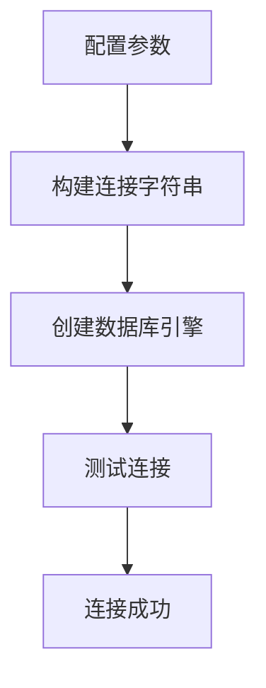
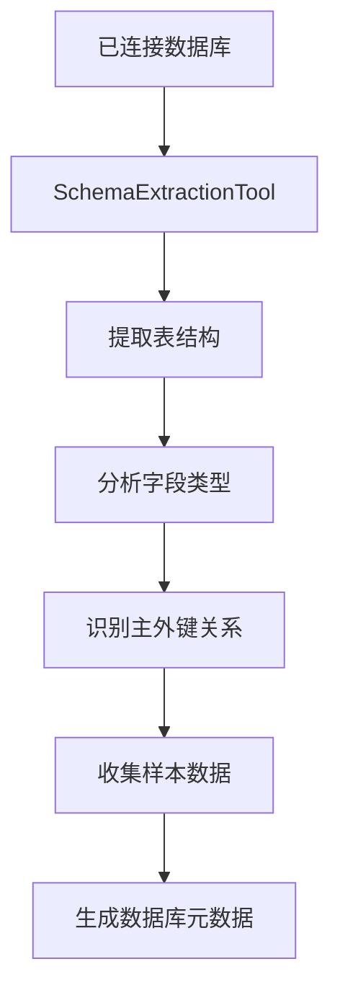
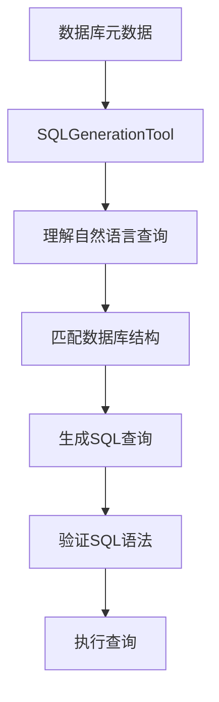

# SemanticSQL Agent 架构流程重新梳理

## 核心三步流程

### 第一步：连接数据库 (Connection)


**实现位置**: `database/connection_manager.py:DatabaseManager`
- **初始化**: `__init__()` 接收 `DatabaseConfig` 配置
- **连接建立**: `initialize()` 建立连接池
- **连接验证**: `test_connection()` 验证连接状态
- **资源管理**: `close()` 关闭连接

### 第二步：分析数据库 (Analysis)


**实现位置**: `tools/sql_tools.py:SyncSchemaExtractionTool`
- **表结构提取**: `get_tables()` 获取所有表名
- **字段信息**: `get_table_info()` 获取字段详情
- **关系分析**: 识别表间关联关系
- **样本数据**: 收集代表性数据样本

### 第三步：生成问题 (Generation)


**实现位置**: `tools/sql_tools.py:SyncSQLGenerationTool`
- **语言理解**: 基于schema理解用户意图
- **SQL生成**: 生成符合数据库结构的SQL
- **语法验证**: `SyncSQLValidationTool` 验证SQL语法
- **安全执行**: `SyncSQLExecutionTool` 执行查询

## 完整代码流程映射

### 1. 数据库连接层
```python
# 配置层
config/trae_config.py:DatabaseConfig -> 数据库连接配置

# 连接管理层  
database/connection_manager.py:DatabaseManager -> 实际连接管理
- initialize(): 建立连接
- get_database_info(): 获取数据库信息
- get_tables(): 获取表列表
- get_table_info(): 获取表详情
```

### 2. 数据库分析层
```python
# 分析工具层
tools/sql_tools.py:SyncSchemaExtractionTool -> 数据库结构分析
- _extract_all_tables(): 提取所有表信息
- _extract_table_info(): 提取单个表详情
- _extract_single_table(): 详细表结构分析

# 业务分析层  
tools/analysis_tools.py -> 业务域分析
- DomainAnalysisTool: 业务域理解
- FieldClassificationTool: 字段分类
- ERAnalysisTool: 实体关系分析
```

### 3. 问题生成层
```python
# SQL生成层
tools/sql_tools.py:SyncSQLGenerationTool -> SQL查询生成
- _build_generation_prompt(): 构建生成提示
- execute(): 执行SQL生成

# 验证执行层
tools/sql_tools.py:SyncSQLValidationTool -> SQL语法验证
tools/sql_tools.py:SyncSQLExecutionTool -> SQL安全执行
```

## 智能体协调层

### agent/sql_agent.py:SQLAgent
```python
class SQLAgent:
    def __init__(self, config):
        # 1. 初始化数据库连接
        self.db_manager = DatabaseManager(config.database)
        
        # 2. 初始化分析工具
        self.tools = [
            SyncSchemaExtractionTool(config.database),    # 数据库分析
            SyncSQLGenerationTool(config.database),       # SQL生成
            SyncSQLValidationTool(config.database),       # SQL验证
            SyncSQLExecutionTool(config.database)         # SQL执行
        ]
    
    def query(self, question):
        # 3. 执行完整流程
        # 连接数据库 → 分析数据库 → 理解问题 → 生成SQL → 验证执行
        return self.execute_task(question)
```

## 实际运行流程验证

### 流程1：手动三步验证
```bash
# 步骤1: 测试连接
python3 -c "
from database.connection_manager import DatabaseManager
from config.trae_config import TraeConfig
config = TraeConfig.load_config('trae_config.yaml')
db = DatabaseManager(config.database)
print('连接成功:', db.initialize())
print('表列表:', db.get_tables())
"

# 步骤2: 分析数据库
python3 -c "
from tools.sql_tools import SyncSchemaExtractionTool
from config.trae_config import TraeConfig
config = TraeConfig.load_config('trae_config.yaml')
tool = SyncSchemaExtractionTool(config.database)
result = tool.execute()
print('数据库分析完成:', result.keys())
"

# 步骤3: 生成问题
python3 -c "
from tools.sql_tools import SyncSQLGenerationTool
from config.trae_config import TraeConfig
config = TraeConfig.load_config('trae_config.yaml')
tool = SyncSQLGenerationTool(config.database)
result = tool.execute(query='查询用户总数')
print('生成SQL:', result)
"
```

### 流程2：智能体自动执行
```bash
# 一键完成三步流程
python3 main.py run "查询用户表中邮箱包含gmail的用户数量" --verbose

# 验证执行轨迹
python3 main.py run "复杂业务查询" --save-trajectory flow.json
```

## 关键验证点

### 连接验证
- 数据库连接是否成功
- 连接池是否正常工作
- 连接超时和重试机制

### 分析验证  
- 表结构是否正确提取
- 字段类型是否准确识别
- 表关系是否正确建立

### 生成验证
- SQL是否符合数据库结构
- 查询是否正确反映用户意图
- 生成的SQL是否安全可执行

## 调试命令

```bash
# 检查数据库连接
python3 main.py test --config trae_config.yaml

# 查看数据库结构
python3 main.py schema --config trae_config.yaml

# 验证工具链
python3 -c "
from agent.sql_agent import SQLAgent
from config.trae_config import TraeConfig
config = TraeConfig.load_config('trae_config.yaml')
agent = SQLAgent(config)
result = agent.explain_schema()
print('Schema分析:', result.keys())
"
```