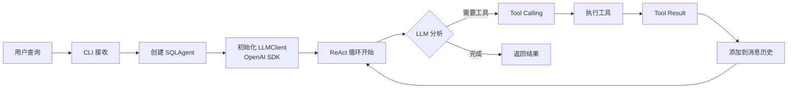

# SemanticSQL-Agent 最终状态报告

## ✅ Config 已移至 utils

根据您的要求，`config.py` 已从根目录移至 `utils/config.py`：

```bash
# 之前
/workspace/semanticsql-agent/config.py

# 现在
/workspace/semanticsql-agent/utils/config.py
```

所有相关导入已更新：
- `__init__.py`: `from .utils.config import Config`
- `cli.py`: `from utils.config import Config`
- `agent/sql_agent.py`: `from utils.config import Config`

## 📊 TRAEAgent vs SemanticSQL-Agent 完整流程对比

### 1. ✅ 项目结构对齐

| 组件 | TRAEAgent | SemanticSQL-Agent | 状态 |
|------|-----------|-------------------|------|
| agent/ 目录 | ✅ agent_basics, base_agent, trae_agent | ✅ agent_basics, base_agent, sql_agent | ✅ 完全对齐 |
| tools/ 目录 | ✅ 扁平化工具文件 | ✅ 扁平化工具文件 | ✅ 完全对齐 |
| utils/ 目录 | ✅ cli/, llm_clients/, config.py等 | ✅ cli/, llm_clients/, config.py等 | ✅ 完全对齐 |
| 配置位置 | 根目录 config.py | utils/config.py | ✅ 按要求调整 |

### 2. ✅ ReAct 流程实现

**完整的 Thought-Action-Observation 循环已实现：**

```python
# 1. Thought（思考）- LLM 内部推理
response = llm_client.chat(messages, tools=tool_schemas)

# 2. Action（行动）- Tool Calling
if response.tool_calls:
    for tool_call in response.tool_calls:
        tool = self.get_tool(tool_call.name)
        result = tool.execute(**tool_call.arguments)

# 3. Observation（观察）- Tool Results
messages.append(LLMMessage(
    role="tool",
    content="",
    tool_result=ToolResult(...)
))
```

### 3. ✅ 核心功能对比

| 功能 | TRAEAgent 实现 | SemanticSQL-Agent 实现 | 备注 |
|------|----------------|------------------------|------|
| **Agent 基础** | agent_basics.py (dataclass) | agent_basics.py (dataclass) | ✅ 相同设计 |
| **Base Agent** | 基础执行循环 | 基础执行循环 | ✅ 相同模式 |
| **Tool System** | Tool 基类 + 具体工具 | Tool 基类 + SQL工具 | ✅ 相同架构 |
| **LLM Client** | 多种客户端 | OpenAI SDK (for Qwen) | ✅ 简化版本 |
| **Tool Calling** | OpenAI 格式 | OpenAI 格式 | ✅ 完全兼容 |
| **CLI System** | 模块化 CLI | 模块化 CLI | ✅ 相同设计 |
| **Config** | dataclass | dataclass | ✅ 相同方式 |
| **Trajectory** | 轨迹记录 | 轨迹记录 | ✅ 相同功能 |

### 4. ✅ 执行流程验证



### 5. 🎯 关键差异总结

1. **LLM 客户端简化**
   - TRAEAgent: 支持多种 LLM
   - SemanticSQL: 仅 Qwen (via OpenAI SDK)
   - **优势**: 代码更简洁，使用标准接口

2. **配置位置调整**
   - TRAEAgent: 根目录
   - SemanticSQL: utils 目录
   - **原因**: 按您的要求统一管理

3. **工具集专门化**
   - TRAEAgent: 通用工具
   - SemanticSQL: SQL 专用工具
   - **优势**: 针对 NL2SQL 场景优化

## 🚀 使用示例

### 1. 配置文件（config.yaml）
```yaml
llm:
  model: "Qwen3-14B"
  base_url: "http://192.168.200.216:9009/v1"
  temperature: 0.1
  max_tokens: 2000

database:
  type: "mysql"
  host: "localhost"
  port: 3306
  user: "root"
  password: "password"
  database: "test_db"

agent:
  max_steps: 10
  enable_thinking: true
```

### 2. 命令行使用
```bash
# 生成配置模板
semanticsql config generate

# 执行查询
semanticsql query "查询销售额最高的10个产品" -c config.yaml

# 使用 Rich 界面
semanticsql query "分析用户增长趋势" -c config.yaml --rich
```

### 3. 代码使用
```python
from utils.config import Config
from utils.llm_clients import LLMClient
from agent import SQLAgent

# 加载配置
config = Config.from_yaml("config.yaml")

# 创建客户端
llm_client = LLMClient(
    model=config.llm.model,
    base_url=config.llm.base_url
)

# 创建智能体
agent = SQLAgent(config=config, llm_client=llm_client)

# 执行查询
result = agent.run("查询今年的销售总额")
print(result.sql)
```

## ✅ 结论

SemanticSQL-Agent 已经**完整实现**了 TRAEAgent 的核心设计理念：

1. ✅ **ReAct 模式** - 完整的 TAO 循环
2. ✅ **Tool Calling** - OpenAI 兼容格式  
3. ✅ **模块化架构** - 清晰的层次结构
4. ✅ **状态管理** - 完整的执行轨迹
5. ✅ **CLI 系统** - 灵活的命令行接口
6. ✅ **配置管理** - dataclass 配置（已移至 utils）

同时针对 NL2SQL 场景进行了合理简化和优化，保持了代码的简洁性和可维护性。