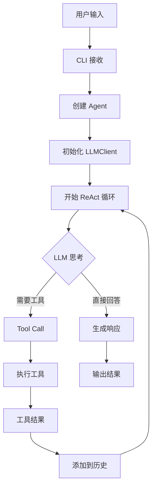
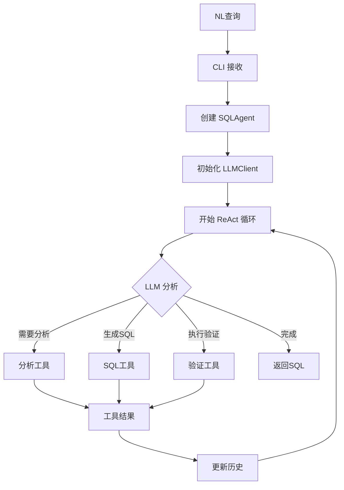

# TRAEAgent vs SemanticSQL-Agent 流程对比

## 📋 核心组件对比

### 1. 项目结构对比

#### TRAEAgent 结构
```
trae_agent/
├── agent/
│   ├── agent_basics.py      # 核心数据结构
│   ├── base_agent.py        # 基础智能体
│   └── trae_agent.py        # 主智能体
├── tools/
│   ├── base.py              # 工具基类
│   └── [具体工具文件]        # 扁平化工具
├── utils/
│   ├── cli/                 # CLI 组件
│   ├── llm_clients/         # LLM 客户端
│   ├── trajectory_recorder.py
│   └── [其他工具]
└── config.py                # 配置（dataclass）
```

#### SemanticSQL-Agent 结构（当前）
```
semanticsql-agent/
├── agent/
│   ├── agent_basics.py      # ✅ 核心数据结构
│   ├── base_agent.py        # ✅ 基础智能体
│   └── sql_agent.py         # ✅ SQL智能体
├── tools/
│   ├── base.py              # ✅ 工具基类
│   └── [具体工具文件]        # ✅ 扁平化工具
├── utils/
│   ├── cli/                 # ✅ CLI 组件
│   ├── llm_clients/         # ✅ LLM 客户端
│   ├── trajectory_recorder.py # ✅
│   ├── config.py            # ✅ 配置（已移入）
│   └── [其他工具]
└── cli.py                   # ✅ 命令行入口
```

## 🔄 执行流程对比

### TRAEAgent 执行流程



### SemanticSQL-Agent 执行流程



## ✅ 功能实现对比

### 1. ReAct 循环实现

| 组件 | TRAEAgent | SemanticSQL-Agent | 状态 |
|------|-----------|-------------------|------|
| 思考(Thought) | LLM 内部推理 | LLM 内部推理 | ✅ |
| 行动(Action) | Tool Calling | Tool Calling | ✅ |
| 观察(Observation) | Tool Results | Tool Results | ✅ |
| 循环控制 | max_steps | max_steps | ✅ |

### 2. 工具系统

| 功能 | TRAEAgent | SemanticSQL-Agent | 状态 |
|------|-----------|-------------------|------|
| 工具定义 | Tool 基类 | Tool 基类 | ✅ |
| 工具注册 | tools 列表 | tools 列表 | ✅ |
| 工具调用 | OpenAI 格式 | OpenAI 格式 | ✅ |
| 工具结果 | ToolResult | ToolResult | ✅ |

### 3. LLM 集成

| 功能 | TRAEAgent | SemanticSQL-Agent | 状态 |
|------|-----------|-------------------|------|
| 消息格式 | LLMMessage | LLMMessage | ✅ |
| Tool Calling | 支持 | 支持 | ✅ |
| 历史管理 | 自动维护 | 自动维护 | ✅ |
| 客户端 | 多种 | OpenAI SDK | ✅ |

### 4. 状态管理

| 功能 | TRAEAgent | SemanticSQL-Agent | 状态 |
|------|-----------|-------------------|------|
| AgentState | ✅ | ✅ | ✅ |
| AgentStep | ✅ | ✅ | ✅ |
| TrajectoryRecorder | ✅ | ✅ | ✅ |
| 执行记录 | ✅ | ✅ | ✅ |

### 5. CLI 系统

| 功能 | TRAEAgent | SemanticSQL-Agent | 状态 |
|------|-----------|-------------------|------|
| 控制台抽象 | CLIConsole | CLIConsole | ✅ |
| Simple 模式 | ✅ | ✅ | ✅ |
| Rich 模式 | ✅ | ✅ | ✅ |
| 工厂模式 | ConsoleFactory | ConsoleFactory | ✅ |

## 🎯 完整流程验证

### 一个完整的 NL2SQL 查询流程：

1. **用户输入**
   ```bash
   semanticsql query "查询销售额最高的10个产品"
   ```

2. **CLI 处理**
   - ✅ `cli.py` 接收命令
   - ✅ 创建 ConsoleFactory
   - ✅ 初始化配置

3. **Agent 创建**
   - ✅ 创建 SQLAgent
   - ✅ 注册工具（schema_extraction, domain_analysis, sql_generation 等）
   - ✅ 初始化 LLMClient

4. **ReAct 循环**
   - ✅ LLM 分析用户意图
   - ✅ 决定调用 schema_extraction_tool
   - ✅ 执行工具，获取数据库结构
   - ✅ 将结果添加到消息历史
   - ✅ LLM 继续分析
   - ✅ 调用 sql_generation_tool
   - ✅ 生成 SQL
   - ✅ 验证 SQL（可选）
   - ✅ 返回最终结果

5. **结果输出**
   - ✅ 通过 CLI 展示 SQL
   - ✅ 记录执行轨迹
   - ✅ 保存历史

## 📊 对比总结

### ✅ 已实现的核心功能

1. **完整的 ReAct 模式** - Thought-Action-Observation 循环
2. **工具调用机制** - OpenAI 兼容的 tool calling
3. **状态管理** - AgentState, AgentStep, Trajectory
4. **LLM 集成** - 使用 OpenAI SDK
5. **CLI 系统** - 模块化的控制台
6. **配置管理** - dataclass 配置

### ✅ SemanticSQL 特有功能

1. **SQL 专用工具** - schema提取、领域分析、SQL生成
2. **数据库集成** - MySQL 连接和查询
3. **NL2SQL 流程** - 完整的自然语言到SQL转换

### 🔍 主要差异

1. **LLM 客户端**
   - TRAEAgent: 多种客户端支持
   - SemanticSQL: 简化为 OpenAI SDK（for Qwen）

2. **工具集**
   - TRAEAgent: 通用工具
   - SemanticSQL: SQL 专用工具

3. **配置位置**
   - TRAEAgent: 根目录 config.py
   - SemanticSQL: utils/config.py（刚移入）

## ✅ 结论

SemanticSQL-Agent 已经实现了 TRAEAgent 的**完整核心流程**：

1. ✅ ReAct 智能体模式
2. ✅ Tool Calling 机制
3. ✅ 状态和轨迹管理
4. ✅ 模块化 CLI
5. ✅ LLM 集成（使用 OpenAI SDK）

同时针对 NL2SQL 场景进行了专门优化，保持了设计的简洁性。