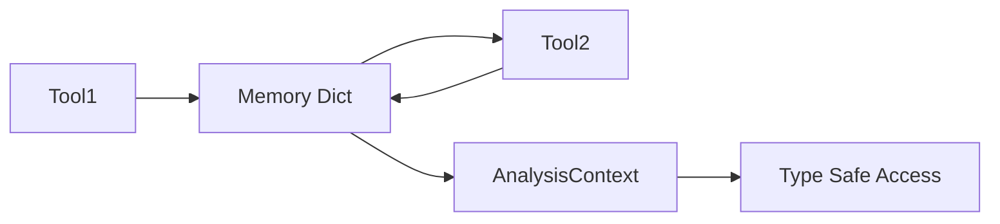
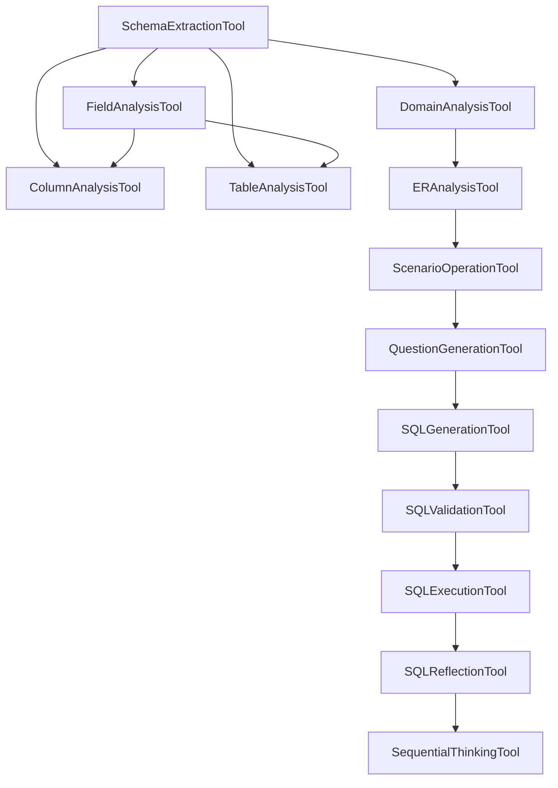

# 技术细节分析文档

## 🔍 代码层面的具体问题分析

### 1. PromptManager vs SequentialThinkingTool 重复实现

#### 当前代码流程分析

```python
# 流程1: PromptManager 路径
PromptManager.get_thinking_prompt("sequential_thinking_main") 
    → render_template("thinking/sequential_thinking_main.j2") 
    → 返回渲染后的字符串

# 流程2: SequentialThinkingTool 路径  
SequentialThinkingTool._create_thinking_chain()
    → self.prompt_manager.get_thinking_prompt("sequential_thinking_main")
    → 再次包装为 LangChain PromptTemplate
    → 构建 RunnableSequence
```

#### 问题分析
1. **双层包装**: 模板被渲染两次，效率低
2. **职责混乱**: PromptManager 不应该知道 thinking 业务逻辑
3. **抽象泄漏**: SequentialThinkingTool 暴露了内部实现细节

#### 重构建议代码
```python
# 重构后的 SequentialThinkingTool
class SequentialThinkingTool(BaseSemanticSQLTool):
    def _create_thinking_chain(self, llm) -> RunnableSequence:
        # 直接使用模板，去掉中间层
        template = self.env.get_template("thinking/sequential_thinking_main.j2")
        
        thinking_prompt = PromptTemplate(
            input_variables=["problem_description", "context", "memory"],
            template=template.source  # 直接使用模板源码
        )
        
        return thinking_prompt | llm | parser
```

### 2. SQLAgent 职责分析

#### 当前代码职责映射

```python
class SQLAgent(BaseAgent):
    # 职责1: 服务容器管理 (25行代码)
    def _create_service_container(self): ...
    
    # 职责2: 工具创建和管理 (45行代码)  
    def create_tools(self): ...
    def _create_analysis_tools(self): ...
    def _create_generation_tools(self): ...
    
    # 职责3: 训练数据生成 (委托给TrainingDataGenerator, 15行代码)
    def generate_training_data(self): ...
    
    # 职责4: 执行流程控制 (继承自BaseAgent)
    def run(self): ...
```

#### 职责重叠分析
- **工具管理** 与 **执行流程** 高度耦合
- **服务容器管理** 应该在更高层 (Application Layer)
- **训练数据生成** 是独立的业务逻辑，不应在Agent中

#### 重构方向建议
```python
# Option A: 职责分离
class SQLAgent(BaseAgent):
    def __init__(self, tool_registry: ToolRegistry, services: ServiceContainer):
        self.tool_registry = tool_registry
        self.services = services
    
    # 只负责编排和执行
    def run(self, task: str): ...

class TrainingDataService:
    def __init__(self, agent: SQLAgent):
        self.agent = agent
    
    def generate_training_data(self): ...

# Option B: 组合模式
class SQLWorkflow:
    def __init__(self):
        self.agent = SQLAgent()
        self.training_service = TrainingDataService() 
        self.tool_manager = ToolManager()
```

### 3. 记忆系统架构分析

#### 当前双重接口问题

```python
# 新式接口 (类型安全)
@dataclass
class AnalysisContext:
    schema_info: Optional[SchemaInfo] = None
    domain_info: Optional[DomainInfo] = None

# 旧式接口 (字典访问)  
class BaseSemanticSQLTool:
    def get_from_memory(self, key: str) -> Dict[str, Any]:
        return self._agent_memory.get_analysis(key)
    
    def save_to_memory(self, tool_name: str, data: Any):
        self._agent_memory.save_context(...)
```

#### 数据流分析


**问题**: 存在两套并行的数据流，容易造成数据不一致

#### 迁移策略建议
```python
# 策略A: 适配器模式 (过渡期)
class MemoryAdapter:
    def __init__(self, context: AnalysisContext):
        self.context = context
    
    def get_analysis(self, key: str) -> Dict[str, Any]:
        # 将类型安全对象转换为字典
        if key == "schema_extraction":
            return asdict(self.context.schema_info) if self.context.schema_info else {}
        # ...

# 策略B: 一次性迁移 (推荐)
class BaseSemanticSQLTool:
    def __init__(self, context: AnalysisContext):
        self.context = context  # 直接使用类型安全上下文
    
    # 删除 get_from_memory 方法
    # 删除 save_to_memory 方法
```

### 4. 工具依赖关系分析

#### 当前工具依赖图



#### 依赖问题分析
1. **链式依赖过长**: 从Schema到Thinking有13层依赖
2. **并行化困难**: 很多工具可以并行执行，但当前是串行设计
3. **错误传播**: 一个工具失败会影响整个链条

#### 优化建议
```python
# 依赖分层设计
class ToolExecutionPlan:
    def __init__(self):
        self.phases = [
            # Phase 1: 基础分析 (可并行)
            [SchemaExtractionTool, DomainAnalysisTool],
            
            # Phase 2: 详细分析 (依赖Phase1，内部可并行)  
            [FieldAnalysisTool, ColumnAnalysisTool, TableAnalysisTool],
            
            # Phase 3: 关系分析
            [ERAnalysisTool],
            
            # Phase 4: 生成阶段 (可并行)
            [ScenarioOperationTool, QuestionGenerationTool],
            
            # Phase 5: SQL相关 (串行)
            [SQLGenerationTool, SQLValidationTool, SQLExecutionTool]
        ]
```

## 🛠️ 重构实施细节

### 阶段1: 提示词系统统一 (详细步骤)

#### Step 1.1: 分析现有 get_thinking_prompt 使用情况
```bash
# 搜索所有使用点
grep -r "get_thinking_prompt" semanticsql-agent/
# 预期结果: 只在 SequentialThinkingTool 中使用
```

#### Step 1.2: 重构 SequentialThinkingTool
```python
# 删除对 get_thinking_prompt 的依赖
class SequentialThinkingTool(BaseSemanticSQLTool):
    def _create_thinking_chain(self, llm):
        # 直接使用 Jinja2 Environment
        template = self.prompt_manager.env.get_template(
            "thinking/sequential_thinking_main.j2"
        )
        # ... 其余逻辑
```

#### Step 1.3: 删除 PromptManager.get_thinking_prompt
```python
# 从 PromptManager 中删除这些方法:
# - get_thinking_prompt()
# - create_tool_prompt_template() (如果只被thinking使用)
```

#### Step 1.4: 验证和测试
```bash
# 运行测试确保功能未破坏
python -m pytest tests/test_thinking_parser.py -v
python -m pytest tests/test_tools.py::test_sequential_thinking -v
```

### 阶段2: Agent 职责分离 (详细步骤)

#### Step 2.1: 提取 TrainingDataGenerator
```python
# 创建 services/training_data_service.py
class TrainingDataService:
    def __init__(self, sql_agent: 'SQLAgent'):
        self.agent = sql_agent
    
    def generate_training_data(self, count: int, output_file: str):
        # 从 SQLAgent 中移动相关逻辑
        pass
```

#### Step 2.2: 创建 ServiceRegistry  
```python
# 创建 utils/service_registry.py
class ServiceRegistry:
    def __init__(self):
        self._services = {}
    
    def register(self, service_type: Type[T], instance: T):
        self._services[service_type] = instance
    
    def get(self, service_type: Type[T]) -> T:
        return self._services[service_type]
```

#### Step 2.3: 重构 SQLAgent
```python
class SQLAgent(BaseAgent):
    def __init__(self, service_registry: ServiceRegistry):
        self.services = service_registry
        super().__init__()
    
    # 移除 _create_service_container
    # 移除 training_generator 相关代码
    # 专注于工具编排逻辑
```

### 阶段3: 记忆系统现代化

#### Step 3.1: 创建迁移适配器 (过渡期)
```python  
class LegacyMemoryAdapter:
    """临时适配器，帮助旧代码逐步迁移到新接口"""
    
    def __init__(self, context: AnalysisContext):
        self.context = context
    
    def get_analysis(self, key: str) -> Dict[str, Any]:
        # 提供向后兼容
        mapping = {
            "schema_extraction": self.context.schema_info,
            "domain_analysis": self.context.domain_info,
            # ...
        }
        result = mapping.get(key)
        return asdict(result) if result else {}
```

#### Step 3.2: 更新所有工具使用新接口
```python
# 逐个更新工具类
class DomainAnalysisTool(BaseSemanticSQLTool):
    def _run(self, use_llm: bool = False, **kwargs) -> str:
        # 旧代码: schema_info = self.get_from_memory("schema_extraction")
        # 新代码: 
        if not self.context.schema_info:
            raise ToolExecutionError(...)
        
        schema_info = self.context.schema_info
        # 直接使用类型安全对象
```

#### Step 3.3: 删除旧接口
```python
class BaseSemanticSQLTool:
    # 删除这些方法:
    # - get_from_memory()
    # - save_to_memory()  
    # - set_memory()
```

## 📊 影响评估和风险分析

### 变更影响范围

| 组件 | 影响程度 | 变更类型 | 风险级别 |
|------|----------|----------|----------|
| PromptManager | 🔴 高 | 删除方法 | 🟡 中 |
| SequentialThinkingTool | 🔴 高 | 重写实现 | 🟡 中 |  
| SQLAgent | 🟡 中 | 职责分离 | 🟢 低 |
| BaseSemanticSQLTool | 🔴 高 | 接口变更 | 🔴 高 |
| 所有工具类 | 🟡 中 | 数据访问方式 | 🟡 中 |

### 风险缓解策略

#### 高风险: BaseSemanticSQLTool 接口变更
**缓解措施**:
1. 保留适配器一个版本周期
2. 增加完整的集成测试覆盖
3. 分批迁移工具类 (每次2-3个)

#### 中风险: PromptManager 方法删除  
**缓解措施**:
1. 先标记为 @deprecated，一个版本后删除
2. 提供明确的迁移指南
3. 添加运行时警告

#### 低风险: SQLAgent 重构
**缓解措施**:
1. 保持公共接口不变
2. 内部重构对外透明
3. 单元测试保证功能一致性

## 📋 检查清单

### 重构前检查
- [ ] 确认所有测试都通过
- [ ] 备份当前代码状态
- [ ] 确认重构范围和边界
- [ ] 准备回滚方案

### 每阶段检查  
- [ ] 功能测试通过
- [ ] 性能无明显下降  
- [ ] 代码覆盖率不下降
- [ ] 文档更新完成

### 重构后检查
- [ ] 所有工具正常工作
- [ ] 集成测试全部通过
- [ ] 代码质量指标改善
- [ ] 架构目标达成