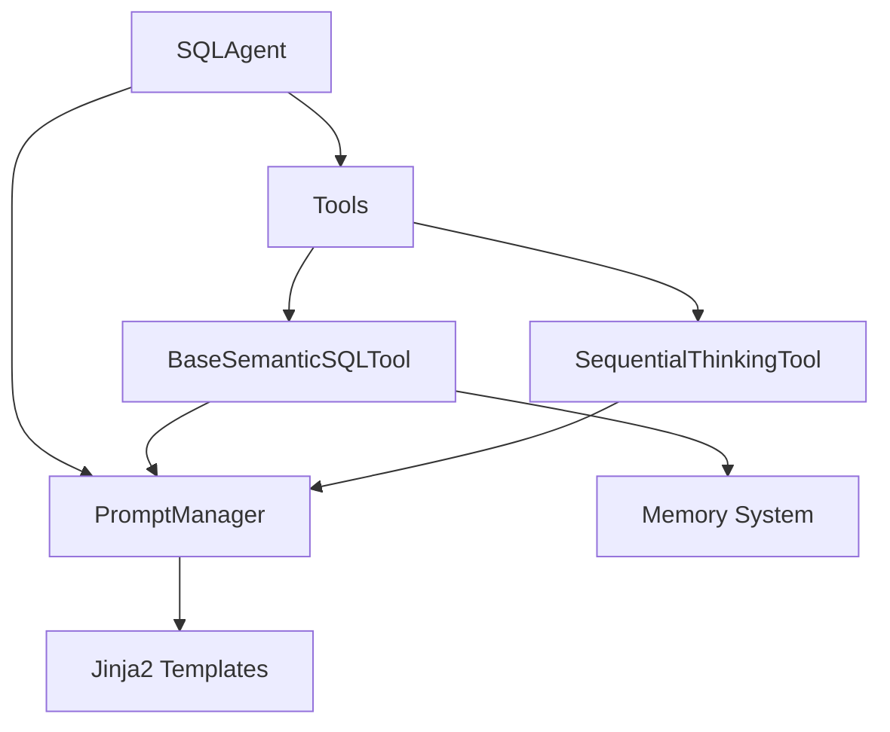

# SemanticSQL-Agent 架构设计分析报告

**文档版本**: v1.0  
**创建日期**: 2024-01-XX  
**分析者**: Claude + 项目维护者  
**目的**: 全面分析当前架构问题，制定优化方案，邀请项目维护者共同决策

---

## 📋 目录
1. [执行摘要](#执行摘要)
2. [当前架构现状](#当前架构现状)  
3. [核心问题分析](#核心问题分析)
4. [具体技术问题](#具体技术问题)
5. [优化方案选项](#优化方案选项)
6. [决策建议框架](#决策建议框架)
7. [讨论点和开放问题](#讨论点和开放问题)

---

## 📊 执行摘要

### 🎯 分析结论
SemanticSQL-Agent 项目在经历了前期优化后，在**架构层面**仍存在一些设计不一致和职责重叠的问题。主要体现在：

1. **提示词管理双重设计**: `PromptManager.get_thinking_prompt` 与 `SequentialThinkingTool` 功能重复
2. **Agent 职责过载**: `SQLAgent` 既管理工具编排又处理训练数据生成  
3. **记忆系统混合模式**: 同时支持类型安全容器和字典式访问
4. **工具分层逻辑不清**: 14个工具分散在4个目录，依赖关系复杂

### 🚦 问题严重程度评估
- 🔴 **高严重**: 提示词管理重复设计 (影响维护性)
- 🟡 **中严重**: Agent 职责重叠 (影响可扩展性)  
- 🟢 **低严重**: 工具分类问题 (影响代码组织)

### 💡 推荐行动
优先解决高严重度问题，采用**渐进式重构**策略，保证系统稳定运行的同时逐步优化架构。

---

## 🏗️ 当前架构现状

### 整体架构图

```
SemanticSQL-Agent/
├── agent/                    # Agent层 - 工作流编排
│   ├── base_agent.py        # BaseAgent (ABC)
│   └── sql_agent.py         # SQLAgent + TrainingDataGenerator
├── tools/                   # Tool层 - 具体功能实现  
│   ├── analysis_tools/      # 6个分析工具
│   ├── generation_tools/    # 3个生成工具
│   ├── validation_tools/    # 2个验证工具
│   ├── reflection_tools/    # 1个反思工具
│   ├── thinking_tools/      # 1个思考工具
│   └── base_tool.py        # 工具基类
├── prompts/                 # 提示词管理层
│   ├── manager.py          # PromptManager
│   └── templates/          # Jinja2模板
└── utils/                   # 支持服务层
    ├── memory.py           # 记忆管理 
    ├── database.py         # 数据库管理
    └── ...
```

### 数据流分析



**发现**: 存在循环依赖和重复路径

---

## 🔍 核心问题分析

### 问题1: 提示词管理架构不一致 🔴

#### 现状描述
- `PromptManager.get_thinking_prompt()` 方法提供思考提示词
- `SequentialThinkingTool` 工具内部又实现了相同的思考逻辑
- 两者功能重复，维护成本高

#### 代码证据
```python
# prompts/manager.py
def get_thinking_prompt(self, thinking_type: str, **kwargs) -> str:
    template_path = f'thinking/{thinking_type}.j2'
    return self.render_template(template_path, **kwargs)

# tools/thinking_tools/sequential_thinking_tool.py  
def _create_thinking_chain(self, llm) -> RunnableSequence:
    prompt_content = self.prompt_manager.get_thinking_prompt("sequential_thinking_main")
    # ... 又是一层包装
```

#### 影响分析
- **维护复杂**: 修改思考逻辑需要改两处
- **设计混乱**: 违反DRY原则
- **职责不清**: PromptManager应该专注模板管理，不应涉及特定业务逻辑

### 问题2: SQLAgent 职责过载 🟡

#### 现状描述  
SQLAgent 类承担了多重职责：
1. 工具管理和编排
2. 训练数据生成  
3. 执行流程控制
4. 服务容器管理

#### 代码证据
```python
class SQLAgent(BaseAgent):
    def __init__(self, settings, db_config, callbacks):
        # 职责1: 服务容器管理
        self.services = self._create_service_container(settings, db_config)
        
        # 职责2: 训练数据生成
        self.training_generator = TrainingDataGenerator(self)
        
    # 职责3: 工具编排
    def create_tools(self): ...
    
    # 职责4: 执行流程
    def run(self, task): ...
```

#### 影响分析
- **单元测试困难**: 多个职责耦合难以单独测试
- **扩展性差**: 添加新功能需要修改核心 Agent 类
- **违反SRP**: 单一职责原则被破坏

### 问题3: 记忆系统设计混合 🟡  

#### 现状描述
同时存在两套记忆访问模式：
1. 新式类型安全容器 (`AnalysisContext`, `SchemaInfo` 等)
2. 旧式字典访问 (`get_from_memory`, `save_to_memory`)

#### 代码证据
```python
# 新式 - utils/memory.py
@dataclass 
class AnalysisContext:
    schema_info: Optional[SchemaInfo] = None
    domain_info: Optional[DomainInfo] = None

# 旧式 - tools/base_tool.py  
def get_from_memory(self, key: str) -> Dict[str, Any]:
    return self._agent_memory.get_analysis(key)
```

#### 影响分析
- **类型安全不完整**: 部分代码仍使用字典，运行时错误风险
- **学习成本高**: 开发者需要了解两套API
- **迁移未完成**: 架构升级不彻底

---

## 🔧 具体技术问题

### A. SequentialThinkingTool 设计问题

**问题**: 工具内部重新实现了 PromptManager 的功能

```python
# 当前设计 - 重复实现
class SequentialThinkingTool:
    def _create_thinking_chain(self, llm):
        prompt_content = self.prompt_manager.get_thinking_prompt("sequential_thinking_main")
        # 又包装了一层 LangChain 逻辑
```

**更好的设计**:
```python
class SequentialThinkingTool:
    def _create_thinking_chain(self, llm):
        # 直接使用模板，减少抽象层
        template = self.prompt_manager.get_template("thinking/sequential_thinking_main.j2")
        # 直接构建链
```

### B. 工具分类逻辑问题

**当前分类**:
```
tools/
├── analysis_tools/     # 数据分析
├── generation_tools/   # 内容生成  
├── validation_tools/   # 验证检查
├── reflection_tools/   # 质量反思
└── thinking_tools/     # 深度思考
```

**问题分析**:
- `thinking_tools` 和 `reflection_tools` 职责重叠
- `generation_tools` 中包含了不同性质的生成 (问题生成 vs SQL生成)
- 分类标准不一致 (按功能 vs 按阶段)

**建议分类方案A - 按数据流**:
```
tools/
├── input_tools/       # 输入处理 (schema_extraction, domain_analysis)
├── analysis_tools/    # 数据分析 (field, column, table, er) 
├── generation_tools/  # 内容生成 (scenario, question, sql)
└── quality_tools/     # 质量保证 (validation, execution, reflection, thinking)
```

**建议分类方案B - 按依赖层次**:
```
tools/
├── core_tools/        # 核心必需 (schema, domain, sql_generation)
├── enhanced_tools/    # 增强分析 (field, column, table, er)  
├── workflow_tools/    # 工作流支持 (scenario, question)
└── quality_tools/     # 质量控制 (validation, reflection, thinking)
```

### C. Agent 工具管理问题

**当前设计**:
```python  
def create_tools(self) -> List[BaseTool]:
    # 硬编码创建所有工具
    return [
        SchemaExtractionTool(db_manager=db_manager),
        DomainAnalysisTool(),
        # ... 14个工具
    ]
```

**问题**:
- 所有工具都被创建，即使不被使用
- 工具依赖关系硬编码在 Agent 中
- 难以进行工具的A/B测试或动态替换

---

## 🎯 优化方案选项

### 方案A: 渐进式重构 (推荐)

#### 阶段1: 提示词系统统一 (1-2天)
- ✅ **删除** `PromptManager.get_thinking_prompt` 方法
- ✅ **简化** `SequentialThinkingTool` 直接使用 Jinja2 模板  
- ✅ **统一** 所有thinking相关逻辑到工具层

#### 阶段2: Agent 职责分离 (2-3天)
- ✅ **提取** `TrainingDataGenerator` 为独立服务
- ✅ **重构** SQLAgent 专注于工作流编排
- ✅ **创建** `ServiceRegistry` 管理服务依赖

#### 阶段3: 记忆系统现代化 (1-2天)  
- ✅ **删除** 字典式 `get_from_memory` 接口
- ✅ **完善** 类型安全的上下文传递
- ✅ **优化** 数据流设计

#### 阶段4: 工具重新组织 (1天)
- ✅ **重新分类** 工具目录结构
- ✅ **标准化** 工具接口
- ✅ **建立** 工具依赖图

**优点**: 风险可控，可逐步验证效果  
**缺点**: 时间较长，期间可能存在不一致状态

### 方案B: 大规模重构

#### 一次性重写整个架构
- 🔄 重新设计 Agent-Tool-Service 三层架构
- 🔄 建立标准的依赖注入容器
- 🔄 统一所有接口和数据模型  
- 🔄 重构所有工具为纯函数模式

**优点**: 架构一致性好，设计清晰  
**缺点**: 风险高，可能引入新bug，开发周期长

### 方案C: 最小化修复

#### 仅修复核心问题
- 🔧 删除 `get_thinking_prompt` 重复实现
- 🔧 轻微调整工具分类
- 🔧 保持现有架构不变

**优点**: 风险最小，改动最少  
**缺点**: 根本性架构问题未解决

---

## 🤝 决策建议框架  

### 决策维度权重

| 维度 | 权重 | 方案A | 方案B | 方案C |
|------|------|-------|-------|-------|
| 🛡️ **风险控制** | 30% | ⭐⭐⭐⭐ | ⭐⭐ | ⭐⭐⭐⭐⭐ |
| 🏗️ **架构清晰度** | 25% | ⭐⭐⭐⭐ | ⭐⭐⭐⭐⭐ | ⭐⭐ |  
| 🚀 **开发效率** | 20% | ⭐⭐⭐ | ⭐⭐ | ⭐⭐⭐⭐⭐ |
| 📈 **长期维护** | 15% | ⭐⭐⭐⭐ | ⭐⭐⭐⭐⭐ | ⭐ |
| 💰 **资源投入** | 10% | ⭐⭐⭐ | ⭐ | ⭐⭐⭐⭐⭐ |
| **总分** | | **3.45** | **3.05** | **3.65** |

### 推荐决策

基于当前项目阶段和团队情况，**推荐方案A (渐进式重构)**：

**理由**:
1. **平衡风险与收益**: 既解决了核心架构问题，又保持了系统稳定
2. **可验证性**: 每个阶段都可以独立测试和验证  
3. **学习友好**: 团队可以在重构过程中学习新的架构模式
4. **回滚能力**: 如果某个阶段出现问题，可以快速回滚

---

## 💬 讨论点和开放问题

### 🔴 需要您决策的关键问题

#### 1. 工具分类策略选择
**选项A**: 按数据流分类 (input → analysis → generation → quality)  
**选项B**: 按依赖层次分类 (core → enhanced → workflow → quality)  
**选项C**: 保持现有分类，仅做微调

**您的偏好**: ________________________

**决策依据**: ________________________

#### 2. SequentialThinkingTool 重构方向  
**选项A**: 完全移除 `get_thinking_prompt`，工具直接使用模板  
**选项B**: 保留 `get_thinking_prompt`，但简化 SequentialThinkingTool  
**选项C**: 重新设计思考工具的抽象层次

**您的偏好**: ________________________

#### 3. 记忆系统迁移策略
**选项A**: 一次性删除所有字典式接口  
**选项B**: 保留向后兼容，新代码使用类型安全接口  
**选项C**: 设计适配器模式，两套接口共存

**您的偏好**: ________________________

### 🟡 需要讨论的设计问题

#### 4. Agent 职责边界
- SQLAgent 应该管理哪些职责？
- TrainingDataGenerator 应该是独立服务还是Agent的一部分？
- 工具的生命周期应该由谁管理？

#### 5. 性能考虑
- 当前的记忆系统是否存在性能瓶颈？
- 14个工具全部实例化是否必要？
- 是否需要引入工具的懒加载机制？

#### 6. 测试策略  
- 重构过程中如何保证测试覆盖率？
- 是否需要添加集成测试？
- Mock 策略如何设计？

### 🟢 开放性讨论

#### 7. 未来扩展考虑
- 如果要支持多数据库类型，架构应该如何调整？
- 如果要添加新的AI模型（如多模态），工具层如何适配？
- 插件化架构是否值得考虑？

---

## 📝 行动项和下一步

### 立即行动项
1. **您的反馈**: 请在本文档中标注您的偏好和意见
2. **优先级确认**: 确认问题的优先级排序是否符合您的判断
3. **资源评估**: 评估团队可投入的重构时间和人力

### 下一步计划  
1. 根据您的反馈调整重构方案
2. 制定详细的实施计划和时间表
3. 开始第一阶段的重构实施

---

## 📞 联系和反馈

**文档维护者**: Claude  
**反馈方式**: 直接在文档中添加注释或创建新的讨论文件  
**更新频率**: 根据重构进展实时更新

---

**请在以下区域添加您的反馈和意见**: 👇

```
=== 您的反馈区域 ===

1. 对当前问题分析的看法:


2. 对推荐方案的意见:  


3. 关键决策点的选择:


4. 其他建议和考虑:


5. 时间和资源约束:

```