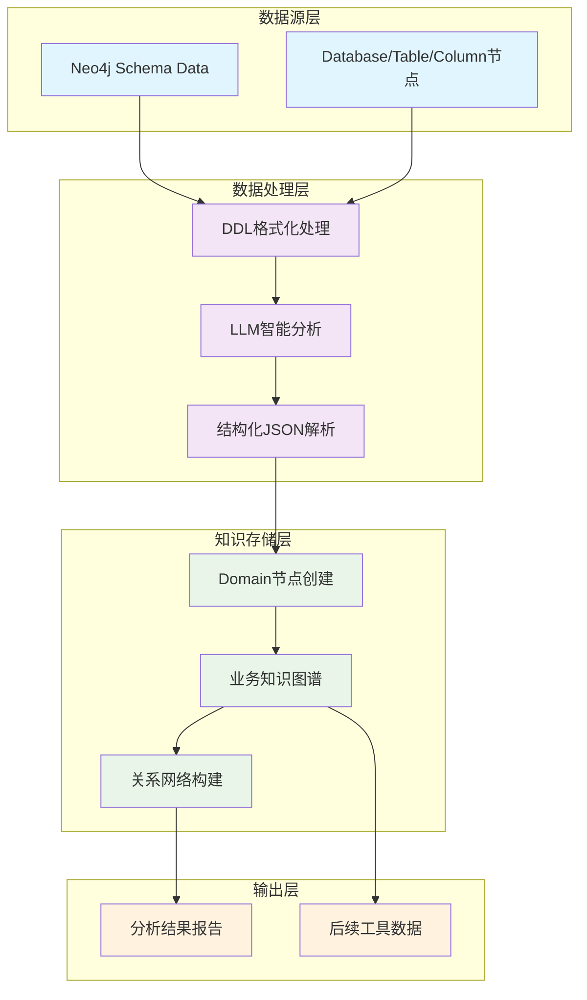

# Domain Analysis Tool 设计文档

## 概述

Domain Analysis Tool 是 SemanticSQL Agent 工具链中的核心业务分析工具，负责深度识别数据库的业务领域特征。该工具整合了 `nl2sql_pipeline` 中成熟的LLM分析算法，采用与 `schema_extraction_tool` 一致的直接Neo4j操作架构，实现从数据结构到业务语义的智能转换。

## 设计理念

### 1. LLM驱动的智能分析
- **算法升级**：从传统关键词匹配升级为基于LLM的深度语义理解
- **结构化分析**：采用pipeline中验证的结构化提示词进行多维度分析
- **业务语言**：使用业务术语而非技术词汇，避免"表"、"字段"等技术表达

### 2. 直接Neo4j操作架构
- **数据复用**：直接从Neo4j读取`schema_extraction_tool`已存储的结构化数据
- **知识图谱**：建立丰富的业务知识网络（Domain、BusinessProblem、SolutionApproach等节点）
- **高效存储**：跳过三元组抽象层，直接创建Neo4j节点和关系

### 3. 管道式数据处理
- **分层处理**：DDL格式化 → LLM分析 → 结构化解析 → 知识图谱存储
- **容错设计**：LLM调用失败时的优雅降级机制
- **批量优化**：支持大型数据库的高效处理

## 核心功能

### 1. 多维度业务分析

基于 `02_domain_analysis_structured.j2` 提示词模板，进行六个维度的深度分析：

```yaml
分析维度:
  domain_type: "精准的业务领域名称（如：电商订单管理、国防工业合同管理）"
  business_problems: "系统旨在解决的核心业务问题列表"
  solution_approaches: "解决业务问题的方法和策略"
  key_entities: "核心业务实体及其角色描述"
  business_rules: "业务约束条件和实体关系规则"
  special_fields: "特殊业务字段及其业务规则"
```

### 2. DDL格式化处理

将Neo4j中的结构化数据转换为LLM友好的DDL格式：

```sql
-- 格式化示例
CREATE TABLE `orders` (
  `id` bigint NOT NULL,
  `customer_id` bigint NOT NULL,
  `status` varchar(50) NOT NULL,
  `total_amount` decimal(10,2) NOT NULL,
  `created_at` timestamp DEFAULT CURRENT_TIMESTAMP,
  PRIMARY KEY (`id`),
  FOREIGN KEY (`customer_id`) REFERENCES `customers` (`id`)
);
```

**关键设计决策**：
- **移除注释信息**：避免将数据库注释传递给LLM，保持分析的客观性
- **保留约束信息**：保持主键、外键等结构约束，为LLM提供关系线索
- **标准化格式**：使用MySQL DDL标准格式，确保LLM理解的一致性

### 3. 结构化JSON解析

LLM返回严格的JSON格式，确保数据的结构化和可解析性：

```json
{
  "domain_type": "电商订单管理系统",
  "business_problems": [
    "订单处理效率需要优化以提升客户满意度",
    "库存管理与订单需求之间需要实现精准匹配",
    "客户数据需要统一管理以支持个性化服务"
  ],
  "solution_approaches": [
    "建立完整的订单生命周期管理流程",
    "实现库存实时监控和自动补货机制",
    "构建客户统一视图和行为分析体系"
  ],
  "key_entities": [
    "订单是系统的核心业务对象，承载完整的交易信息和状态流转",
    "客户作为业务主体，包含基本信息、偏好数据和交易历史",
    "商品承载库存信息和销售属性，支持订单组合和定价策略"
  ],
  "business_rules": [
    "当订单创建时，系统必须验证库存充足性并锁定相应商品",
    "若客户连续三次订单被取消，则需要触发风险评估流程",
    "订单状态变更为已发货时，系统自动更新库存并通知客户"
  ],
  "special_fields": [
    "total_amount字段代表订单总金额，必须在订单确认后保持不变以确保财务一致性"
  ]
}
```

### 4. 业务知识图谱构建

基于LLM分析结果，建立丰富的Neo4j知识图谱：

```cypher
-- 领域节点
(d:Domain {
    name: "电商订单管理系统",
    confidence: 0.95,
    analysis_timestamp: "2024-01-15T10:30:00"
})

-- 业务问题节点
(bp1:BusinessProblem {
    description: "订单处理效率需要优化以提升客户满意度",
    domain: "电商订单管理系统",
    priority: "high"
})

-- 解决方案节点
(sa1:SolutionApproach {
    description: "建立完整的订单生命周期管理流程", 
    addresses_problem: "订单处理效率问题",
    implementation_complexity: "medium"
})

-- 核心实体映射
(ke1:KeyEntity {
    description: "订单是系统的核心业务对象，承载完整的交易信息和状态流转",
    entity_name: "Order",
    business_importance: "critical"
})

-- 业务规则节点
(br1:BusinessRule {
    description: "当订单创建时，系统必须验证库存充足性并锁定相应商品",
    rule_type: "constraint",
    trigger_condition: "订单创建"
})

-- 关系结构
(database)-[:BELONGS_TO_DOMAIN]->(d)
(d)-[:HAS_BUSINESS_PROBLEM]->(bp1)
(d)-[:HAS_SOLUTION_APPROACH]->(sa1)
(d)-[:HAS_KEY_ENTITY]->(ke1)
(d)-[:HAS_BUSINESS_RULE]->(br1)
(sa1)-[:ADDRESSES]->(bp1)
(ke1)-[:MAPS_TO_TABLE]->(table_orders)
```

## 技术架构

### 1. 数据流设计



### 2. 核心算法流程

1. **依赖验证**：检查 `schema_extraction_tool` 是否已成功执行
2. **数据读取**：从Neo4j查询Database、Table、Column节点的完整信息
3. **DDL转换**：将结构化数据格式化为标准DDL语句
4. **LLM分析**：使用结构化提示词进行六维度业务分析
5. **响应解析**：解析LLM返回的JSON格式分析结果
6. **图谱构建**：创建Domain及相关业务知识节点
7. **关系建立**：建立丰富的业务知识关系网络
8. **结果输出**：生成人性化的分析报告

### 3. LLM集成架构

#### 提示词工程
基于 `02_domain_analysis_structured.j2` 的高质量提示词：

```jinja2
您现担任跨行业首席数据架构师和业务专家。请依据所提供之数据库 Schema，分析该数据库的业务领域，并严格按照以下JSON格式输出分析结果。

分析要求：
1. 使用业务语言而非技术术语（避免使用"表"、"字段"、"外键"等技术词汇）
2. 基于 Schema 信息进行合理推理，不要臆测没有依据的内容
3. 所有描述都必须是完整的句子，不能是简单的名词或短语
4. 严格遵循下面的JSON格式，不要输出任何JSON之外的内容

Schema 如下：
{{ schema_ddl }}
```

#### LLM服务配置
```python
LLM_CONFIG = {
    "temperature": 0.1,        # 保持分析结果的一致性
    "max_tokens": 3000,        # 支持详细的业务分析
    "top_p": 0.9,              # 适度的创造性
    "frequency_penalty": 0.0,   # 不惩罚重复，保证完整性
}
```

#### 错误处理与降级
- **JSON解析失败**：提供重试机制和默认值策略
- **LLM服务异常**：降级到规则匹配模式
- **网络超时**：支持异步处理和结果缓存

## Neo4j 图结构设计

### 1. 节点类型定义

```cypher
-- 领域节点
CREATE (d:Domain {
    name: String,                    // 领域名称
    confidence: Float,               // 分析置信度
    analysis_timestamp: DateTime,    // 分析时间戳
    llm_model: String,              // 使用的LLM模型
    analysis_version: String        // 分析算法版本
})

-- 业务问题节点
CREATE (bp:BusinessProblem {
    description: String,             // 问题描述
    domain: String,                  // 所属领域
    priority: String,                // 优先级 (high/medium/low)
    complexity: String              // 复杂度
})

-- 解决方案节点
CREATE (sa:SolutionApproach {
    description: String,             // 方案描述
    addresses_problem: String,       // 解决的问题
    implementation_complexity: String, // 实现复杂度
    business_impact: String         // 业务影响
})

-- 核心实体节点
CREATE (ke:KeyEntity {
    description: String,             // 实体描述
    entity_name: String,            // 实体名称
    business_importance: String,     // 业务重要性
    lifecycle: String,              // 生命周期特征
    data_volume: String            // 数据量特征
})

-- 业务规则节点
CREATE (br:BusinessRule {
    description: String,             // 规则描述
    rule_type: String,              // 规则类型 (constraint/trigger/validation)
    trigger_condition: String,       // 触发条件
    business_impact: String,        // 业务影响
    enforcement_level: String       // 执行级别
})
```

### 2. 关系类型定义

```cypher
-- 基础关系
(Database)-[:BELONGS_TO_DOMAIN]->(Domain)
(Domain)-[:HAS_BUSINESS_PROBLEM]->(BusinessProblem)
(Domain)-[:HAS_SOLUTION_APPROACH]->(SolutionApproach)
(Domain)-[:HAS_KEY_ENTITY]->(KeyEntity)
(Domain)-[:HAS_BUSINESS_RULE]->(BusinessRule)

-- 业务逻辑关系
(SolutionApproach)-[:ADDRESSES]->(BusinessProblem)
(BusinessRule)-[:GOVERNS]->(KeyEntity)
(KeyEntity)-[:MAPS_TO_TABLE]->(Table)
(BusinessRule)-[:APPLIES_TO_FIELD]->(Column)

-- 依赖关系
(KeyEntity)-[:DEPENDS_ON]->(KeyEntity)
(BusinessRule)-[:TRIGGERS]->(BusinessRule)
(SolutionApproach)-[:REQUIRES]->(KeyEntity)
```

### 3. 查询模式

```cypher
-- 获取领域的完整业务知识
MATCH (d:Domain)-[r]->(n)
WHERE d.name = '电商订单管理系统'
RETURN d, r, n

-- 查找特定表对应的业务实体
MATCH (t:Table)-[:MAPPED_BY]-(ke:KeyEntity)-[:BELONGS_TO]-(d:Domain)
WHERE t.name = 'orders'
RETURN d.name, ke.description, ke.business_importance

-- 获取业务规则和对应的数据约束
MATCH (br:BusinessRule)-[:APPLIES_TO_FIELD]->(c:Column)-[:BELONGS_TO]->(t:Table)
RETURN br.description, t.name, c.name, br.trigger_condition
```

## 配置选项

### 1. LLM分析参数

```python
DOMAIN_ANALYSIS_CONFIG = {
    # LLM配置
    "llm_temperature": 0.1,            # 保持分析一致性
    "llm_max_tokens": 3000,            # 支持详细分析
    "llm_timeout": 60,                 # 分析超时时间（秒）
    
    # 重试配置
    "max_retries": 3,                  # 最大重试次数
    "retry_delay": 2.0,                # 重试间隔（秒）
    
    # 解析配置
    "json_validation": True,           # 启用JSON格式验证
    "fallback_to_rules": True,         # LLM失败时降级到规则
    
    # 质量控制
    "min_confidence": 0.6,             # 最低置信度阈值
    "max_entities": 10,                # 最大实体数量
    "max_rules": 15,                   # 最大规则数量
}
```

### 2. DDL格式化配置

```python
DDL_FORMAT_CONFIG = {
    # 表结构配置
    "include_comments": False,          # 不包含数据库注释
    "include_indexes": True,           # 包含索引信息
    "include_constraints": True,       # 包含约束信息
    
    # 格式配置
    "table_prefix": "CREATE TABLE",    # 表创建语句前缀
    "column_quotes": "`",              # 列名引用符号
    "line_separator": "\n",           # 行分隔符
    
    # 过滤配置
    "exclude_system_tables": True,     # 排除系统表
    "max_tables": 50,                  # 最大表数量
    "max_columns_per_table": 100,      # 单表最大列数
}
```

### 3. Neo4j存储配置

```python
STORAGE_CONFIG = {
    # 节点配置
    "domain_node_label": "Domain",
    "business_problem_label": "BusinessProblem", 
    "solution_approach_label": "SolutionApproach",
    "key_entity_label": "KeyEntity",
    "business_rule_label": "BusinessRule",
    
    # 关系配置
    "domain_relation": "BELONGS_TO_DOMAIN",
    "problem_relation": "HAS_BUSINESS_PROBLEM",
    "solution_relation": "HAS_SOLUTION_APPROACH",
    
    # 存储优化
    "batch_size": 100,                 # 批量写入大小
    "enable_indexes": True,            # 启用索引
    "enable_constraints": True,        # 启用约束
}
```

## 工具调用链

### 1. 前置依赖
- **schema_extraction_tool**：必须成功执行，提供数据库结构信息

### 2. 后续工具
- **field_analysis_tool**：字段语义分析，可利用领域上下文
- **table_analysis_tool**：表关系分析，结合业务实体理解
- **er_analysis_tool**：实体关系分析，基于业务规则优化

### 3. 调用序列

```python
# 标准工具链调用序列
TOOL_SEQUENCE = [
    "schema_extraction_tool",        # 1. 数据库结构提取
    "domain_analysis_tool",          # 2. 业务领域分析 ← 当前工具
    "field_analysis_tool",           # 3. 字段语义分析
    "table_analysis_tool",           # 4. 表关系分析
    "er_analysis_tool"              # 5. 实体关系分析
]
```

## 输出格式

### 1. 成功输出示例

```text
✅ 业务领域分析完成

🎯 领域识别结果:
  • 业务领域: 电商订单管理系统 (置信度: 0.95)
  • 核心问题: 3个业务问题待解决
  • 解决方案: 3个解决方案策略
  • 关键实体: 5个核心业务实体
  • 业务规则: 8条业务规则

📊 分析统计:
  • 分析表数: 12个表
  • DDL长度: 2,847字符
  • LLM耗时: 8.5秒
  
🔗 核心业务概念:
  订单生命周期管理、客户统一视图、库存实时监控、风险评估流程

💾 业务知识图谱已构建完成，共创建25个业务节点，38个关系连接
```

### 2. 失败输出示例

```text
❌ 领域分析失败: LLM服务暂时不可用

🔧 降级处理:
  • 已启用规则匹配模式
  • 基于关键词识别出可能领域: 电商、财务
  • 建议稍后重试以获得完整分析

⚠️  限制说明:
  • 规则模式精度较低 (约60-70%)
  • 缺少业务规则和解决方案分析
  • 无法生成详细的业务实体描述
```

## 性能考虑

### 1. LLM调用优化
- **单次调用**：整个数据库的DDL一次性提交给LLM分析
- **Token控制**：限制DDL长度，大数据库按重要性筛选表
- **缓存机制**：相同DDL内容的分析结果可缓存24小时

### 2. 数据库操作优化
- **批量查询**：使用单个Cypher查询获取所有必要数据
- **批量写入**：使用事务批量创建节点和关系
- **索引利用**：为常用查询字段建立索引

### 3. 内存管理
- **流式处理**：大型DDL内容流式生成，避免内存峰值
- **对象复用**：重用JSON解析器和Cypher查询构建器
- **垃圾回收**：及时释放大型临时对象

## 最佳实践

### 1. 提示词优化
- **上下文控制**：保持提示词简洁明确
- **格式约束**：严格要求JSON输出格式
- **示例引导**：在提示词中包含预期输出示例

### 2. 错误恢复
- **多级降级**：LLM → 规则匹配 → 默认值
- **部分成功**：支持部分解析成功的结果
- **用户反馈**：提供明确的失败原因和建议

### 3. 质量保证
- **结果验证**：检查JSON格式完整性和逻辑一致性
- **置信度评估**：基于分析内容质量计算置信度
- **人工审核**：支持关键业务的人工审核流程

## 扩展机制

### 1. 自定义提示词
```python
# 支持业务特定的提示词模板
custom_template = """
特定行业分析要求：
1. 关注合规性要求
2. 重视数据安全规则
3. 分析监管约束
...
"""
tool.set_custom_prompt_template(custom_template)
```

### 2. 领域知识库
```python
# 支持领域特定的知识库
domain_knowledge_base = {
    "金融": {
        "key_concepts": ["风控", "合规", "流动性"],
        "typical_entities": ["账户", "交易", "资产"],
        "business_rules": ["T+1结算", "反洗钱检查"]
    }
}
tool.load_domain_knowledge(domain_knowledge_base)
```

### 3. 多模型支持
```python
# 支持多个LLM模型的对比分析
model_configs = [
    {"provider": "openai", "model": "gpt-4"},
    {"provider": "anthropic", "model": "claude-3"},
    {"provider": "local", "model": "llama2-13b"}
]
tool.enable_multi_model_analysis(model_configs)
```

## 故障排除

### 1. 常见问题

**LLM响应格式错误**
```text
问题：LLM返回的不是有效JSON格式
排查：检查提示词模板和LLM服务配置
解决：启用JSON格式验证和自动修复
```

**Neo4j连接失败**
```text
问题：无法连接到Neo4j数据库
排查：检查连接参数和网络状态
解决：确认Neo4j服务正常运行，检查认证信息
```

**依赖检查失败**
```text
问题：schema_extraction_tool尚未执行
排查：检查工具执行顺序和依赖关系
解决：确保按正确顺序调用工具链
```

### 2. 性能问题

**分析速度慢**
- 检查LLM服务响应时间
- 优化DDL内容长度
- 启用结果缓存机制

**内存使用过高**
- 启用流式处理模式
- 增加垃圾回收频率
- 分批处理大型数据库

## 版本演进

### v2.0.0 (当前设计版本)
- 基于LLM的深度语义分析
- 直接Neo4j操作架构
- 结构化业务知识图谱
- 完整的六维度分析体系

### v1.0.0 (当前实现版本)
- 基于关键词匹配的简单分析
- 三元组抽象模式
- 有限的领域识别能力
- 预定义的领域库

### 升级路径
1. **保持接口兼容**：_run方法签名不变
2. **渐进式升级**：支持新旧算法共存
3. **数据迁移**：从三元组模式迁移到图结构
4. **性能对比**：提供新旧版本效果对比

---

**总结**：Domain Analysis Tool v2.0 通过整合先进的LLM算法和结构化提示词工程，实现了从数据结构到业务语义的智能转换。该设计不仅大幅提升了分析准确度，还建立了丰富的业务知识图谱，为整个SemanticSQL Agent工具链提供了强大的业务上下文支撑。