# Domain Analysis Tool 数据流图文档

## 概述

本文档通过详细的流程图和数据流图，可视化展示 Domain Analysis Tool 基于 LLM 的智能分析过程。涵盖从 Neo4j 数据读取到业务知识图谱构建的完整数据处理流水线。

## 总体数据流架构

### 高层级数据流概览

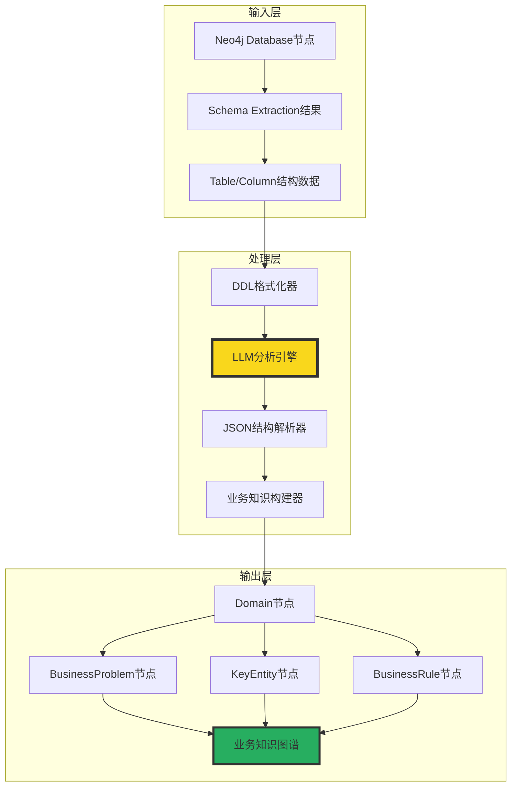

## 详细执行流程图

### 主流程：_run() 方法执行流

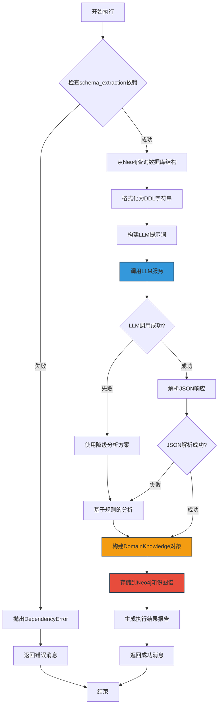

## 数据转换流程

### Schema到DDL转换流程

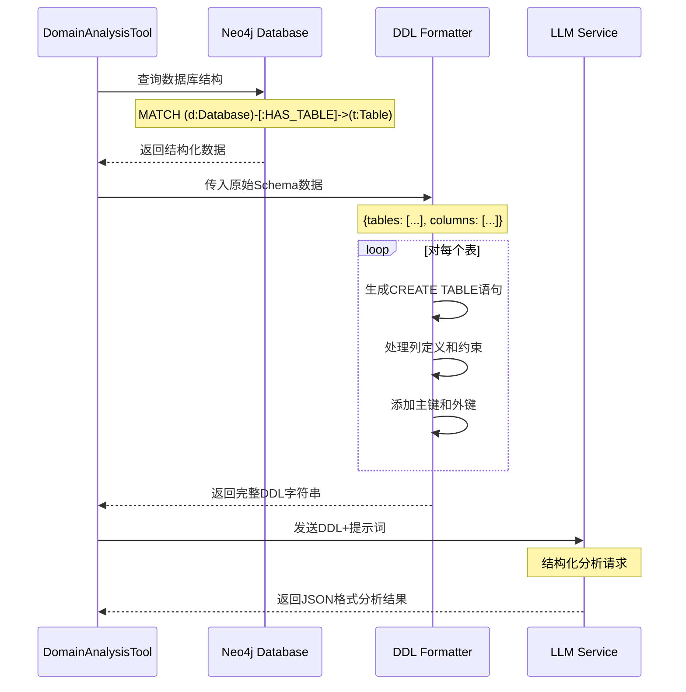

### Neo4j数据查询详细流程

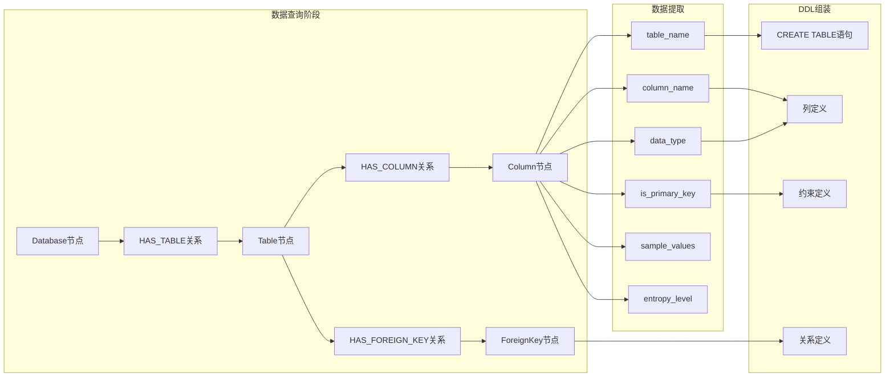

## LLM分析处理流程

### 提示词构建和LLM调用流程

```mermaid
flowchart LR
    subgraph "提示词工程"
        A[DDL内容] --> B[Jinja2模板加载]
        B --> C[02_domain_analysis_structured.j2]
        C --> D[模板渲染]
        D --> E[结构化提示词]
    end
    
    subgraph "LLM服务调用"
        F[LLM请求配置] --> G[temperature: 0.1]
        F --> H[max_tokens: 4000]
        F --> I[timeout: 120s]
        
        E --> J[LLM API调用]
        G --> J
        H --> J  
        I --> J
        
        J --> K{调用成功?}
        K -->|Yes| L[JSON响应]
        K -->|No| M[重试机制]
        M --> N{达到最大重试?}
        N -->|No| J
        N -->|Yes| O[降级处理]
    end
    
    subgraph "响应处理"
        L --> P[清理响应格式]
        P --> Q[移除```json标记]
        Q --> R[JSON.parse()]
        R --> S[数据验证]
        S --> T[DomainKnowledge对象]
    end
    
    style J fill:#3498db,stroke:#2c3e50,stroke-width:3px
    style T fill:#27ae60,stroke:#2c3e50,stroke-width:3px
```

### LLM六维分析数据流

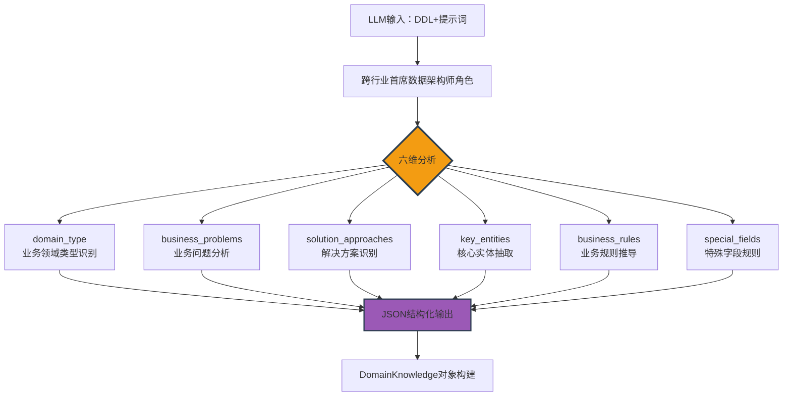

## Neo4j知识图谱构建流程

### 业务知识节点创建流程

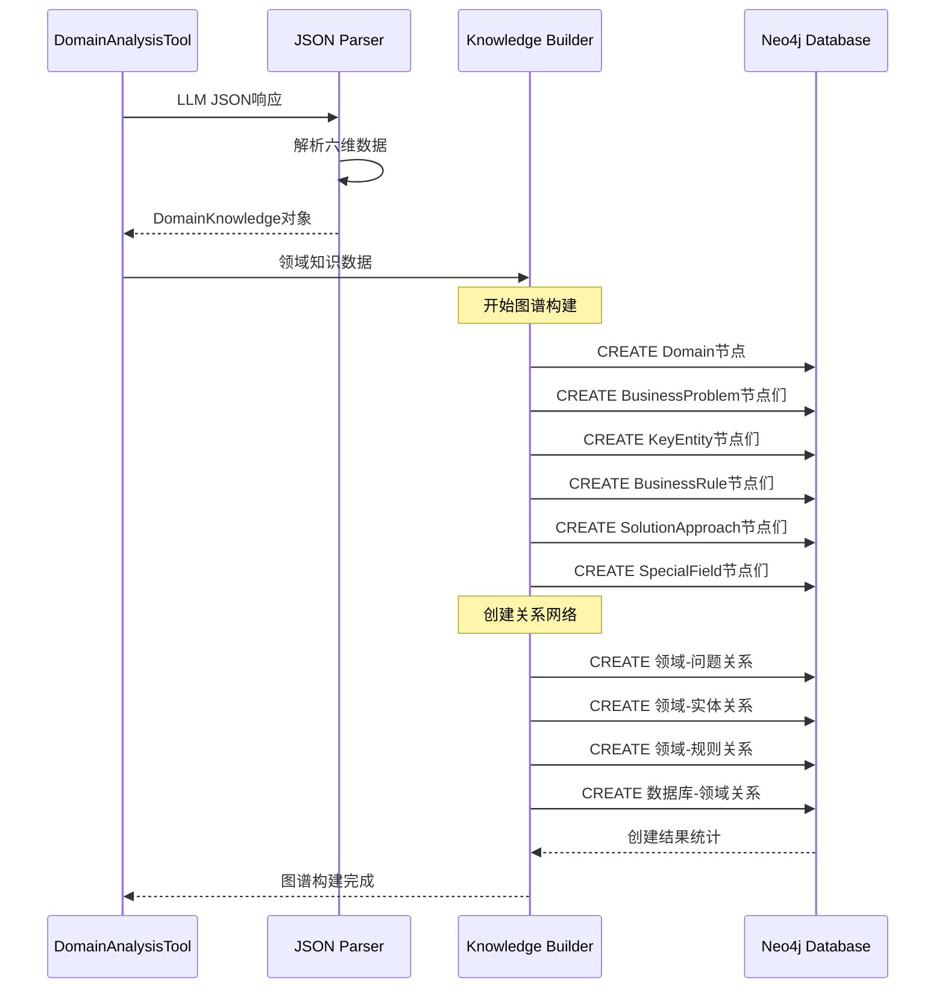

### 知识图谱结构详图

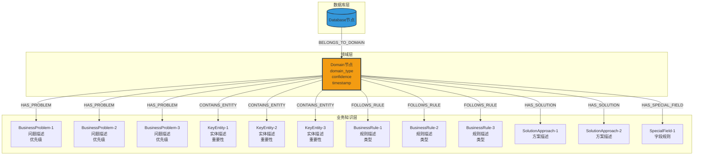

## 错误处理和降级流程

### 异常处理数据流

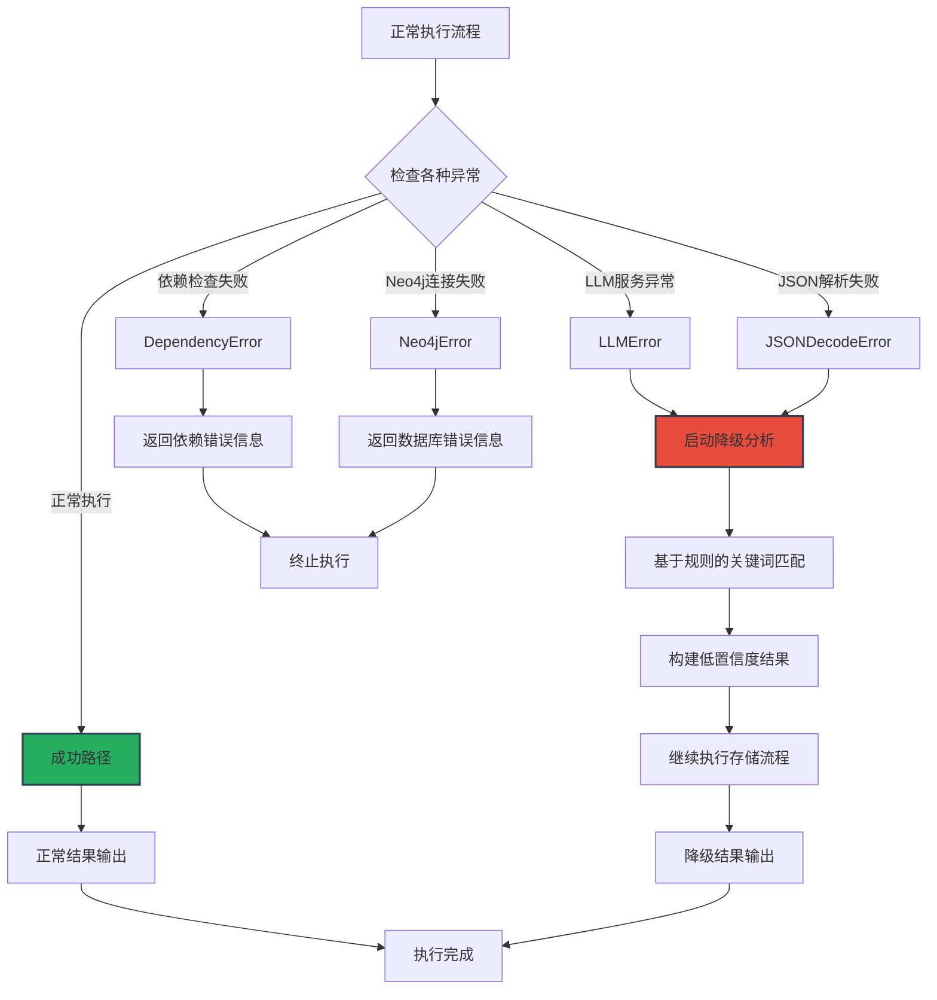

### 降级分析数据流

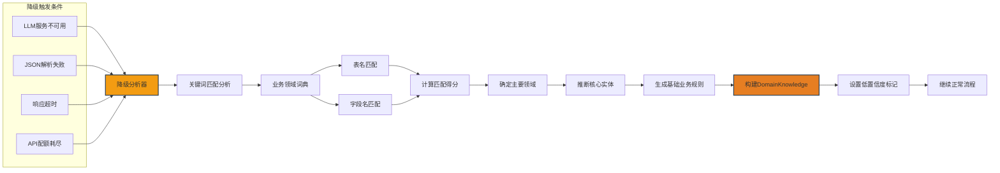

## 数据缓存和性能优化流程

### 缓存策略数据流

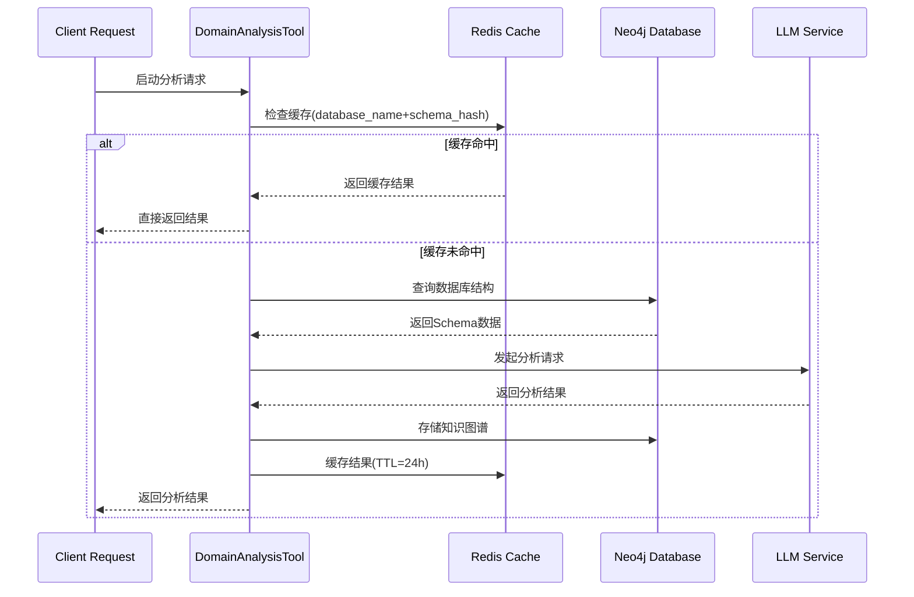

### 批量处理优化流程

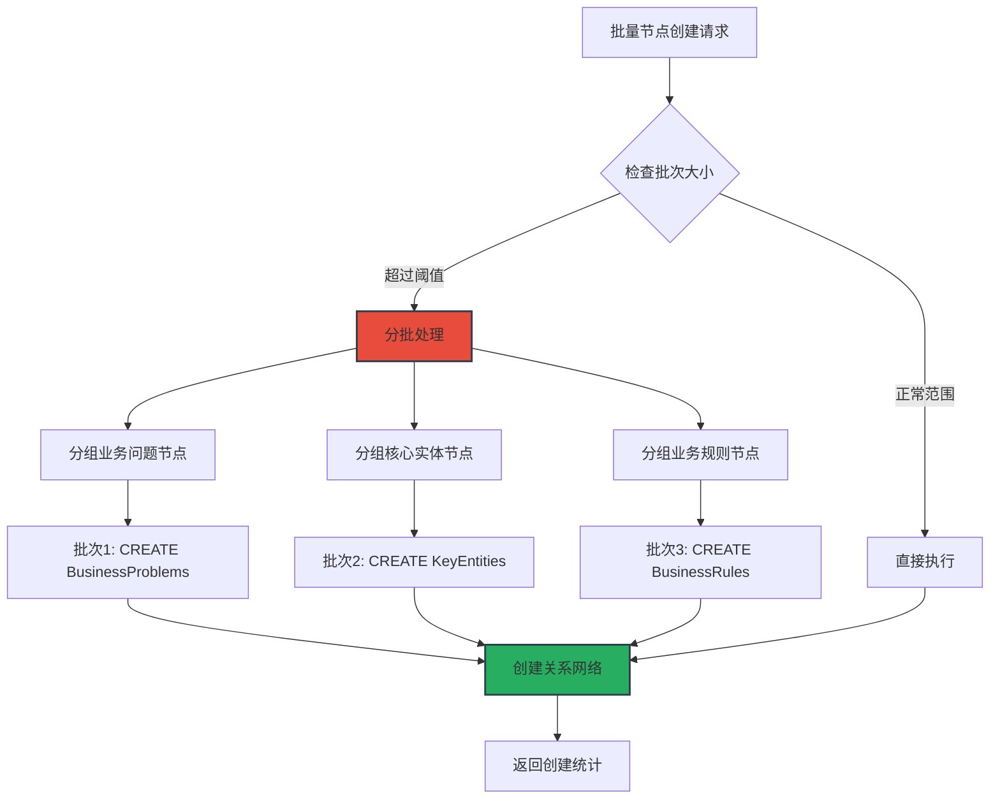

## 监控和日志数据流

### 执行监控流程

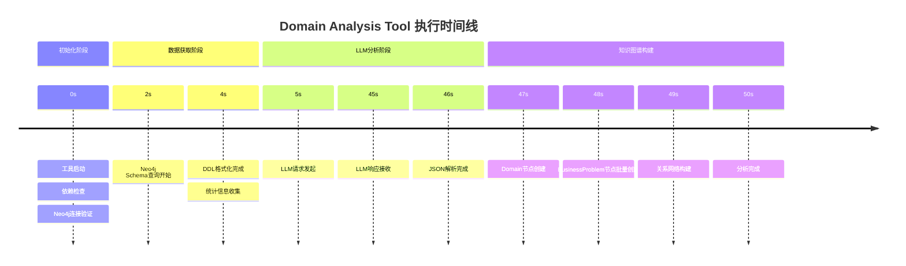

### 性能指标监控

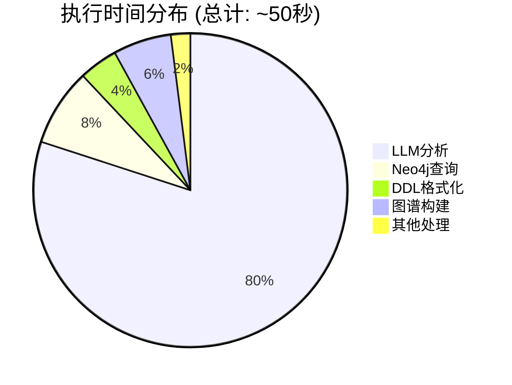

## 数据流总结

### 关键数据流节点

1. **输入数据流**: Neo4j Database → Table/Column结构 → DDL字符串
2. **分析数据流**: DDL + 提示词 → LLM服务 → JSON结构化响应  
3. **解析数据流**: JSON响应 → 数据验证 → DomainKnowledge对象
4. **存储数据流**: DomainKnowledge → Neo4j节点创建 → 关系网络构建
5. **输出数据流**: 图谱统计 → 执行报告 → 结果返回

### 性能优化点

- **缓存机制**: Redis缓存分析结果，避免重复LLM调用
- **批量操作**: Neo4j批量节点创建，减少网络往返  
- **并行处理**: 图谱节点创建和关系构建并行执行
- **降级策略**: LLM不可用时自动切换到规则分析
- **连接池**: Neo4j连接复用，减少连接开销

通过这些详细的数据流图，开发者可以清楚地理解 Domain Analysis Tool 的完整执行过程，为代码实现和系统优化提供重要参考。