# Domain Analysis Tool 架构设计文档

## 概述

Domain Analysis Tool 采用现代化的 **LLM + 图数据库** 架构模式，整合了传统的规则匹配、统计分析和前沿的大语言模型技术。本文档详细阐述了工具的技术架构、设计决策和实现策略。

## 核心架构理念

### 1. 混合智能架构 (Hybrid Intelligence)

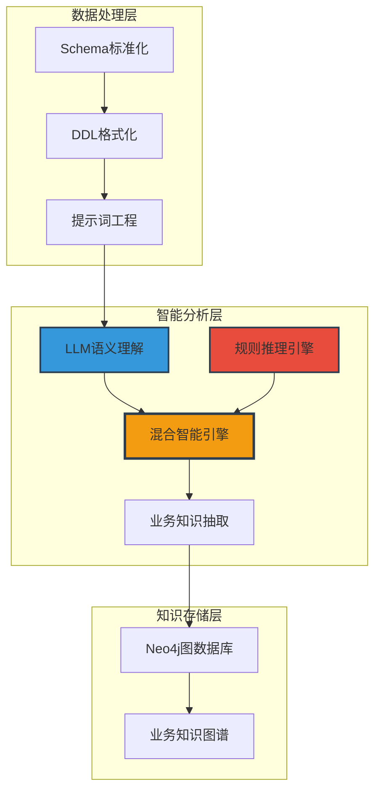
```mermaid
graph TB
    subgraph "智能分析层"
        A[LLM语义理解] --> C[混合智能引擎]
        B[规则推理引擎] --> C
        C --> D[业务知识抽取]
    end
    
    subgraph "数据处理层" 
        E[Schema标准化] --> F[DDL格式化]
        F --> G[提示词工程]
        G --> A
    end
    
    subgraph "知识存储层"
        H[Neo4j图数据库] --> I[业务知识图谱]
        D --> H
    end
    
    style C fill:#f39c12,stroke:#2c3e50,stroke-width:3px
    style A fill:#3498db,stroke:#2c3e50,stroke-width:2px
    style B fill:#e74c3c,stroke:#2c3e50,stroke-width:2px
```

**设计原则**:
- **LLM主导**: 利用大模型的语义理解能力进行深度分析
- **规则补充**: 传统规则作为降级和验证机制
- **知识积累**: 分析结果持久化为可查询的图结构
- **渐进优化**: 支持基于反馈的迭代改进

### 2. 六维业务分析框架

基于 `nl2sql_pipeline` 的成熟算法，采用结构化的六维分析方法：

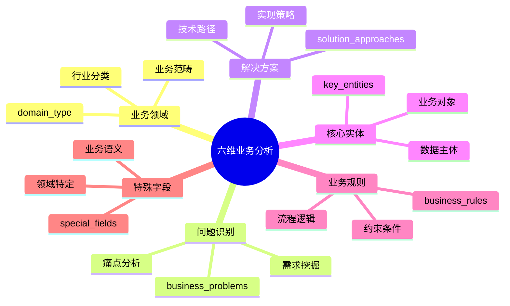
```mermaid
mindmap
  root((六维业务分析))
    业务领域
      domain_type
      行业分类
      业务范畴
    问题识别  
      business_problems
      痛点分析
      需求挖掘
    解决方案
      solution_approaches
      技术路径
      实现策略
    核心实体
      key_entities
      业务对象
      数据主体
    业务规则
      business_rules
      约束条件
      流程逻辑
    特殊字段
      special_fields
      领域特定
      业务语义
```

## 技术架构设计

### 1. 分层架构模式

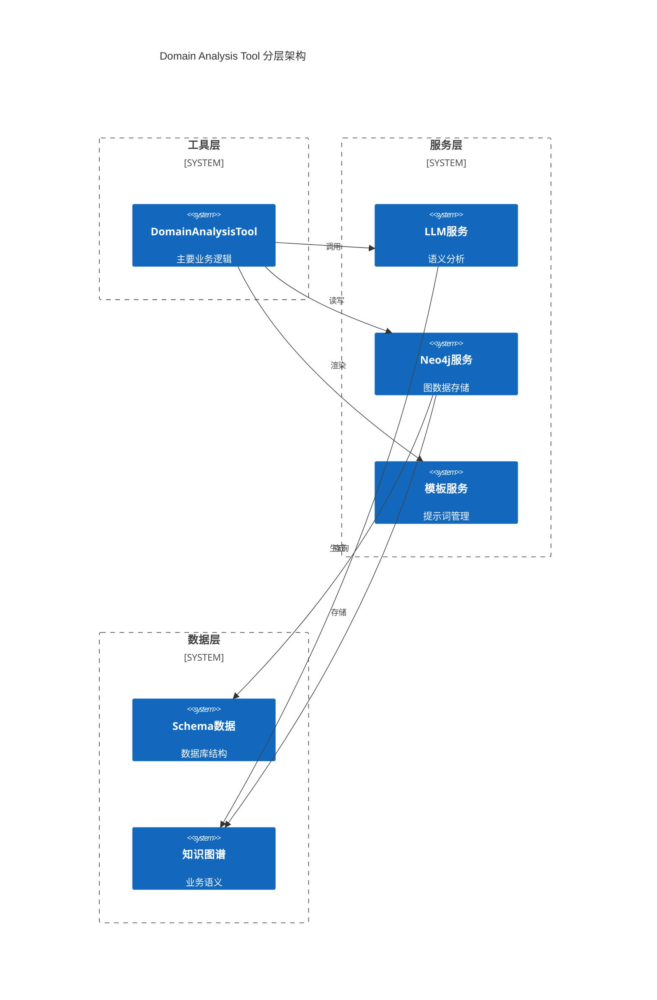
```mermaid
C4Context
    title Domain Analysis Tool 分层架构

    System_Boundary(b1, "工具层") {
        System(tool, "DomainAnalysisTool", "主要业务逻辑")
    }
    
    System_Boundary(b2, "服务层") {
        System(llm, "LLM服务", "语义分析")
        System(neo4j, "Neo4j服务", "图数据存储") 
        System(template, "模板服务", "提示词管理")
    }
    
    System_Boundary(b3, "数据层") {
        System(schema, "Schema数据", "数据库结构")
        System(knowledge, "知识图谱", "业务语义")
    }
    
    Rel(tool, llm, "调用")
    Rel(tool, neo4j, "读写")  
    Rel(tool, template, "渲染")
    Rel(llm, knowledge, "生成")
    Rel(neo4j, knowledge, "存储")
    Rel(neo4j, schema, "查询")
```

**架构特点**:
- **清晰分层**: 工具-服务-数据三层架构，职责明确
- **服务解耦**: LLM、Neo4j、模板服务独立，便于测试和维护
- **数据驱动**: 以数据流为核心的处理链路
- **可扩展性**: 支持新服务的插入和替换

### 2. 数据流架构

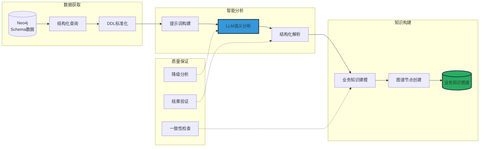
```mermaid
flowchart LR
    subgraph "数据获取"
        A[(Neo4j<br/>Schema数据)] --> B[结构化查询]
        B --> C[DDL标准化]
    end
    
    subgraph "智能分析"
        C --> D[提示词构建]
        D --> E[LLM语义分析]
        E --> F[结构化解析]
    end
    
    subgraph "知识构建" 
        F --> G[业务知识建模]
        G --> H[图谱节点创建]
        H --> I[(业务知识图谱)]
    end
    
    subgraph "质量保证"
        J[降级分析] -.-> E
        K[结果验证] -.-> F
        L[一致性检查] -.-> G
    end
    
    style E fill:#3498db,stroke:#2c3e50,stroke-width:3px
    style I fill:#27ae60,stroke:#2c3e50,stroke-width:3px
```

## LLM集成架构详解

### 1. 提示词工程架构

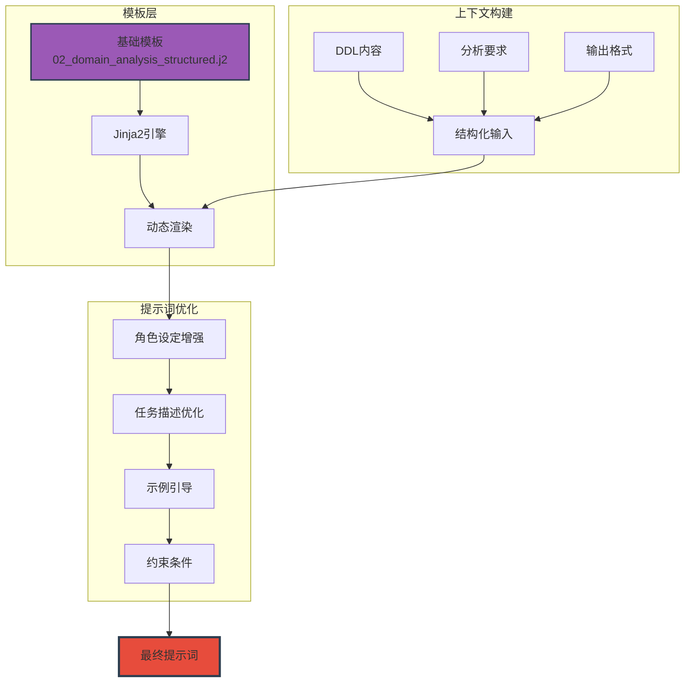
```mermaid
graph TD
    subgraph "模板层"
        A[基础模板<br/>02_domain_analysis_structured.j2] --> B[Jinja2引擎]
        B --> C[动态渲染]
    end
    
    subgraph "上下文构建"
        D[DDL内容] --> E[结构化输入]
        F[分析要求] --> E
        G[输出格式] --> E
        E --> C
    end
    
    subgraph "提示词优化"  
        C --> H[角色设定增强]
        H --> I[任务描述优化] 
        I --> J[示例引导]
        J --> K[约束条件]
    end
    
    K --> L[最终提示词]
    
    style A fill:#9b59b6,stroke:#2c3e50,stroke-width:2px
    style L fill:#e74c3c,stroke:#2c3e50,stroke-width:3px
```

**提示词设计原则**:
- **角色驱动**: "跨行业首席数据架构师和业务专家" 角色设定
- **任务明确**: 具体的分析要求和输出格式约束
- **结构化输出**: 严格的JSON格式规范
- **领域无关**: 通用的分析框架，适用于各种业务场景

### 2. LLM服务集成模式

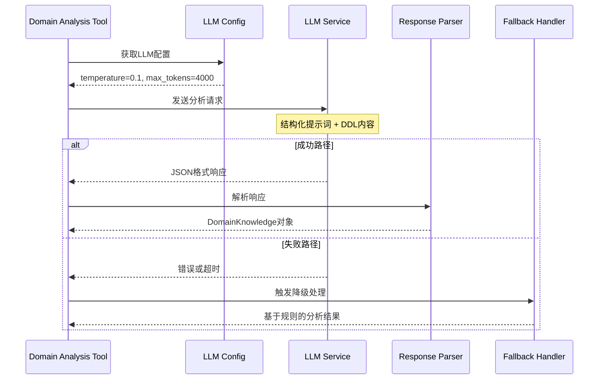
```mermaid
sequenceDiagram
    participant Tool as Domain Analysis Tool
    participant Config as LLM Config
    participant Service as LLM Service
    participant Parser as Response Parser
    participant Fallback as Fallback Handler

    Tool->>Config: 获取LLM配置
    Config-->>Tool: temperature=0.1, max_tokens=4000
    
    Tool->>Service: 发送分析请求
    Note over Service: 结构化提示词 + DDL内容
    
    alt 成功路径
        Service-->>Tool: JSON格式响应
        Tool->>Parser: 解析响应
        Parser-->>Tool: DomainKnowledge对象
    else 失败路径
        Service-->>Tool: 错误或超时
        Tool->>Fallback: 触发降级处理
        Fallback-->>Tool: 基于规则的分析结果
    end
```

**集成策略**:
- **配置化管理**: 支持不同LLM模型的参数调优
- **异步处理**: 避免长时间阻塞主流程
- **重试机制**: 网络异常时的自动重试
- **优雅降级**: LLM不可用时的备选方案

### 3. 响应解析架构

```mermaid
graph LR
    subgraph "原始响应处理"
        A[LLM Raw Response] --> B[格式清理]
        B --> C[```json标记移除]
        C --> D[JSON字符串]
    end
    
    subgraph "结构化解析"
        D --> E[JSON.parse()]
        E --> F{解析成功?}
        F -->|Yes| G[数据验证]
        F -->|No| H[解析异常]
    end
    
    subgraph "数据建模"
        G --> I[字段映射]
        I --> J[类型转换]
        J --> K[DomainKnowledge构建]
        
        H --> L[默认值填充]
        L --> K
    end
    
    style E fill:#3498db,stroke:#2c3e50,stroke-width:2px
    style K fill:#27ae60,stroke:#2c3e50,stroke-width:3px
```

## Neo4j图数据库架构

### 1. 知识图谱架构设计

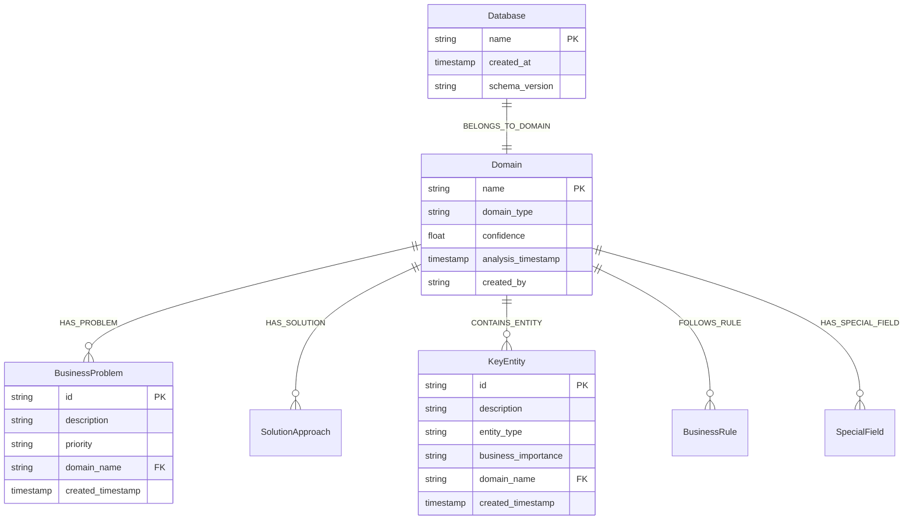
```mermaid
erDiagram
    Database ||--|| Domain : BELONGS_TO_DOMAIN
    Domain ||--o{ BusinessProblem : HAS_PROBLEM
    Domain ||--o{ SolutionApproach : HAS_SOLUTION  
    Domain ||--o{ KeyEntity : CONTAINS_ENTITY
    Domain ||--o{ BusinessRule : FOLLOWS_RULE
    Domain ||--o{ SpecialField : HAS_SPECIAL_FIELD
    
    Database {
        string name PK
        timestamp created_at
        string schema_version
    }
    
    Domain {
        string name PK
        string domain_type
        float confidence
        timestamp analysis_timestamp
        string created_by
    }
    
    BusinessProblem {
        string id PK
        string description
        string priority
        string domain_name FK
        timestamp created_timestamp
    }
    
    KeyEntity {
        string id PK  
        string description
        string entity_type
        string business_importance
        string domain_name FK
        timestamp created_timestamp
    }
```

**设计优势**:
- **语义丰富**: 图结构天然表达业务概念之间的关系
- **查询灵活**: 支持复杂的关联查询和路径分析
- **扩展友好**: 新增节点类型和关系类型成本低
- **性能优化**: 基于关系的快速遍历和聚合

### 2. 直接Neo4j操作模式

不同于传统的ORM抽象，采用直接Cypher操作：

```python
# 传统方式 (避免)
class DomainRepository:
    def create_domain(self, domain: Domain) -> None:
        # 复杂的ORM映射逻辑
        pass

# 直接操作方式 (推荐)  
def _create_domain_node(self, domain_knowledge: DomainKnowledge) -> None:
    cypher = """
    MERGE (d:Domain {name: $domain_name})
    SET d.domain_type = $domain_type,
        d.confidence = $confidence,
        d.analysis_timestamp = $timestamp
    RETURN d
    """
    self.neo4j_client.run(cypher, **params)
```

**优势分析**:
- **性能提升**: 减少中间层的开销
- **灵活控制**: 精确控制查询逻辑和事务边界
- **调试友好**: 直接查看和优化Cypher语句
- **功能完整**: 充分利用Neo4j的高级特性

## 错误处理和容错架构

### 1. 多层次错误处理

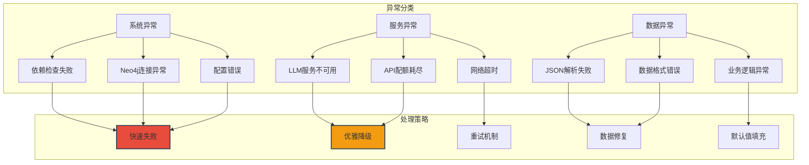
```mermaid
graph TD
    subgraph "异常分类"
        A[系统异常] --> A1[依赖检查失败]
        A --> A2[Neo4j连接异常]
        A --> A3[配置错误]
        
        B[服务异常] --> B1[LLM服务不可用]  
        B --> B2[API配额耗尽]
        B --> B3[网络超时]
        
        C[数据异常] --> C1[JSON解析失败]
        C --> C2[数据格式错误]
        C --> C3[业务逻辑异常]
    end
    
    subgraph "处理策略"
        A1 --> D1[快速失败]
        A2 --> D1
        A3 --> D1
        
        B1 --> D2[优雅降级]
        B2 --> D2
        B3 --> D3[重试机制]
        
        C1 --> D4[数据修复]
        C2 --> D4
        C3 --> D5[默认值填充]
    end
    
    style D2 fill:#f39c12,stroke:#2c3e50,stroke-width:2px
    style D1 fill:#e74c3c,stroke:#2c3e50,stroke-width:2px
```

### 2. 降级处理架构

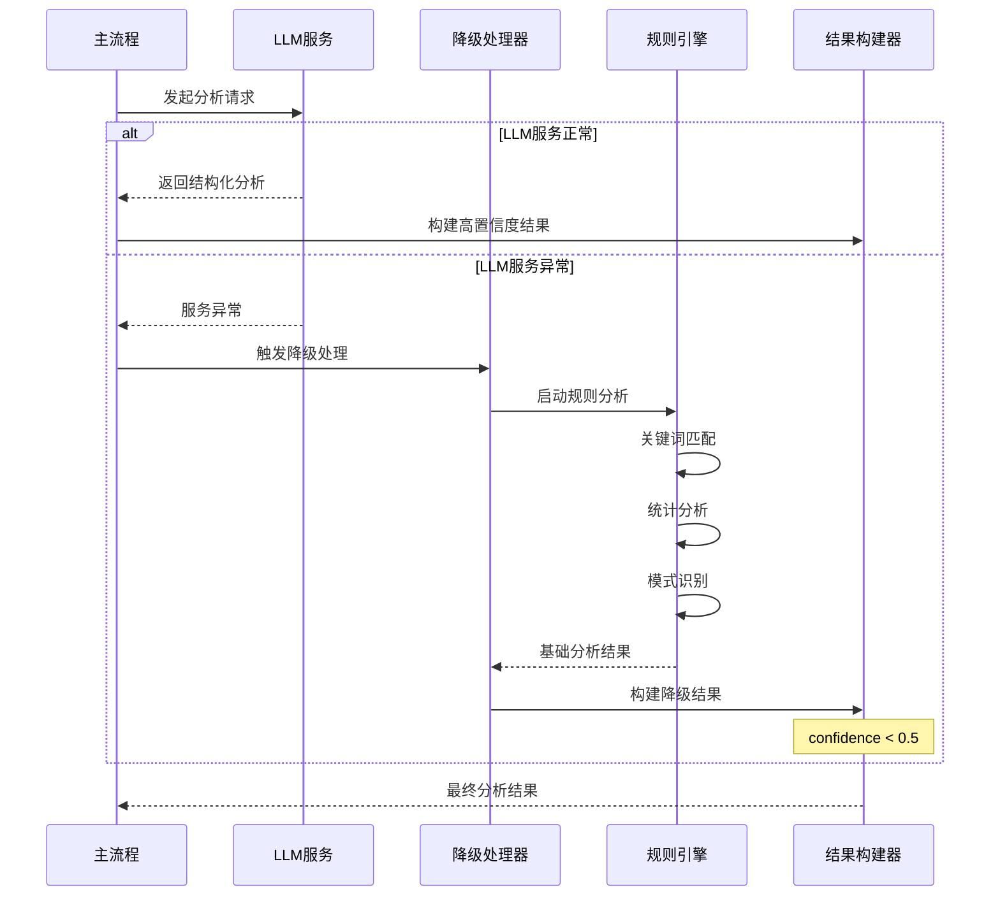
```mermaid
sequenceDiagram
    participant Main as 主流程
    participant LLM as LLM服务
    participant Fallback as 降级处理器
    participant Rules as 规则引擎
    participant Result as 结果构建器

    Main->>LLM: 发起分析请求
    
    alt LLM服务正常
        LLM-->>Main: 返回结构化分析
        Main->>Result: 构建高置信度结果
    else LLM服务异常
        LLM-->>Main: 服务异常
        Main->>Fallback: 触发降级处理
        Fallback->>Rules: 启动规则分析
        
        Rules->>Rules: 关键词匹配
        Rules->>Rules: 统计分析
        Rules->>Rules: 模式识别
        
        Rules-->>Fallback: 基础分析结果
        Fallback->>Result: 构建降级结果
        Note over Result: confidence < 0.5
    end
    
    Result-->>Main: 最终分析结果
```

## 性能优化架构

### 1. 缓存层设计

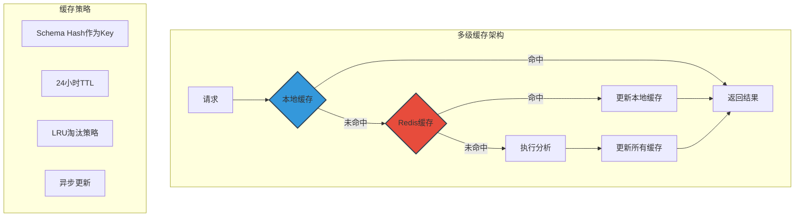
```mermaid
graph TB
    subgraph "多级缓存架构"
        A[请求] --> B{本地缓存}
        B -->|命中| C[返回结果]
        B -->|未命中| D{Redis缓存}
        D -->|命中| E[更新本地缓存]
        D -->|未命中| F[执行分析]
        E --> C
        F --> G[更新所有缓存]
        G --> C
    end
    
    subgraph "缓存策略"
        H[Schema Hash作为Key]
        I[24小时TTL]
        J[LRU淘汰策略]
        K[异步更新]
    end
    
    style B fill:#3498db,stroke:#2c3e50,stroke-width:2px
    style D fill:#e74c3c,stroke:#2c3e50,stroke-width:2px
```

**缓存设计原则**:
- **分层缓存**: 本地内存 + Redis分布式缓存
- **智能失效**: 基于Schema变化的智能缓存失效
- **异步更新**: 后台定期刷新热点数据
- **压缩存储**: 序列化优化减少存储空间

### 2. 并发处理架构

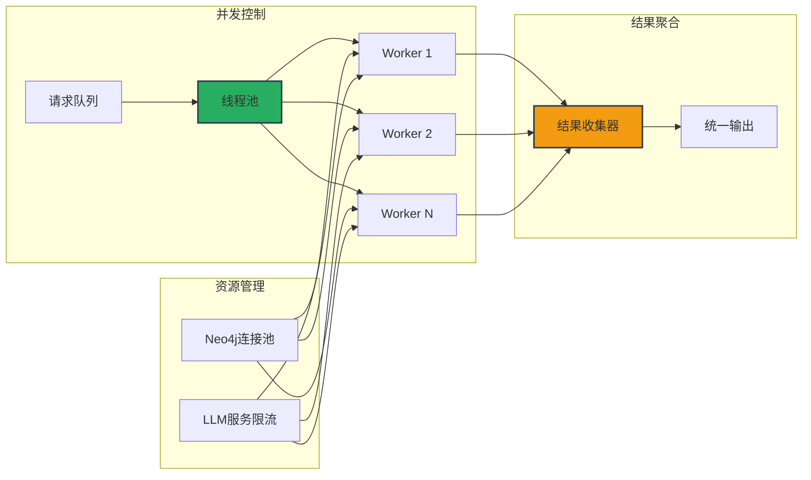
```mermaid
graph LR
    subgraph "并发控制"
        A[请求队列] --> B[线程池]
        B --> C[Worker 1]
        B --> D[Worker 2] 
        B --> E[Worker N]
    end
    
    subgraph "资源管理"
        F[Neo4j连接池] --> C
        F --> D
        F --> E
        
        G[LLM服务限流] --> C
        G --> D  
        G --> E
    end
    
    subgraph "结果聚合"
        C --> H[结果收集器]
        D --> H
        E --> H
        H --> I[统一输出]
    end
    
    style B fill:#27ae60,stroke:#2c3e50,stroke-width:2px
    style H fill:#f39c12,stroke:#2c3e50,stroke-width:2px
```

## 扩展性架构设计

### 1. 插件化架构

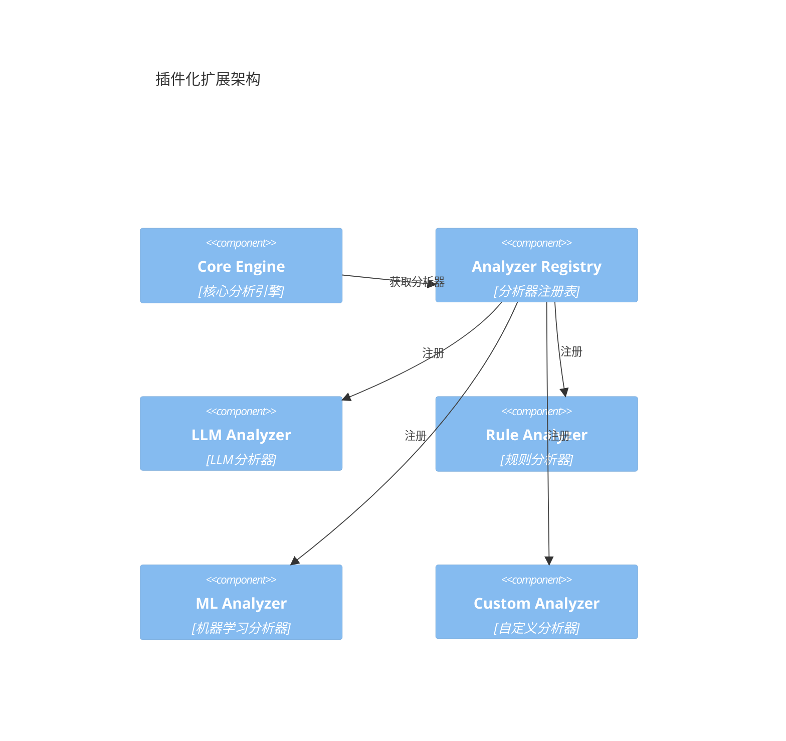
```mermaid
C4Component
    title 插件化扩展架构

    Component(core, "Core Engine", "核心分析引擎")
    Component(analyzer_registry, "Analyzer Registry", "分析器注册表")
    
    Component(llm_analyzer, "LLM Analyzer", "LLM分析器")
    Component(rule_analyzer, "Rule Analyzer", "规则分析器") 
    Component(ml_analyzer, "ML Analyzer", "机器学习分析器")
    
    Component(custom_analyzer, "Custom Analyzer", "自定义分析器")
    
    Rel(core, analyzer_registry, "获取分析器")
    Rel(analyzer_registry, llm_analyzer, "注册")
    Rel(analyzer_registry, rule_analyzer, "注册")
    Rel(analyzer_registry, ml_analyzer, "注册")
    Rel(analyzer_registry, custom_analyzer, "注册")
```

**扩展点设计**:
- **分析器接口**: 统一的分析器抽象，支持多种实现
- **结果合并策略**: 多个分析器结果的智能融合
- **配置驱动**: 通过配置文件控制分析器的启用和参数
- **热插拔支持**: 运行时动态加载新的分析器

### 2. 配置化架构

```yaml
# domain_analysis_config.yaml
analyzers:
  primary: "llm_analyzer"
  fallback: "rule_analyzer" 
  custom: []

llm_config:
  model: "gpt-4"
  temperature: 0.1
  max_tokens: 4000
  timeout: 120

neo4j_config:
  batch_size: 50
  connection_pool_size: 10
  timeout: 30

cache_config:
  enabled: true
  ttl: 86400  # 24 hours
  max_size: 1000
```

## 安全架构设计

### 1. 数据安全

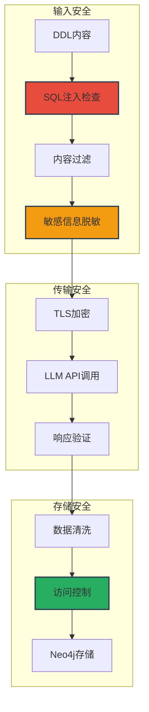
```mermaid
graph TB
    subgraph "输入安全"
        A[DDL内容] --> B[SQL注入检查]
        B --> C[内容过滤]
        C --> D[敏感信息脱敏]
    end
    
    subgraph "传输安全"
        D --> E[TLS加密]
        E --> F[LLM API调用]
        F --> G[响应验证]
    end
    
    subgraph "存储安全"  
        G --> H[数据清洗]
        H --> I[访问控制]
        I --> J[Neo4j存储]
    end
    
    style B fill:#e74c3c,stroke:#2c3e50,stroke-width:2px
    style D fill:#f39c12,stroke:#2c3e50,stroke-width:2px
    style I fill:#27ae60,stroke:#2c3e50,stroke-width:2px
```

### 2. API安全

```python
class SecurityConfig:
    """安全配置管理"""
    
    # API密钥管理
    LLM_API_KEY_ROTATION_DAYS = 30
    
    # 访问控制
    MAX_REQUESTS_PER_HOUR = 100
    
    # 数据过滤
    SENSITIVE_PATTERNS = [
        r'password', r'secret', r'token', 
        r'credit_card', r'ssn', r'email'
    ]
    
    # 传输安全
    REQUIRE_TLS = True
    MIN_TLS_VERSION = '1.2'
```

## 监控和可观测性架构

### 1. 多维度监控

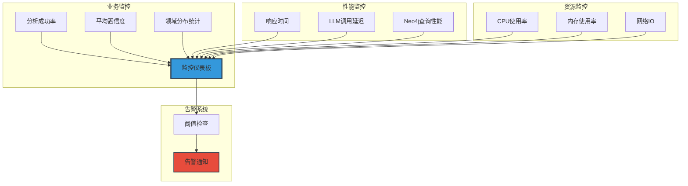
```mermaid
graph TD
    subgraph "业务监控"
        A[分析成功率] --> D[监控仪表板]
        B[平均置信度] --> D
        C[领域分布统计] --> D
    end
    
    subgraph "性能监控"
        E[响应时间] --> D
        F[LLM调用延迟] --> D  
        G[Neo4j查询性能] --> D
    end
    
    subgraph "资源监控"
        H[CPU使用率] --> D
        I[内存使用率] --> D
        J[网络IO] --> D
    end
    
    subgraph "告警系统"
        D --> K[阈值检查]
        K --> L[告警通知]
    end
    
    style D fill:#3498db,stroke:#2c3e50,stroke-width:3px
    style L fill:#e74c3c,stroke:#2c3e50,stroke-width:2px
```

### 2. 日志架构

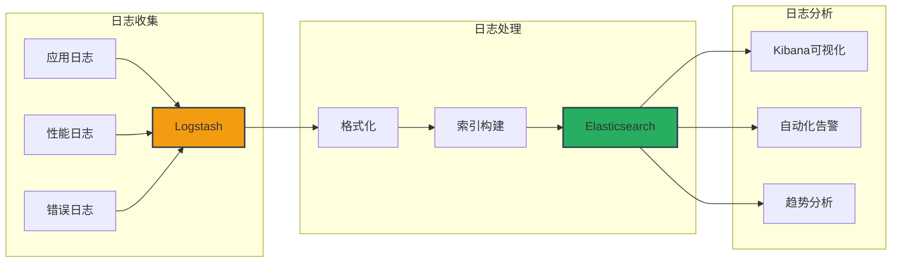
```mermaid
flowchart LR
    subgraph "日志收集"
        A[应用日志] --> D[Logstash]
        B[性能日志] --> D
        C[错误日志] --> D
    end
    
    subgraph "日志处理"
        D --> E[格式化]
        E --> F[索引构建]  
        F --> G[Elasticsearch]
    end
    
    subgraph "日志分析"
        G --> H[Kibana可视化]
        G --> I[自动化告警]
        G --> J[趋势分析]
    end
    
    style D fill:#f39c12,stroke:#2c3e50,stroke-width:2px
    style G fill:#27ae60,stroke:#2c3e50,stroke-width:2px
```

## 部署架构设计

### 1. 容器化部署

```yaml
# docker-compose.yml
version: '3.8'
services:
  domain-analyzer:
    build: .
    environment:
      - NEO4J_URI=bolt://neo4j:7687
      - LLM_API_ENDPOINT=https://api.openai.com/v1
    depends_on:
      - neo4j
      - redis
      
  neo4j:
    image: neo4j:5.x
    environment:
      - NEO4J_AUTH=neo4j/password
    volumes:
      - neo4j_data:/data
      
  redis:
    image: redis:7-alpine
    command: redis-server --maxmemory 1gb
```

### 2. 微服务架构

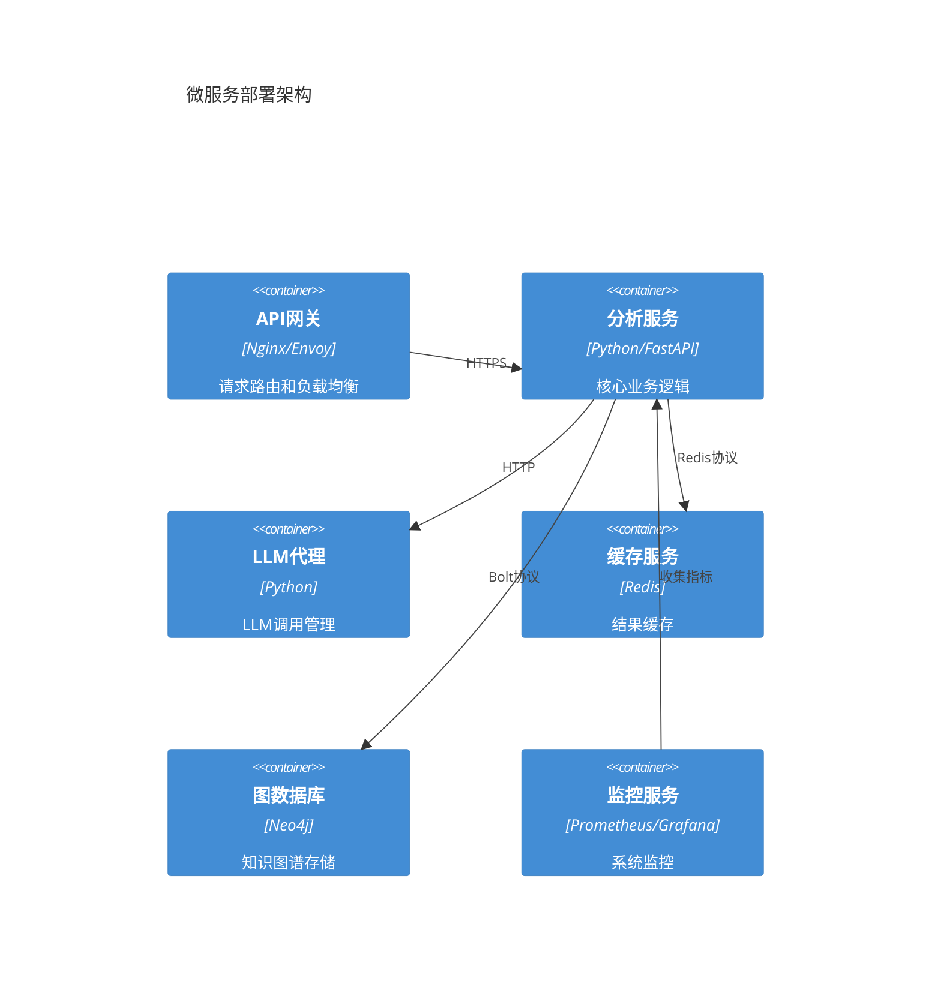
```mermaid
C4Container
    title 微服务部署架构

    Container(api_gateway, "API网关", "Nginx/Envoy", "请求路由和负载均衡")
    Container(analyzer_service, "分析服务", "Python/FastAPI", "核心业务逻辑")
    Container(llm_proxy, "LLM代理", "Python", "LLM调用管理")
    Container(cache_service, "缓存服务", "Redis", "结果缓存")
    Container(graph_db, "图数据库", "Neo4j", "知识图谱存储")
    Container(monitoring, "监控服务", "Prometheus/Grafana", "系统监控")

    Rel(api_gateway, analyzer_service, "HTTPS")
    Rel(analyzer_service, llm_proxy, "HTTP")
    Rel(analyzer_service, cache_service, "Redis协议")
    Rel(analyzer_service, graph_db, "Bolt协议")
    Rel(monitoring, analyzer_service, "收集指标")
```

## 架构演进路径

### 1. 版本演进策略

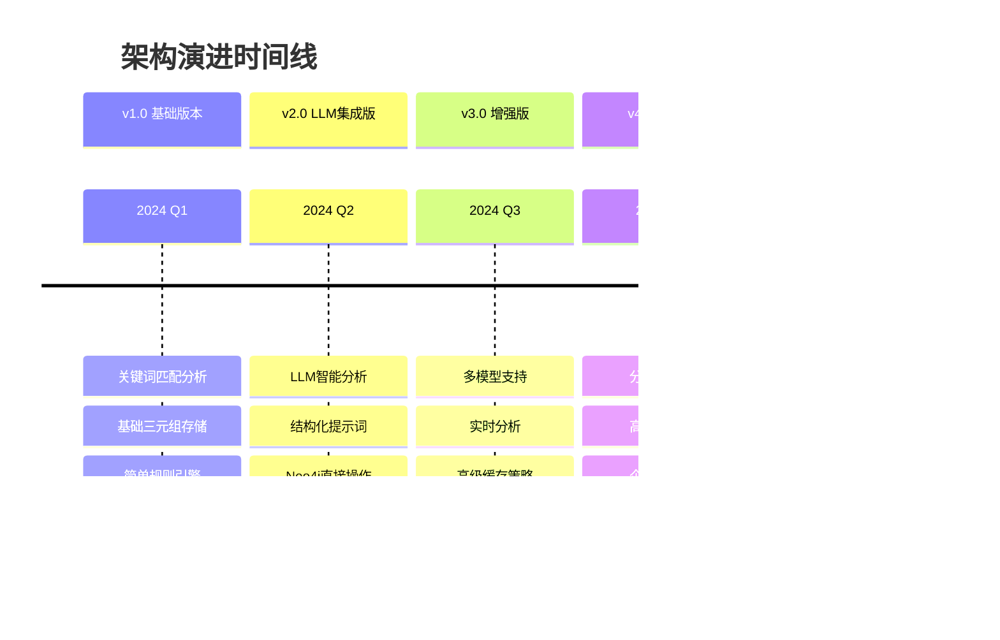
```mermaid
timeline
    title 架构演进时间线
    
    section v1.0 基础版本
        2024 Q1    : 关键词匹配分析
                   : 基础三元组存储
                   : 简单规则引擎
    
    section v2.0 LLM集成版
        2024 Q2    : LLM智能分析
                   : 结构化提示词
                   : Neo4j直接操作
                   : 六维分析框架
    
    section v3.0 增强版
        2024 Q3    : 多模型支持
                   : 实时分析
                   : 高级缓存策略
                   : 插件化架构
    
    section v4.0 企业版
        2024 Q4    : 分布式部署
                   : 高可用设计
                   : 企业级安全
                   : AI辅助优化
```

### 2. 技术债务管理

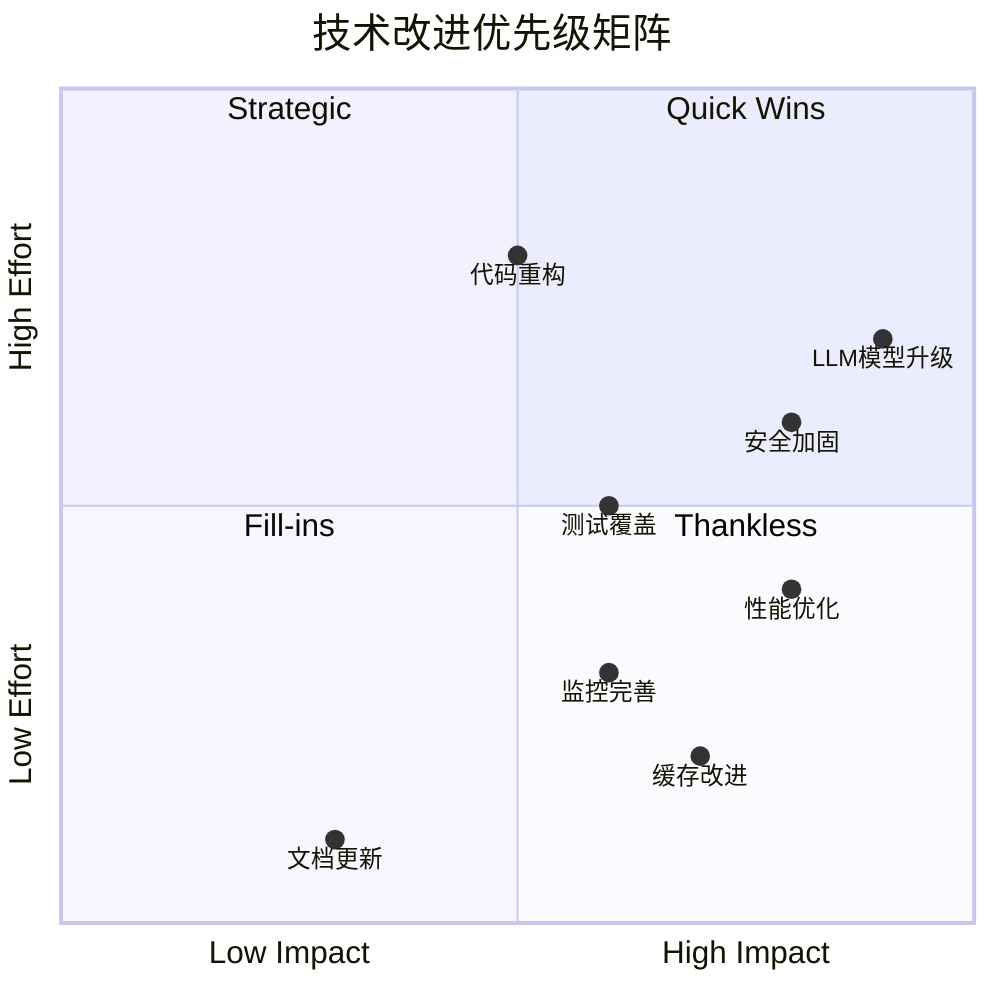
```mermaid
quadrantChart
    title 技术改进优先级矩阵
    x-axis Low Impact --> High Impact
    y-axis Low Effort --> High Effort
    
    quadrant-1 Quick Wins
    quadrant-2 Strategic
    quadrant-3 Fill-ins  
    quadrant-4 Thankless

    LLM模型升级: [0.9, 0.7]
    性能优化: [0.8, 0.4]
    缓存改进: [0.7, 0.2]
    监控完善: [0.6, 0.3]
    安全加固: [0.8, 0.6]
    文档更新: [0.3, 0.1]
    代码重构: [0.5, 0.8]
    测试覆盖: [0.6, 0.5]
```

## 总结

Domain Analysis Tool 的架构设计体现了以下核心价值：

### 技术创新
- **LLM + 图数据库**: 前沿AI技术与传统图结构的完美结合
- **六维分析法**: 结构化的业务理解框架
- **混合智能**: LLM主导 + 规则补充的智能分析模式

### 工程实践  
- **分层架构**: 清晰的职责分离和模块化设计
- **直接操作**: 跳过ORM抽象的高性能数据库访问
- **错误处理**: 多层次的异常处理和优雅降级

### 企业级特性
- **高性能**: 多级缓存和并发处理优化
- **高可用**: 降级机制和容错设计
- **可扩展**: 插件化架构支持功能扩展
- **可观测**: 完整的监控和日志体系

该架构设计为Domain Analysis Tool提供了坚实的技术基础，既满足了当前的功能需求，又为未来的发展预留了扩展空间。