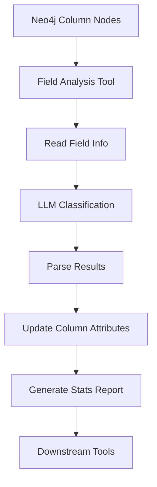

# Field Analysis Tool 设计文档

## 概述

Field Analysis Tool 是 SemanticSQL Agent 工具链中的核心分析工具，负责对数据库字段进行语义分类和业务理解。该工具基于 `schema_extraction_tool` 已提供的字段元数据和熵值信息，采用 `field_classification_pipeline` 的LLM分类算法，实现字段的智能化语义分类。

## 设计理念

### 1. 数据复用优化
- **基础数据复用**：直接使用schema_extraction_tool已采集的sample_values和entropy_level
- **LLM智能分类**：采用field_classification_pipeline的成熟分类算法
- **简化处理设计**：逐字段处理，无批量逻辑复杂性

### 2. 记忆持久化架构
- **Neo4j图存储**：将分析结果以图结构持久化，支持复杂的关联查询
- **知识积累机制**：支持分析结果的增量更新和历史追踪
- **链式工具协作**：为后续分析工具提供结构化的语义知识

### 3. 高性能处理
- **批量处理设计**：支持大规模字段的批量分析处理
- **优雅降级机制**：在外部依赖不可用时提供备用分析方案
- **错误恢复能力**：单个字段失败不影响整体分析流程

## 核心功能

### 1. 字段语义分类

采用field_classification_pipeline的标准分类体系，将字段分为7大类别：

- **identifier**: 标识符（如ID、编号等）
- **measure**: 度量值（可计算的数值）
- **dimension**: 维度（分类、分组字段）
- **datetime**: 日期时间
- **text**: 文本
- **boolean**: 布尔值
- **other**: 其他类型

### 2. 熵值等级直接使用

直接使用schema_extraction_tool已计算的entropy_level字符串：

```python
# schema_extraction_tool提供的熵值等级字符串
entropy_levels = {
    "high": 唯一值比例 >= 0.8,    # 高唯一性字段
    "medium": 唯一值比例 >= 0.4,  # 中等唯一性字段
    "low": 唯一值比例 < 0.4     # 低唯一性字段
}

# LLM提示词中直接使用字符串
field_data = {
    'field_name': 'users.id',
    'data_type': 'int',
    'samples': [1, 2, 3],
    'entropy': 'high'  # 直接使用字符串，无需数值转换
}
```

### 3. 重要性评估

采用field_classification_pipeline的重要性评估模式：

- **high**: 标识符类字段（identifier）
- **medium**: 度量值、维度、时间字段（measure, dimension, datetime）
- **low**: 文本、布尔、其他字段（text, boolean, other）

### 4. LLM智能分析

结合上下文信息，使用大语言模型进行深度语义分析：

```jinja2
# LLM 分析提示词模板
你是一个数据库字段分析专家，请分析以下字段：

字段信息：
- 字段名: {{ field_name }}
- 数据类型: {{ data_type }}
- 样本值: {{ sample_values }}
- 熵值等级: {{ entropy_level }}

上下文信息：
- 表名: {{ table_name }}
- 数据库领域: {{ domain_type }}

请返回JSON格式的分析结果...
```

## 技术架构

### 1. 数据流设计



### 2. 核心算法流程

1. **依赖检查**：验证 `schema_extraction_tool` 的执行结果
2. **直接数据读取**：从Neo4j Column节点直接查询字段信息
3. **逐字段LLM分类**：使用entropy_level字符串进行逐个字段分类
4. **结果解析**：解析LLM返回的JSON分类结果
5. **属性更新**：直接更新Column节点的category/field_type/importance属性
6. **统计报告**：生成分类统计和分析报告

### 3. Neo4j 图结构扩展

在原有的 Database -> Table -> Column 结构基础上，增加语义分析节点：

```cypher
# 扩展Column节点属性
(c:Column {
    name: "column_name",
    data_type: "varchar",
    
    # schema_extraction_tool 提供的基础信息
    is_primary: true,
    is_nullable: false,
    entropy_level: "high",
    sample_values: ["value1", "value2"],
    
    # field_analysis_tool 新增的语义信息
    category: "identifier",
    semantic_type: "primary_key", 
    business_meaning: "用户唯一标识符",
    importance: "critical",
    classification_confidence: 0.95,
    entropy_value: 0.92,
    analysis_timestamp: "2024-01-15T10:30:00"
})

# 新增语义关系
(c:Column)-[:BELONGS_TO_CATEGORY]->(cat:FieldCategory {name: "identifier"})
(c:Column)-[:HAS_IMPORTANCE]->(imp:ImportanceLevel {name: "critical"})
(c:Column)-[:HAS_SEMANTIC_TYPE]->(sem:SemanticType {name: "primary_key"})
```

## 使用指南

### 1. 快速开始

```python
from tools.analysis_tools.field_analysis_tool import create_field_analysis_tool

# 创建工具实例
tool = create_field_analysis_tool(
    memory_manager=neo4j_manager,
    database_manager=db_manager
)

# 执行分析（前提：已执行 schema_extraction_tool）
result = tool._run()
print(result)
```

### 2. 在Agent中使用

```python
# 工具会自动集成到Agent中
agent = create_semantic_sql_agent(
    settings=settings,
    use_database=True,
    use_memory=True
)

# Agent会按依赖顺序自动调用工具
result = agent.invoke("请分析数据库的字段语义信息")
```

### 3. 工具链调用序列

```python
# 标准分析工具链
tools_sequence = [
    "schema_extraction_tool",    # 1. 提取数据库结构
    "field_analysis_tool",       # 2. 分析字段语义  ← 当前工具
    "domain_analysis_tool",      # 3. 分析业务领域
    "table_analysis_tool",       # 4. 分析表关系
    "er_analysis_tool"          # 5. 分析ER关系
]
```

## 配置选项

### 1. 分析参数配置

```python
FIELD_ANALYSIS_CONFIG = {
    # 数据采集配置
    "sample_size": 500,                    # 每个字段的采样数量
    "batch_size": 10,                      # LLM分析的批处理大小
    
    # LLM配置
    "llm_temperature": 0.1,                # 保持分析结果一致性
    "llm_max_tokens": 2000,                # 单次调用最大token数
    
    # 分析阈值
    "confidence_threshold": 0.7,           # 分类置信度阈值
    "entropy_high_threshold": 0.7,         # 高熵阈值
    "entropy_medium_threshold": 0.3,       # 中熵阈值
    
    # 重试配置
    "max_retries": 3,                      # 最大重试次数
    "retry_delay": 1.0,                    # 重试间隔（秒）
}
```

### 2. 字段模式配置

```python
FIELD_PATTERNS = {
    "identifier": {
        "name_patterns": ["id", "_id", "uuid", "key"],
        "type_patterns": ["int", "bigint", "varchar", "uuid"],
        "importance": "critical",
        "confidence": 0.9
    },
    "datetime": {
        "name_patterns": ["time", "date", "created_at"],
        "type_patterns": ["datetime", "timestamp", "date"],
        "importance": "medium", 
        "confidence": 0.85
    }
    # ... 更多模式定义
}
```

## 最佳实践

### 1. 性能优化

**简化处理策略**：
```python
# 简化设计的配置
OPTIMAL_CONFIG = {
    "max_retries": 3,        # LLM调用重试次数
    "sample_count": 3,       # 每个字段的样本数量
    "temperature": 0.1,      # 保证分类结果一致性
}
# 注意：移除了batch_size，采用逐字段处理
```

**数据复用优化**：
- 无需重复采样，直接使用schema_extraction_tool的数据
- 直接使用entropy_level字符串，无需数值转换
- 逐字段处理，逻辑简单明了

### 2. 错误处理

**依赖检查**：
```python
# 确保前置工具已执行
if not self._check_dependency("schema_extraction_tool"):
    raise DependencyError("需要先执行 schema_extraction_tool")
```

**降级处理**：
```python
# LLM不可用时的降级方案
try:
    result = self._classify_with_llm(field_info)
except LLMError:
    result = self._classify_with_rules(field_info)
    result["confidence"] *= 0.7  # 降低置信度
```

### 3. 质量保证

**结果验证**：
- 检查分类结果的一致性
- 验证置信度分布的合理性
- 对比规则分类和LLM分类的差异

**持续优化**：
- 收集分类错误案例，优化规则库
- 调整LLM提示词提高分类准确性
- 基于反馈迭代改进算法

## 故障排除

### 1. 常见错误

**依赖未满足**：
```text
错误：❌ 字段分析失败: 依赖检查失败，需要先执行 schema_extraction_tool
解决：确保 schema_extraction_tool 已成功执行并将结果存储到Neo4j
```

**LLM服务异常**：
```text
错误：⚠️ LLM分析失败，降级到规则分析
解决：检查LLM服务配置，确认API密钥和端点地址正确
```

**数据库连接失败**：
```text
错误：❌ 字段样本采集失败: 数据库连接异常
解决：检查数据库连接参数，确认数据库服务正常
```

### 2. 性能问题

**分析速度慢**：
- 无数据采样开销，主要瘤点在LLM调用
- 逐字段处理设计，如需提速可考虑并发处理
- 检查LLM服务响应时间和网络状况

**LLM服务异常**：
- 检查API密钥和端点地址配置
- 检查LLM服务的可用性和负载状况
- 考虑使用较小的batch_size减轻服务压力

## 扩展开发

### 1. 自定义分类器

```python
class CustomFieldClassifier:
    """自定义字段分类器"""
    
    def classify(self, field_info: Dict[str, Any]) -> Dict[str, Any]:
        """
        实现自定义分类逻辑
        
        Args:
            field_info: 字段信息
            
        Returns:
            分类结果
        """
        # 自定义分类逻辑
        pass

# 注册自定义分类器
tool.register_classifier("custom", CustomFieldClassifier())
```

### 2. 新增语义类型

```python
# 扩展语义类型定义
EXTENDED_SEMANTIC_TYPES = {
    "geolocation": {
        "patterns": ["lat", "lng", "coordinate"],
        "validation": lambda x: is_coordinate_format(x)
    },
    "email": {
        "patterns": ["email", "mail"],
        "validation": lambda x: is_email_format(x)
    }
}
```

### 3. 集成外部服务

```python
class ExternalAnalysisService:
    """外部分析服务集成"""
    
    async def analyze_field(self, field_info):
        """调用外部分析API"""
        # 集成第三方分析服务
        pass
```

## 版本历史

### v2.0.0 (当前版本)
- 基于Pipeline算法的完整重写
- 新增LLM智能分析能力
- 支持批量处理和错误恢复
- 完善的Neo4j图结构存储

### v1.0.0 (历史版本)
- 基础的规则分类功能  
- 简单的模式匹配逻辑
- 基本的三元组存储机制

## 相关文档

- [API接口文档](./API接口文档.md) - 详细的API规范和技术实现
- [Schema Extraction Tool](../schema_extraction_tool/README.md) - 前置依赖工具文档
- [SemanticSQL Agent架构](../../README.md) - 整体系统架构说明

---

**总结**：Field Analysis Tool 通过结合传统规则匹配、统计分析和现代LLM技术，实现了高精度的字段语义理解。该工具不仅提供了完整的分类体系，还具备良好的扩展性和可维护性，是 SemanticSQL Agent 工具链中的核心组件。