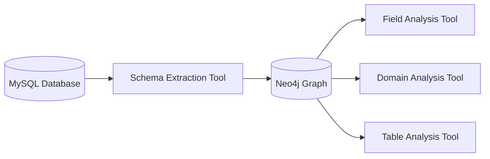

# Schema Extraction Tool 设计文档

## 概述

Schema Extraction Tool是SemanticSQL Agent工具链的第一个工具，负责从MySQL数据库提取基础结构信息并直接存储到Neo4j图数据库。该工具遵循极简设计原则，专注于纯元数据提取，为后续分析工具提供基础数据。

## 设计原则

### 1. 极简操作
- **只处理实际存在的信息**：不进行推理、分析或增强
- **直接简单操作**：不进行性能优化，保持代码简洁
- **避免过度工程**：专注当前阶段任务，不预设未来需求

### 2. 阶段分离
- **纯提取职责**：只负责元数据提取和存储
- **不进行分析**：业务语义分析由后续工具处理
- **为后续铺路**：确保数据完整性，支持链式工具调用

### 3. 直接Neo4j操作
- **跳过三元组抽象**：直接操作Neo4j节点和关系
- **图结构存储**：按照标准图模式创建Database、Table、Column节点
- **高效存储**：减少中间层次，提高存储效率

## 核心功能

### 1. 数据库结构提取
```python
def _extract_mysql_metadata(self, db_manager: DatabaseManager) -> Dict[str, Any]:
    """
    从MySQL提取元数据
    - 获取数据库信息
    - 获取表名列表（支持过滤）
    - 提取每个表的详细信息
    """
```

**提取内容：**
- 数据库名称和基本信息
- 表名列表（支持黑名单过滤）
- 表注释信息（可配置是否使用数据库注释）
- 列的完整信息和元数据

### 2. 表信息提取
```python
def _extract_table_metadata(self, db_manager: DatabaseManager, table_name: str) -> Dict[str, Any]:
    """
    提取单个表的元数据
    - 表基本信息
    - 表注释（可配置）
    - 列信息列表
    """
```

**提取的表信息：**
- `name`: 表名
- `row_count`: 行数（当前阶段为null，后续填充）
- `business_desc`: 业务描述（来自表注释或为空）
- `columns`: 列信息数组

### 3. 列信息提取
```python
def _extract_columns_metadata(self, db_manager: DatabaseManager, table_name: str) -> List[Dict[str, Any]]:
    """
    提取列元数据 - 包含当前阶段所有字段
    - 基础列信息
    - 约束信息
    - 增强元数据
    """
```

**提取的列信息：**
- **基础字段：**
  - `name`: 列名
  - `data_type`: 数据类型
  - `is_nullable`: 是否可为空
  - `is_primary`: 是否主键
  - `business_desc`: 业务描述（来自列注释）

- **增强字段：**
  - `is_foreign`: 是否外键（通过INFORMATION_SCHEMA检查）
  - `entropy_level`: 熵值等级（high/medium/low，基于唯一值比例）
  - `sample_values`: 样本值列表（采集100个不重复值）
  - `category`: 字段类别（当前阶段为null，后续分析填充）

### 4. 直接Neo4j存储
```python
def _store_to_neo4j(self, raw_data: Dict[str, Any]) -> None:
    """
    直接存储到Neo4j图结构
    - 创建Database节点
    - 创建Table节点和CONTAINS关系
    - 创建Column节点和HAS_COLUMN关系
    """
```

**图结构设计：**
```cypher
# Database节点
(d:Database {name: "database_name", business_desc: ""})

# Table节点和关系
(d:Database)-[:CONTAINS]->(t:Table {name: "table_name", row_count: null, business_desc: ""})

# Column节点和关系
(t:Table)-[:HAS_COLUMN]->(c:Column {
    name: "column_name",
    data_type: "varchar",
    is_nullable: true,
    is_primary: false,
    is_foreign: false,
    category: null,
    entropy_level: "medium",
    sample_values: ["value1", "value2"],
    business_desc: ""
})
```

## 核心算法

### 1. 熵值等级计算
```python
def _calculate_entropy_level(self, db_manager: DatabaseManager, table_name: str, column_name: str) -> Optional[str]:
    """
    采样500个数据计算唯一值比例
    - 高熵（high）：唯一值比例 >= 0.8
    - 中熵（medium）：唯一值比例 >= 0.4
    - 低熵（low）：唯一值比例 < 0.4
    """
```

**算法逻辑：**
1. 检查表是否有数据，无数据返回"low"
2. 采样500个非空值
3. 计算唯一值比例 = 唯一值数量 / 总样本数
4. 根据比例阈值分类：
   - `>= 0.8`: high（如ID、UUID等）
   - `>= 0.4`: medium（如姓名、地址等）
   - `< 0.4`: low（如状态、类型等）

### 2. 外键检测
```python
def _check_foreign_key(self, db_manager: DatabaseManager, table_name: str, column_name: str) -> Optional[bool]:
    """
    通过INFORMATION_SCHEMA.KEY_COLUMN_USAGE检查外键约束
    """
```

**检测逻辑：**
- 查询INFORMATION_SCHEMA.KEY_COLUMN_USAGE表
- 检查REFERENCED_TABLE_NAME是否非空
- 返回布尔值或None（检查失败时）

### 3. 表过滤机制
```python
def _filter_tables(self, table_names: List[str], blacklist: List[str]) -> List[str]:
    """
    基于黑名单的简单过滤
    - 支持部分匹配
    - 记录过滤统计
    """
```

## 配置选项

### 1. 表过滤配置
```python
# 在_extract_mysql_metadata中配置
filtered_tables = self._filter_tables(all_tables, ["aid_info"])
```
- **黑名单过滤**：跳过包含指定字符串的表名
- **默认黑名单**：["aid_info"]（可修改）

### 2. 注释使用配置
```python
# 表注释配置
use_db_comments = True  # 是否使用数据库中的表注释

# 列注释配置  
use_db_comments = True  # 是否使用数据库中的列注释
```

### 3. 采样配置
```python
# 熵值计算采样数
sample_sql = f"SELECT {column_name} FROM {table_name} WHERE {column_name} IS NOT NULL LIMIT 500"

# 样本值采集数
sql = f"SELECT DISTINCT {column_name} FROM {table_name} WHERE {column_name} IS NOT NULL LIMIT 100"
```

## 错误处理

### 1. 分层错误处理
```python
# 工具级别错误
raise_tool_error(self.name, "未找到数据库连接信息")

# 业务逻辑错误
try:
    # 业务操作
    pass
except Exception as e:
    self.logger.error(f"❌ {self.name}: {error_msg}")
    return f"❌ {error_msg}"
```

### 2. 优雅降级
- **熵值计算失败**：返回"low"
- **外键检测失败**：返回None
- **样本值采集失败**：返回空数组
- **注释获取失败**：使用空字符串

### 3. 依赖检查
```python
# Neo4j连接检查
if not self.memory_manager or not getattr(self.memory_manager, 'neo4j_graph', None):
    raise Exception("Neo4j连接不可用，无法存储schema信息")

# 数据库管理器检查
if not self.database_manager:
    raise_tool_error(self.name, "未找到数据库连接信息")
```

## 输出格式

### 1. 成功输出
```text
✅ schema_extraction_tool提取完成，已存储到Neo4j。请继续执行field_analysis_tool工具。
```

### 2. 失败输出
```text
❌ Schema提取失败: [具体错误信息]
```

### 3. 日志输出
```text
🔧 schema_extraction_tool: 开始执行
📊 成功提取数据库 testdb: 5 个表 (过滤后)
🚫 过滤了 2 个表：['aid_info']
💾 成功存储到Neo4j: 1个数据库, 5个表, 25个列
✅ schema_extraction_tool: 执行完成 - 成功处理 5 个表
```

## 工具调用链

### 1. 前置条件
- 数据库连接已配置
- Neo4j连接已建立
- DatabaseManager和Neo4jMemoryManager已注入

### 2. 后续工具
执行完成后，数据存储在Neo4j中，后续工具可以查询：
- `field_analysis_tool`: 字段语义分析
- `domain_analysis_tool`: 领域分析
- `table_analysis_tool`: 表关系分析

### 3. 数据流


## 性能考虑

### 1. 采样策略
- **熵值计算**：最多采样500条记录
- **样本值采集**：最多采集100个不重复值
- **避免全表扫描**：使用LIMIT限制数据量

### 2. 批量操作
- **表级别处理**：逐表处理，避免内存爆炸
- **Neo4j批量写入**：使用MERGE操作避免重复

### 3. 错误恢复
- **部分失败容忍**：单个表/列失败不影响整体
- **优雅降级**：关键字段缺失时使用默认值

## 使用示例

### 1. 基本用法
```python
from tools.analysis_tools.schema_extraction_tool import create_schema_extraction_tool

# 创建工具
tool = create_schema_extraction_tool(
    memory_manager=neo4j_memory_manager,
    database_manager=database_manager
)

# 执行提取
result = tool._run()
print(result)  # "✅ schema_extraction_tool提取完成，已存储到Neo4j。请继续执行field_analysis_tool工具。"
```

### 2. 在Agent中使用
```python
# 工具会被自动添加到Agent的工具列表中
agent = create_semantic_sql_agent(
    settings=settings,
    use_database=True,
    use_memory=True
)

# Agent会自动调用工具
result = agent.invoke("分析数据库结构")
```

## 测试验证

### 1. 单元测试要点
- 数据库连接测试
- 元数据提取正确性
- Neo4j存储完整性
- 错误处理覆盖

### 2. 集成测试要点
- 与其他工具的数据流
- 大数据量处理
- 异常场景恢复

## 后续优化方向

### 1. 性能优化
- 并行处理多个表
- 更智能的采样策略
- 缓存机制

### 2. 功能扩展
- 支持更多数据库类型
- 更复杂的表过滤规则
- 增量更新机制

### 3. 可观测性
- 更详细的执行指标
- 性能监控
- 数据质量检查