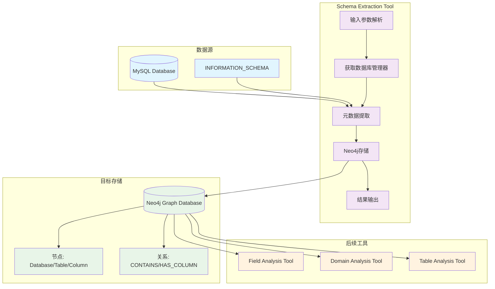
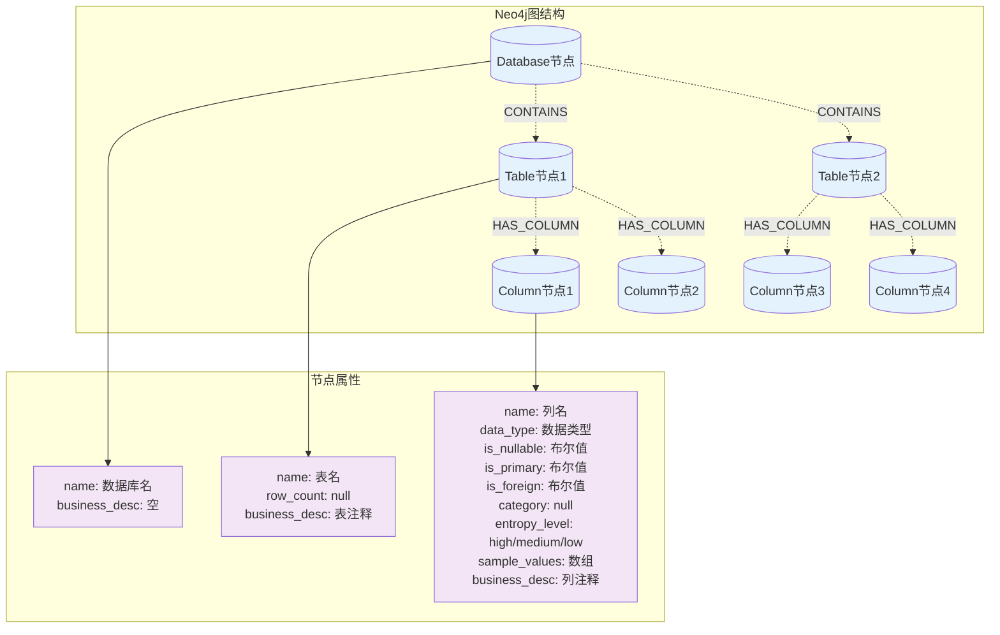
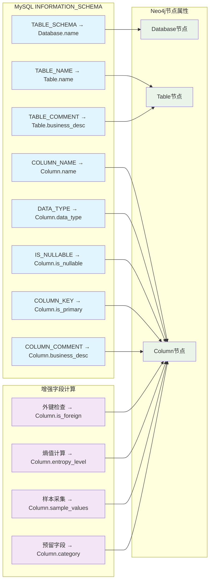
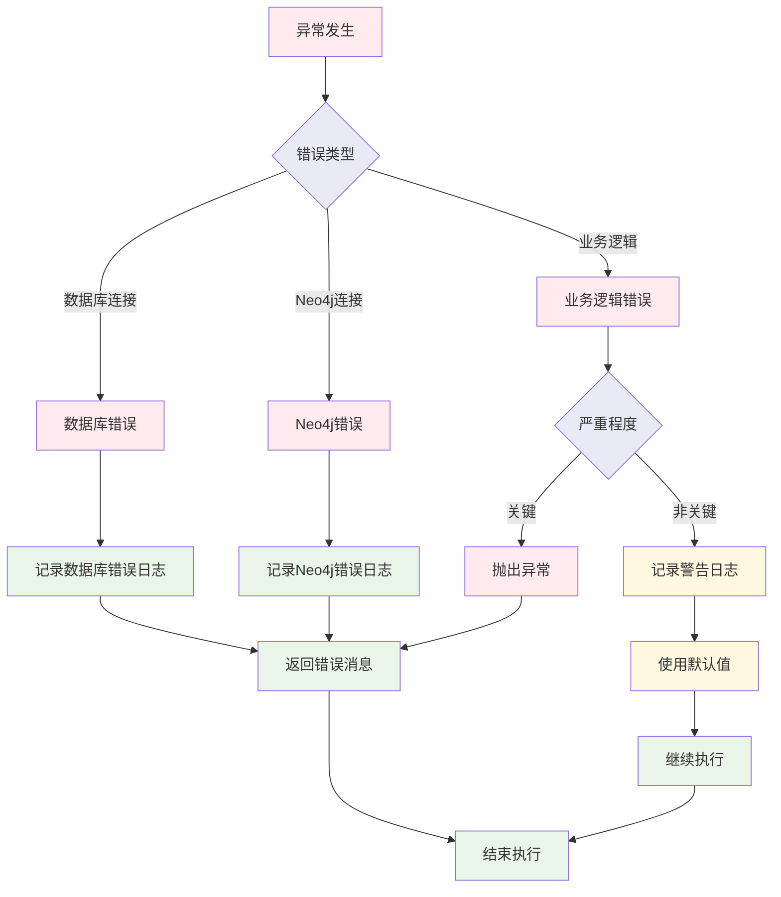
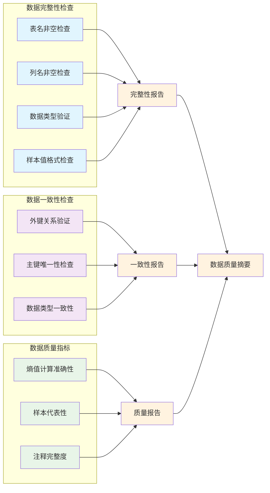

# Schema Extraction Tool 数据流图

## 整体数据流架构



## 详细数据提取流程

```mermaid
flowchart TD
    Start([开始]) --> GetDbInfo[获取数据库信息]
    GetDbInfo --> GetTables[获取所有表名]
    GetTables --> FilterTables[过滤表名<br/>黑名单: aid_info]
    FilterTables --> LoopTables{遍历每个表}
    
    LoopTables --> ExtractTable[提取表元数据]
    ExtractTable --> GetTableComment[获取表注释<br/>可配置开关]
    GetTableComment --> GetColumns[获取列信息]
    GetColumns --> LoopColumns{遍历每列}
    
    LoopColumns --> ExtractColumn[提取列基础信息]
    ExtractColumn --> CheckFK[检查外键约束]
    CheckFK --> CalcEntropy[计算熵值等级<br/>采样500条]
    CalcEntropy --> CollectSample[采集样本值<br/>最多100个]
    CollectSample --> NextColumn{下一列?}
    
    NextColumn -->|是| LoopColumns
    NextColumn -->|否| NextTable{下一表?}
    NextTable -->|是| LoopTables
    NextTable -->|否| StoreNeo4j[存储到Neo4j]
    
    StoreNeo4j --> CreateDB[创建Database节点]
    CreateDB --> CreateTables[创建Table节点和关系]
    CreateTables --> CreateColumns[创建Column节点和关系]
    CreateColumns --> Success[返回成功消息]
    Success --> End([结束])
    
    %% 错误处理分支
    ExtractTable -->|失败| LogError[记录错误日志]
    CheckFK -->|失败| DefaultFK[设为null]
    CalcEntropy -->|失败| DefaultEntropy[设为low]
    CollectSample -->|失败| EmptySample[设为空数组]
    StoreNeo4j -->|失败| ErrorMsg[返回错误消息]
    
    LogError --> NextTable
    DefaultFK --> CalcEntropy
    DefaultEntropy --> CollectSample
    EmptySample --> NextColumn
    ErrorMsg --> End
    
    classDef process fill:#e3f2fd
    classDef decision fill:#fff3e0
    classDef error fill:#ffebee
    classDef success fill:#e8f5e8
    
    class GetDbInfo,ExtractTable,ExtractColumn,CheckFK,CalcEntropy,CollectSample,StoreNeo4j,CreateDB,CreateTables,CreateColumns process
    class LoopTables,LoopColumns,NextColumn,NextTable decision
    class LogError,DefaultFK,DefaultEntropy,EmptySample,ErrorMsg error
    class Success success
```



## MySQL数据提取详情

```mermaid
graph LR
    subgraph "INFORMATION_SCHEMA查询"
        T1[TABLES表<br/>获取表名和注释]
        T2[COLUMNS表<br/>获取列信息]
        T3[KEY_COLUMN_USAGE表<br/>获取外键信息]
    end
    
    subgraph "业务表查询"
        S1[采样查询<br/>SELECT ... LIMIT 500]
        S2[样本查询<br/>SELECT DISTINCT ... LIMIT 100]
        S3[计数查询<br/>SELECT COUNT(*)]
    end
    
    subgraph "提取的数据"
        D1[数据库名称]
        D2[表名列表]
        D3[表注释]
        D4[列基础信息]
        D5[外键状态]
        D6[熵值等级]
        D7[样本值]
    end
    
    T1 --> D1
    T1 --> D2
    T1 --> D3
    T2 --> D4
    T3 --> D5
    S1 --> D6
    S2 --> D7
    S3 --> D6
    
    classDef schema fill:#e1f5fe
    classDef business fill:#f3e5f5
    classDef data fill:#e8f5e8
    
    class T1,T2,T3 schema
    class S1,S2,S3 business
    class D1,D2,D3,D4,D5,D6,D7 data
```

## Neo4j存储结构



## 数据转换映射

### MySQL → Neo4j 字段映射



## 错误处理流程



## 性能优化数据流

```mermaid
graph TD
    subgraph "采样策略"
        S1[表数据量检查<br/>COUNT(*)]
        S2[熵值采样<br/>LIMIT 500]
        S3[样本值采集<br/>LIMIT 100]
    end
    
    subgraph "批量操作"
        B1[逐表处理<br/>避免内存溢出]
        B2[Neo4j MERGE<br/>避免重复]
        B3[连接复用<br/>减少开销]
    end
    
    subgraph "缓存机制"
        C1[元数据缓存<br/>可选功能]
        C2[连接池<br/>数据库连接]
        C3[查询优化<br/>索引使用]
    end
    
    S1 --> Optimize1[优化数据采样]
    S2 --> Optimize1
    S3 --> Optimize1
    
    B1 --> Optimize2[优化批量处理]
    B2 --> Optimize2
    B3 --> Optimize2
    
    C1 --> Optimize3[优化性能瓶颈]
    C2 --> Optimize3
    C3 --> Optimize3
    
    Optimize1 --> Performance[整体性能提升]
    Optimize2 --> Performance
    Optimize3 --> Performance
    
    classDef sampling fill:#e1f5fe
    classDef batch fill:#f3e5f5
    classDef cache fill:#e8f5e8
    classDef result fill:#fff3e0
    
    class S1,S2,S3 sampling
    class B1,B2,B3 batch
    class C1,C2,C3 cache
    class Optimize1,Optimize2,Optimize3,Performance result
```

## 数据质量检查流程

