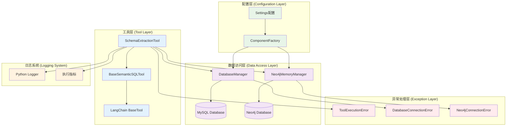
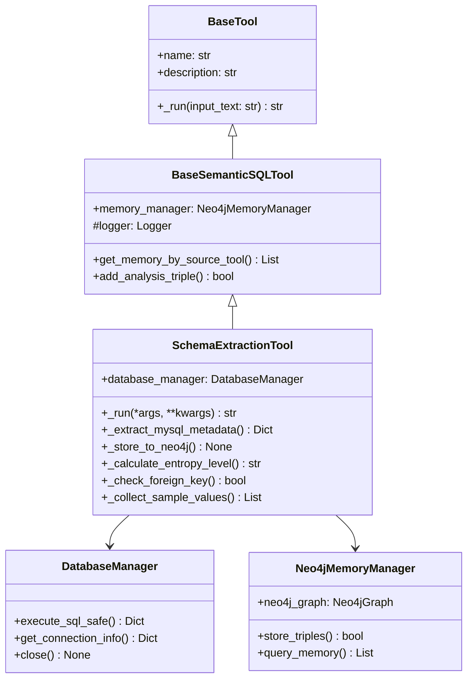
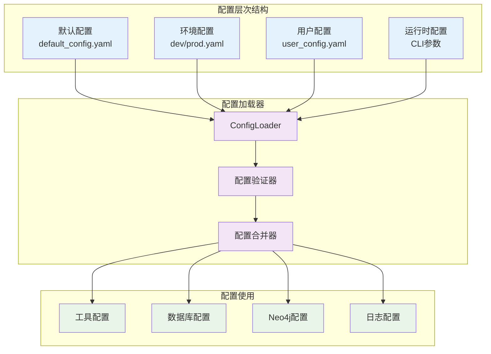
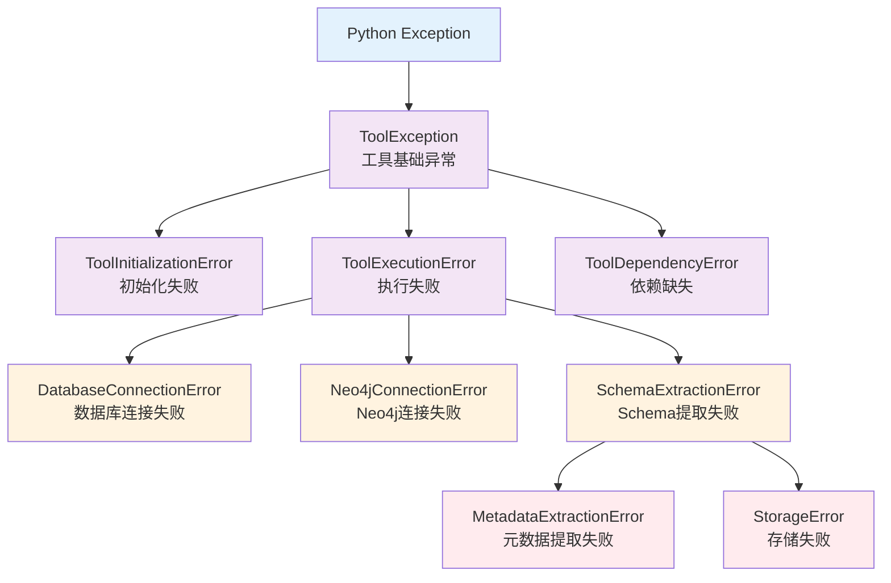

# Schema Extraction Tool 架构设计

## 整体架构概览



## 核心组件架构

### 1. 工具继承体系



### 2. 数据处理管道

```mermaid
graph LR
    subgraph "输入处理 (Input Processing)"
        InputParsing[参数解析]
        Validation[输入验证]
        Configuration[配置加载]
    end
    
    subgraph "数据提取 (Data Extraction)"
        DBConnection[数据库连接]
        SchemaQuery[结构查询]
        MetadataExtraction[元数据提取]
        DataSampling[数据采样]
    end
    
    subgraph "数据处理 (Data Processing)"
        DataCleaning[数据清洗]
        EntropyCalculation[熵值计算]
        FKDetection[外键检测]
        SampleCollection[样本收集]
    end
    
    subgraph "数据存储 (Data Storage)"
        GraphStructure[图结构构建]
        Neo4jStorage[Neo4j存储]
        RelationshipCreation[关系创建]
    end
    
    subgraph "输出处理 (Output Processing)"
        ResultFormatting[结果格式化]
        LoggingAndMetrics[日志记录]
        ErrorHandling[错误处理]
    end
    
    InputParsing --> Validation
    Validation --> Configuration
    Configuration --> DBConnection
    
    DBConnection --> SchemaQuery
    SchemaQuery --> MetadataExtraction
    MetadataExtraction --> DataSampling
    
    DataSampling --> DataCleaning
    DataCleaning --> EntropyCalculation
    EntropyCalculation --> FKDetection
    FKDetection --> SampleCollection
    
    SampleCollection --> GraphStructure
    GraphStructure --> Neo4jStorage
    Neo4jStorage --> RelationshipCreation
    
    RelationshipCreation --> ResultFormatting
    ResultFormatting --> LoggingAndMetrics
    LoggingAndMetrics --> ErrorHandling
    
    classDef input fill:#e1f5fe
    classDef extraction fill:#f3e5f5
    classDef processing fill:#e8f5e8
    classDef storage fill:#fff3e0
    classDef output fill:#fce4ec
    
    class InputParsing,Validation,Configuration input
    class DBConnection,SchemaQuery,MetadataExtraction,DataSampling extraction
    class DataCleaning,EntropyCalculation,FKDetection,SampleCollection processing
    class GraphStructure,Neo4jStorage,RelationshipCreation storage
    class ResultFormatting,LoggingAndMetrics,ErrorHandling output
```



## 设计模式应用

### 1. 策略模式 (Strategy Pattern)

```python
# 抽象策略
class EntropyCalculationStrategy(ABC):
    @abstractmethod
    def calculate(self, values: List[Any]) -> str:
        pass

# 具体策略
class UniqueRatioStrategy(EntropyCalculationStrategy):
    def calculate(self, values: List[Any]) -> str:
        unique_ratio = len(set(values)) / len(values)
        if unique_ratio >= 0.8:
            return "high"
        elif unique_ratio >= 0.4:
            return "medium"
        else:
            return "low"

class ShannonEntropyStrategy(EntropyCalculationStrategy):
    def calculate(self, values: List[Any]) -> str:
        # Shannon熵值计算
        pass

# 上下文类
class SchemaExtractionTool:
    def __init__(self, entropy_strategy: EntropyCalculationStrategy = None):
        self.entropy_strategy = entropy_strategy or UniqueRatioStrategy()
    
    def _calculate_entropy_level(self, values: List[Any]) -> str:
        return self.entropy_strategy.calculate(values)
```

### 2. 工厂模式 (Factory Pattern)

```python
class SchemaExtractionToolFactory:
    @staticmethod
    def create_tool(config: Dict[str, Any]) -> SchemaExtractionTool:
        """根据配置创建工具"""
        # 创建数据库管理器
        db_manager = DatabaseManager(config.get("database"))
        
        # 创建Neo4j管理器
        neo4j_manager = Neo4jMemoryManager(config.get("neo4j"))
        
        # 创建工具
        return SchemaExtractionTool(
            memory_manager=neo4j_manager,
            database_manager=db_manager
        )
    
    @classmethod
    def create_with_custom_strategies(cls, 
                                    config: Dict[str, Any],
                                    entropy_strategy: EntropyCalculationStrategy = None,
                                    filter_strategy: TableFilterStrategy = None) -> SchemaExtractionTool:
        """创建带自定义策略的工具"""
        tool = cls.create_tool(config)
        
        if entropy_strategy:
            tool.entropy_strategy = entropy_strategy
        if filter_strategy:
            tool.filter_strategy = filter_strategy
            
        return tool
```

### 3. 模板方法模式 (Template Method Pattern)

```python
class BaseExtractionTool(ABC):
    """提取工具的抽象基类"""
    
    def extract(self) -> str:
        """模板方法 - 定义提取流程"""
        try:
            self._pre_extract()
            raw_data = self._do_extract()
            processed_data = self._process_data(raw_data)
            self._store_data(processed_data)
            result = self._post_extract()
            return result
        except Exception as e:
            return self._handle_error(e)
    
    @abstractmethod
    def _do_extract(self) -> Dict[str, Any]:
        """子类实现具体提取逻辑"""
        pass
    
    def _pre_extract(self) -> None:
        """提取前处理（可选重写）"""
        self.logger.info("开始提取...")
    
    def _process_data(self, raw_data: Dict[str, Any]) -> Dict[str, Any]:
        """数据处理（可选重写）"""
        return raw_data
    
    def _post_extract(self) -> str:
        """提取后处理（可选重写）"""
        return "提取完成"
    
    def _handle_error(self, error: Exception) -> str:
        """错误处理（可选重写）"""
        return f"提取失败: {error}"

class SchemaExtractionTool(BaseExtractionTool):
    def _do_extract(self) -> Dict[str, Any]:
        """实现Schema特定的提取逻辑"""
        return self._extract_mysql_metadata(self.database_manager)
```

### 4. 观察者模式 (Observer Pattern)

```python
class ExtractionObserver(ABC):
    @abstractmethod
    def on_table_processed(self, table_name: str, table_data: Dict[str, Any]):
        pass
    
    @abstractmethod
    def on_extraction_completed(self, total_tables: int, total_columns: int):
        pass

class QualityMetricsObserver(ExtractionObserver):
    def __init__(self):
        self.quality_metrics = {}
    
    def on_table_processed(self, table_name: str, table_data: Dict[str, Any]):
        # 收集质量指标
        self.quality_metrics[table_name] = {
            "has_comment": bool(table_data.get("business_desc")),
            "column_count": len(table_data.get("columns", [])),
            "commented_columns": sum(1 for col in table_data.get("columns", []) 
                                   if col.get("business_desc"))
        }
    
    def on_extraction_completed(self, total_tables: int, total_columns: int):
        # 生成质量报告
        print(f"质量报告: {total_tables} 表, {total_columns} 列")

class SchemaExtractionTool:
    def __init__(self, observers: List[ExtractionObserver] = None):
        self.observers = observers or []
    
    def add_observer(self, observer: ExtractionObserver):
        self.observers.append(observer)
    
    def _notify_table_processed(self, table_name: str, table_data: Dict[str, Any]):
        for observer in self.observers:
            observer.on_table_processed(table_name, table_data)
    
    def _notify_extraction_completed(self, total_tables: int, total_columns: int):
        for observer in self.observers:
            observer.on_extraction_completed(total_tables, total_columns)
```

## 依赖注入架构

### 1. 依赖接口定义

```python
from abc import ABC, abstractmethod

class IDatabaseManager(ABC):
    @abstractmethod
    def execute_sql_safe(self, sql: str) -> Dict[str, Any]:
        pass
    
    @abstractmethod
    def get_connection_info(self) -> Dict[str, Any]:
        pass

class IMemoryManager(ABC):
    @abstractmethod
    def store_data(self, data: Any) -> bool:
        pass
    
    @abstractmethod
    def query_data(self, query: str) -> List[Any]:
        pass

class ISchemaExtractor(ABC):
    @abstractmethod
    def extract(self) -> str:
        pass
```

### 2. 依赖注入容器

```python
class DIContainer:
    def __init__(self):
        self._services = {}
        self._factories = {}
    
    def register_singleton(self, interface: type, implementation: type):
        """注册单例服务"""
        self._services[interface] = implementation
    
    def register_factory(self, interface: type, factory: Callable):
        """注册工厂方法"""
        self._factories[interface] = factory
    
    def resolve(self, interface: type):
        """解析依赖"""
        if interface in self._services:
            return self._services[interface]()
        elif interface in self._factories:
            return self._factories[interface]()
        else:
            raise ValueError(f"Service {interface} not registered")

# 使用示例
container = DIContainer()
container.register_singleton(IDatabaseManager, DatabaseManager)
container.register_singleton(IMemoryManager, Neo4jMemoryManager)

# 创建工具
db_manager = container.resolve(IDatabaseManager)
memory_manager = container.resolve(IMemoryManager)
tool = SchemaExtractionTool(memory_manager, db_manager)
```

## 配置管理架构

### 1. 分层配置结构



### 2. 配置类定义

```python
from pydantic import BaseSettings, Field
from typing import Optional, List, Dict, Any

class DatabaseConfig(BaseSettings):
    host: str = "localhost"
    port: int = 3306
    database: str
    username: str
    password: str
    charset: str = "utf8mb4"
    
    class Config:
        env_prefix = "DB_"

class Neo4jConfig(BaseSettings):
    url: str = "bolt://localhost:7687"
    username: str = "neo4j"
    password: str
    database: str = "neo4j"
    
    class Config:
        env_prefix = "NEO4J_"

class SchemaExtractionConfig(BaseSettings):
    # 表过滤配置
    table_blacklist: List[str] = Field(default_factory=lambda: ["aid_info"])
    use_db_comments: bool = True
    
    # 采样配置
    entropy_sample_size: int = 500
    sample_value_limit: int = 100
    
    # 性能配置
    max_workers: int = 1
    connection_timeout: int = 30
    query_timeout: int = 60
    
    # 质量检查
    enable_quality_check: bool = True
    min_comment_coverage: float = 0.5
    
    class Config:
        env_prefix = "SCHEMA_"

class ToolSettings(BaseSettings):
    database: DatabaseConfig
    neo4j: Neo4jConfig
    schema_extraction: SchemaExtractionConfig
    
    class Config:
        env_file = ".env"
        env_nested_delimiter = "__"
```

## 错误处理架构

### 1. 异常层次结构



### 2. 错误处理策略

```python
from enum import Enum
from typing import Union, Callable

class ErrorSeverity(Enum):
    CRITICAL = "critical"  # 必须停止执行
    WARNING = "warning"    # 可以继续但需记录
    INFO = "info"         # 仅记录信息

class ErrorHandler:
    def __init__(self):
        self.handlers = {}
    
    def register_handler(self, 
                        exception_type: type, 
                        handler: Callable, 
                        severity: ErrorSeverity = ErrorSeverity.WARNING):
        self.handlers[exception_type] = (handler, severity)
    
    def handle_error(self, error: Exception) -> Union[str, None]:
        error_type = type(error)
        
        # 查找最匹配的处理器
        for exc_type, (handler, severity) in self.handlers.items():
            if isinstance(error, exc_type):
                return handler(error, severity)
        
        # 默认处理
        return self._default_handler(error)
    
    def _default_handler(self, error: Exception) -> str:
        return f"未处理的异常: {error}"

# 使用示例
class SchemaExtractionTool:
    def __init__(self):
        self.error_handler = ErrorHandler()
        self._setup_error_handlers()
    
    def _setup_error_handlers(self):
        self.error_handler.register_handler(
            DatabaseConnectionError, 
            self._handle_database_error,
            ErrorSeverity.CRITICAL
        )
        
        self.error_handler.register_handler(
            MetadataExtractionError,
            self._handle_metadata_error,
            ErrorSeverity.WARNING
        )
    
    def _handle_database_error(self, error: DatabaseConnectionError, severity: ErrorSeverity) -> str:
        self.logger.error(f"数据库连接失败: {error}")
        return f"❌ 数据库连接失败，请检查配置: {error}"
    
    def _handle_metadata_error(self, error: MetadataExtractionError, severity: ErrorSeverity) -> str:
        self.logger.warning(f"元数据提取失败: {error}")
        return None  # 继续执行
```

## 性能监控架构

### 1. 指标收集系统

```python
from dataclasses import dataclass
from time import time
from contextlib import contextmanager

@dataclass
class PerformanceMetrics:
    extraction_time: float = 0.0
    database_query_count: int = 0
    database_query_time: float = 0.0
    neo4j_write_count: int = 0
    neo4j_write_time: float = 0.0
    tables_processed: int = 0
    columns_processed: int = 0
    memory_usage_mb: float = 0.0

class MetricsCollector:
    def __init__(self):
        self.metrics = PerformanceMetrics()
        self.start_time = None
    
    @contextmanager
    def measure_time(self, metric_name: str):
        start = time()
        try:
            yield
        finally:
            duration = time() - start
            setattr(self.metrics, metric_name, 
                   getattr(self.metrics, metric_name) + duration)
    
    def increment_counter(self, metric_name: str, value: int = 1):
        current = getattr(self.metrics, metric_name)
        setattr(self.metrics, metric_name, current + value)
    
    def get_report(self) -> Dict[str, Any]:
        return {
            "performance_metrics": self.metrics,
            "efficiency": {
                "tables_per_second": self.metrics.tables_processed / max(self.metrics.extraction_time, 1),
                "columns_per_second": self.metrics.columns_processed / max(self.metrics.extraction_time, 1),
                "avg_query_time": self.metrics.database_query_time / max(self.metrics.database_query_count, 1)
            }
        }
```

### 2. 缓存架构

```python
from abc import ABC, abstractmethod
import hashlib
from typing import Optional, Any

class ICache(ABC):
    @abstractmethod
    def get(self, key: str) -> Optional[Any]:
        pass
    
    @abstractmethod
    def set(self, key: str, value: Any, ttl: Optional[int] = None):
        pass
    
    @abstractmethod
    def delete(self, key: str):
        pass

class MemoryCache(ICache):
    def __init__(self, max_size: int = 1000):
        self.cache = {}
        self.max_size = max_size
    
    def get(self, key: str) -> Optional[Any]:
        return self.cache.get(key)
    
    def set(self, key: str, value: Any, ttl: Optional[int] = None):
        if len(self.cache) >= self.max_size:
            # 简单LRU：删除第一个
            oldest_key = next(iter(self.cache))
            del self.cache[oldest_key]
        
        self.cache[key] = value

class CacheableSchemaExtractionTool(SchemaExtractionTool):
    def __init__(self, cache: Optional[ICache] = None, **kwargs):
        super().__init__(**kwargs)
        self.cache = cache or MemoryCache()
    
    def _get_cache_key(self, table_name: str, operation: str) -> str:
        """生成缓存键"""
        db_info = self.database_manager.get_connection_info()
        content = f"{db_info['database']}:{table_name}:{operation}"
        return hashlib.md5(content.encode()).hexdigest()
    
    def _extract_table_metadata_cached(self, db_manager, table_name):
        """带缓存的表元数据提取"""
        cache_key = self._get_cache_key(table_name, "table_metadata")
        
        # 尝试从缓存获取
        cached_result = self.cache.get(cache_key)
        if cached_result:
            self.logger.debug(f"从缓存获取表 {table_name} 的元数据")
            return cached_result
        
        # 执行提取
        result = super()._extract_table_metadata(db_manager, table_name)
        
        # 存入缓存
        self.cache.set(cache_key, result, ttl=3600)  # 1小时过期
        
        return result
```

这个架构设计文档全面展示了Schema Extraction Tool的设计思想、核心组件、设计模式应用、依赖管理、配置管理、错误处理和性能监控等方面。通过这些架构设计，工具具备了良好的可扩展性、可维护性和可测试性。